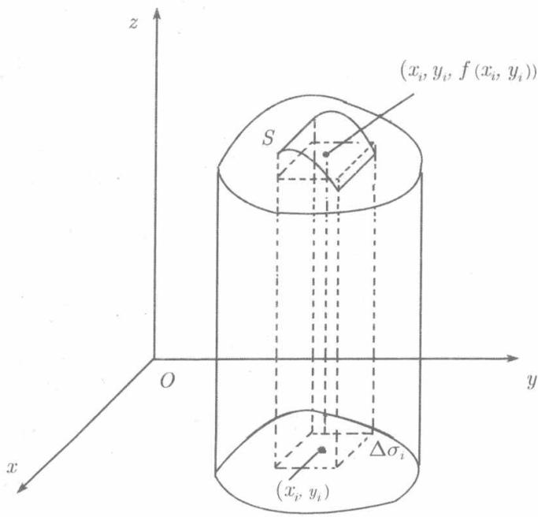

一个柱体，以 $xOy$ 平面上有界闭区域 $D$ 作底，以定义在 $D$ 上的非负连续函数 $z = f(x,y)$ 所表示的曲面为顶，而侧面是以区域 $D$ 的边界 $C$ 为准线母线平行

  
图10.1

于 $Oz$ 轴的柱面（见图10.1)，称之为曲顶柱体。当 $f(x,y)$ 恒等于常数即顶位于平行于底面的平面上时，得到平顶柱体。我们知道，平顶柱体的体积等于底面积与高的乘积。而现在的问题是：如何定义和计算曲顶柱体的体积 $V$

用任意的方式将 $D$ 分为 $n$ 个小区域：

$$
\Delta \sigma_ {1}, \Delta \sigma_ {2}, \dots , \Delta \sigma_ {n}.
$$

在下文，区域 $\Delta \sigma_{i}$ 的面积也以 $\Delta \sigma_{i}$ 表示. 以每个小区域的边界曲线为准线作母线平行于 $Oz$ 轴的柱面，这

些柱面就把原来的曲顶柱体分成了 $n$ 个小曲顶柱体，这些小曲顶柱体的体积之和就是原来曲面柱体的体积.

在区域 $\Delta \sigma_{1},\Delta \sigma_{2},\dots ,\Delta \sigma_{n}$ 依次任取一点

$$
P _ {1} \left(x _ {1}, y _ {1}\right), P _ {2} \left(x _ {2}, y _ {2}\right), \dots , P _ {n} \left(x _ {n}, y _ {n}\right),
$$

以 $f(x_{i},y_{i})$ 为高 $\Delta \sigma_{i}$ 为底的平顶柱体的体积为 $f(x_{i},y_{i})\Delta \sigma_{i}$ ，用它作为相应的小曲顶柱体的体积的近似值，并将所有这 $n$ 个近似值相加，就得到所求的曲顶柱体的体积的近似值

$$
\sum_ {i = 1} ^ {n} f \left(x _ {i}, y _ {i}\right) \Delta \sigma_ {i}. \tag {10.1}
$$

称区域 $\Delta \sigma_{i}$ 的任意两点间的距离的最大者为它的直径，记为 $d_{i}$ ，令 $d = \max_{1\leqslant i\leqslant n}d_i$ ，直观上容易相信： $d$ 愈小，即 $D$ 被分得愈细每个小区域愈小时，近似值(10.1)就愈精确。如果当 $d\to 0$ 时和数(10.1)存在极限，则说这个极限值为曲顶柱体的体积：

$$
V = \lim  _ {d \rightarrow 0} \sum_ {i = 1} ^ {n} f \left(x _ {i}, y _ {i}\right) \Delta \sigma_ {i}. \tag {10.2}
$$

如果 $D$ 不是曲顶柱体的底，而是分布有质量的薄片， $f(x,y)$ 是质量分布的面密度(单位面积上的质量)，则类似于刚才所做的，将 $D$ 任意分为小区域 $\Delta \sigma_1,\Delta \sigma_2,\dots ,$ $\Delta \sigma_{n}$ ，在区域 $\Delta \sigma_{i}$ 任取 $P_{i}(x_{i},y_{i})$ ，将 $\Delta \sigma_{i}$ 上质量的分布密度看作常数 $f(x_{i},y_{i})$ ，则 $\Delta \sigma_{i}$ 的质量近似地等于 $f(x_{i},y_{i})\Delta \sigma_{i}$ ，于是薄片 $D$ 的质量近似地由和数（10.1）表示，而(10.2)右端的极限就是 $D$ 的质量：

$$
m = \lim  _ {d \rightarrow 0} \sum_ {i = 1} ^ {n} f \left(x _ {i}, y _ {i}\right) \Delta \sigma_ {i}. \tag {10.3}
$$

现在，抽去 $f(x,y)$ 本身所表示的几何意义或物理意义，并弃去 $f(x,y)\geqslant 0$ 的限制，而从数学上研究和数(10.1)的极限，就导致二重积分的概念的建立.
