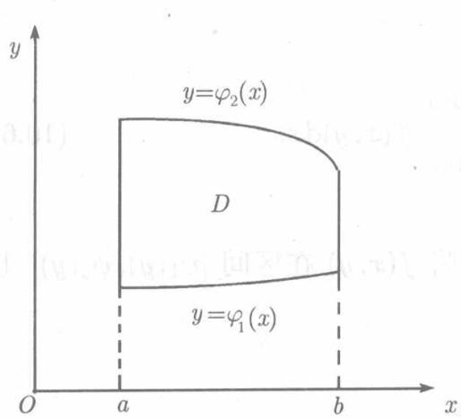
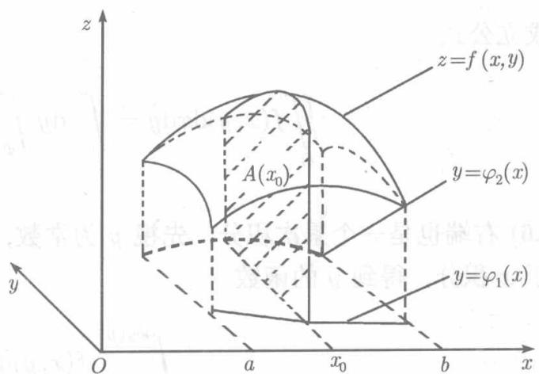
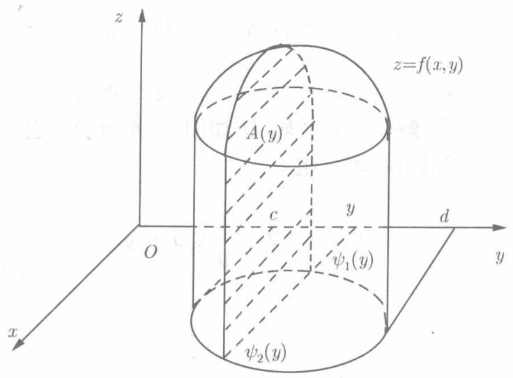
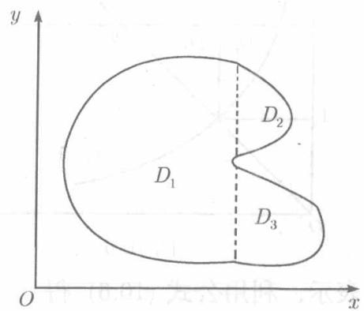
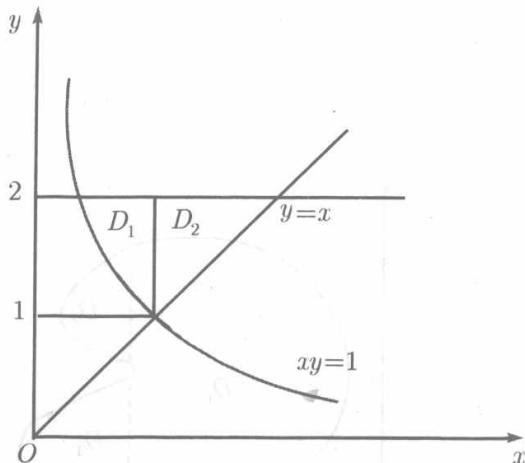
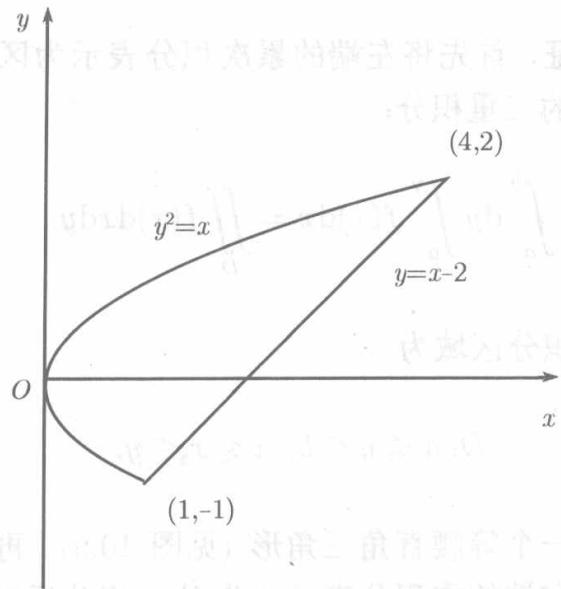
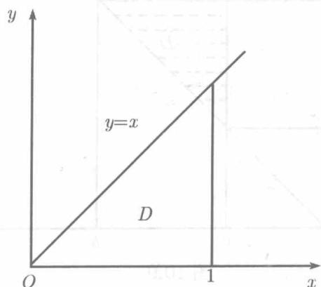
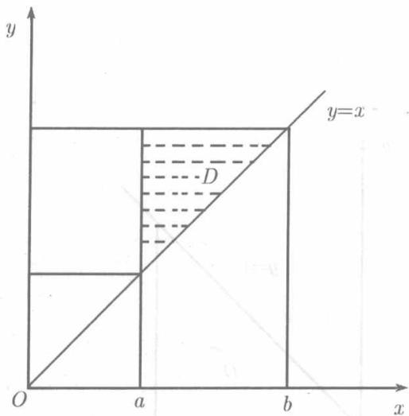

我们知道，当 $f(x,y)$ 是 $D$ 上的非负连续函数时， $f(x,y)$ 在 $D$ 上的二重积分可以看作是曲顶柱体的体积。另一方面，由5.4.3节，当平行截面的面积为已知

时，立体的体积可以通过定积分求得，现在，就用这一方法求曲顶柱体的体积，从而导出二重积分的计算方法.

设区域 $D$ 由2条直线 $x = a, x = b (a < b)$ 以及2条曲线 $y = \varphi_{1}(x), y = \varphi_{2}(x) (\varphi_{2}(x) \geqslant \varphi_{1}(x))$ 所围成（见图10.2），这可以用不等式组表示为

$$
D: a \leqslant x \leqslant b, \varphi_ {1} (x) \leqslant y \leqslant \varphi_ {2} (x).
$$

又设曲顶柱体的顶由方程 $z = f(x,y)$ 给出， $f(x,y)$ 是 $D$ 上的连续函数。为了求这个曲顶柱体的体积 $V$ ，以平面 $x = x_0$ ( $a \leqslant x_0 \leqslant b$ ) 截这柱体，则截面是一个曲边梯形，它位于平面 $x = x_0$ 上的两条直线 $y = \varphi_1(x_0)$ 和 $y = \varphi_2(x_0)$ 之间，曲边是曲线 $z = f(x_0,y)$ ，底边是区间 $[\varphi_1(x_0), \varphi_2(x_0)]$ （见图10.3中的阴影部分），于是该截面的面积为 $A(x_0) = \int_{\varphi_1(x_0)}^{\varphi_2(x_0)} f(x_0,y) \, \mathrm{d}y$ ，对区间 $[a,b]$ 上的任何 $x_0$ 都是如此，将 $x_0$ 改记为 $x$ ，则得曲顶柱体被垂直于 $Ox$ 轴的平行平面所截得的面积

$$
A (x) = \int_ {\varphi_ {1} (x)} ^ {\varphi_ {2} (x)} f (x, y) \mathrm {d} y.
$$

  
图10.2

  
图10.3

将 $A(x)$ 在区间 $[a,b]$ 上积分，即得体积 $V$ ：

$$
V = \int_ {a} ^ {b} \left[ \int_ {\varphi_ {1} (x)} ^ {\varphi_ {2} (x)} f (x, y) \mathrm {d} y \right] \mathrm {d} x.
$$

上式右端相继进行了两次定积分：第一次将 $x$ 看作常数，在区间 $[\varphi_1(x),\varphi_2(x)]$ 上将 $f(x,y)$ 关于 $y$ 积分，得到 $x$ 的函数

$$
\int_ {\varphi_ {1} (x)} ^ {\varphi_ {2} (x)} f (x, y) \mathrm {d} y,
$$

第二次，将这一函数在区间 $[a,b]$ 上积分．习惯上，把这两个相继的积分过程记为

$$
\int_ {a} ^ {b} \mathrm {d} x \int_ {\varphi_ {1} (x)} ^ {\varphi_ {2} (x)} f (x, y) \mathrm {d} y,
$$

并称之为累次积分.注意体积 $V$ 就是 $f(x,y)$ 在 $D$ 上的二重积分，于是得到通过累次积分计算二重积分的公式

$$
\iint_ {D} f (x, y) \mathrm {d} x \mathrm {d} y = \int_ {a} ^ {b} \mathrm {d} x \int_ {\varphi_ {1} (x)} ^ {\varphi_ {2} (x)} f (x, y) \mathrm {d} y. \tag {10.5}
$$

类似地，若 $D$ 由两条直线 $y = c, y = d (c < d)$ 及两条曲线 $x = \psi_{1}(y), x = \psi_{2}(y), (\psi_{1}(y) \leqslant \psi_{2}(y))$ 所围成（见图10.4），即

$$
D \colon c \leqslant y \leqslant d, \quad \psi_ {1} (y) \leqslant x \leqslant \psi_ {2} (y),
$$

则成立公式

$$
\iint_ {D} f (x, y) \mathrm {d} x \mathrm {d} y = \int_ {c} ^ {d} \mathrm {d} y \int_ {\psi_ {1} (y)} ^ {\psi_ {2} (y)} f (x, y) \mathrm {d} x. \tag {10.6}
$$

(10.6) 右端也是一个累次积分，先视 $y$ 为常数，将 $f(x, y)$ 在区间 $[\psi_1(y), \psi_2(y)]$ 上关于 $x$ 积分，得到 $y$ 的函数

$$
\int_ {\psi_ {1} (y)} ^ {\psi_ {2} (y)} f (x, y) \mathrm {d} x,
$$

再将这一函数在 $[c,d]$ 上积分.

注意，为能使用公式(10.5)， $D$ 的两条边界曲线的纵标 $y$ 必须是横标的单值函数 $y = \varphi_{1}(x)$ 和 $y = \varphi_{2}(x)$ ，因此，垂直于 $Ox$ 轴的每一直线与 $D$ 的边界相交不能多于两点．类似于此，为能应用公式(10.6)，垂直于 $Oy$ 轴的每一直线与 $D$ 的边界相交不能多于两点．这两个性质中的任何一个对于区域 $D$ 都不成立时，需将 $D$ 分成若干个彼此不重叠的部分区域（见图10.5)，使得它们的每一个具有所述性质之一，应用(10.5）或(10.6）计算出每个部分区域上的积分，将这些积分相加，即得整个区域 $D$ 上的积分.

  
图10.5

若区域 $D$ 可用 $a \leqslant x \leqslant b, \varphi_1(x) \leqslant y \leqslant \varphi_2(x)$ 表示，也可用 $c \leqslant y \leqslant d, \psi_1(y) \leqslant x \leqslant \psi_2(y)$ 表示，则 $f(x,y)$ 在 $D$ 上的二重积分既可用 (10.5) 也可用 (10.6) 计算：

$$
\iint_ {D} f (x, y) \mathrm {d} x \mathrm {d} y = \int_ {a} ^ {b} \mathrm {d} x \int_ {\varphi_ {1} (x)} ^ {\varphi_ {2} (x)} f (x, y) \mathrm {d} y = \int_ {c} ^ {d} \mathrm {d} y \int_ {\psi_ {1} (y)} ^ {\psi_ {2} (y)} f (x, y) \mathrm {d} x.
$$

特别，当 $D$ 是一个矩形，用不等式 $a \leqslant x \leqslant b, c \leqslant y \leqslant d$ 表示时，则上述公式中

$$
\varphi_ {1} (x) \equiv c, \varphi_ {2} (x) \equiv d, \psi_ {1} (y) \equiv a, \psi_ {2} (y) \equiv b,
$$

于是：

$$
\iint_ {D} f (x, y) \mathrm {d} x \mathrm {d} y = \int_ {a} ^ {b} \mathrm {d} x \int_ {c} ^ {d} f (x, y) \mathrm {d} y = \int_ {c} ^ {d} \mathrm {d} y \int_ {a} ^ {b} f (x, y) \mathrm {d} x. \tag {10.7}
$$

此时，二重积分 $\iint_{D} f(x, y) \mathrm{d}x \mathrm{~d}y$ 也记为 $\int_{a}^{b} \int_{c}^{d} f(x, y) \mathrm{d}x \mathrm{~d}y$ .

公式 (10.5)、(10.6)、(10.7) 都是在 $f(x, y) \geqslant 0$ 的假设下得到的，不过所有这些公式对于 $f(x, y) \leqslant 0$ 或 $f(x, y)$ 在 $D$ 上变号的情形也还是正确的。

例10.2.1 求以矩形 $D: -1 \leqslant x \leqslant 1, -2 \leqslant y \leqslant 2$ 为底以平面 $4x + 3y + 12z - 12 = 0$ 为顶的四壁垂直于 $xOy$ 平面的柱体的体积 $V$ .

解 由 $4x + 3y + 12z - 12 = 0$ 得 $z = 1 - \frac{x}{3} -\frac{y}{4}$ ，于是，利用公式(10.7）得：

$$
\begin{array}{l} V = \iint_ {D} \left(1 - \frac {x}{3} - \frac {y}{4}\right) d x d y = \int_ {- 1} ^ {1} d x \int_ {- 2} ^ {2} \left(1 - \frac {x}{3} - \frac {y}{4}\right) d y \\ = \int_ {- 1} ^ {1} \left[ y - \frac {x y}{3} - \frac {y ^ {2}}{8} \right] _ {- 2} ^ {2} d x = \int_ {- 1} ^ {1} \left(4 - \frac {4 x}{3}\right) d x = \left(4 x - \frac {2 x ^ {2}}{3}\right) \Bigg | _ {- 1} ^ {1} = 8. \quad \square \\ \end{array}
$$

  
图10.6

例10.2.2 计算积分 $\iint_{D} \frac{x^2}{y^2} \mathrm{d}x \mathrm{d}y$ ，其中 $D$ 由 $xy = 1, y = x, y = 2$ 所围成。

**解** 积分区域 $D$ 如图10.6所示，它可以由不等式组

$$
1 \leqslant y \leqslant 2, \quad \frac {1}{y} \leqslant x \leqslant y
$$

表示，利用公式(10.6)，得

$$
\begin{array}{l} \iint_ {D} \frac {x ^ {2}}{y ^ {2}} \mathrm {d} x \mathrm {d} y = \int_ {1} ^ {2} \mathrm {d} y \int_ {\frac {1}{y}} ^ {y} \frac {x ^ {2}}{y ^ {2}} \mathrm {d} x = \left. \int_ {1} ^ {2} \frac {x ^ {3}}{3 y ^ {2}} \right| _ {\frac {1}{y}} ^ {y} \mathrm {d} y \\ = \frac {1}{3} \int_ {1} ^ {2} \left(y - \frac {1}{y ^ {5}}\right) d y = \frac {1}{3} \cdot \left(\frac {y ^ {2}}{2} + \frac {1}{4 y ^ {4}}\right) \Bigg | _ {2} ^ {2} = \frac {27}{64}. \\ \end{array}
$$

若利用公式 (10.5), 则需要将 $D$ 分成两个区域 $D_{1}$ 和 $D_{2}$

$$
D _ {1}: \frac {1}{2} \leqslant x \leqslant 1, \frac {1}{x} \leqslant y \leqslant 2; D _ {2}: 1 \leqslant x \leqslant 2, x \leqslant y \leqslant 2.
$$

分别在 $D_{1}$ 和 $D_{2}$ 上积分：

$$
\begin{array}{l} \iint_ {D} \frac {x ^ {2}}{y ^ {2}} \mathrm {d} x \mathrm {d} y = \iint_ {D _ {1}} \frac {x ^ {2}}{y ^ {2}} \mathrm {d} x \mathrm {d} y + \iint_ {D _ {2}} \frac {x ^ {2}}{y ^ {2}} \mathrm {d} x \mathrm {d} y \\ = \int_ {\frac {1}{2}} ^ {1} \mathrm {d} x \int_ {\frac {1}{x}} ^ {2} \frac {x ^ {2}}{y ^ {2}} \mathrm {d} y + \int_ {1} ^ {2} \mathrm {d} x \int_ {x} ^ {2} \frac {x ^ {2}}{y ^ {2}} \mathrm {d} y \\ = \int_ {\frac {1}{2}} ^ {1} \left[ - \frac {x ^ {2}}{y} \right] _ {\frac {1}{x}} ^ {2} \mathrm {d} x + \int_ {1} ^ {2} \left[ - \frac {x ^ {2}}{y} \right] _ {x} ^ {2} \mathrm {d} x \\ = \int_ {\frac {1}{2}} ^ {1} \left(x ^ {3} - \frac {x ^ {2}}{2}\right) d x + \int_ {1} ^ {2} \left(x - \frac {x ^ {2}}{2}\right) d x \\ = \left(\frac {x ^ {4}}{4} - \frac {x ^ {3}}{6}\right) \Big | _ {\frac {1}{2}} ^ {1} + \left(\frac {x ^ {2}}{2} - \frac {x ^ {3}}{6}\right) \Big | _ {1} ^ {2} = \frac {27}{64}. \\ \end{array}
$$

这样做，要麻烦得多。可见，在计算二重积分时，为了使计算过程简单便捷，适当选择积分次序是至关重要的。

例10.2.3 计算二重积分 $\iint_{D} xy \, \mathrm{d}\sigma$ ，其中 $D$ 是由抛物线 $y^{2} = x$ 与直线 $y = x - 2$ 所围成的区域（见图10.7）

解 由积分区域 $D$ 的形状可见，先对 $x$ 积分后对 $y$ 积分较为简便。抛物线 $y^{2} = x$ 与直线 $y = x - 2$ 交于点 $(1, -1)$ 和 $(4, 2)$ ，利用公式 (10.6) 得

$$
\begin{array}{l} \iint_ {D} x y \mathrm {d} \sigma = \int_ {- 1} ^ {2} \mathrm {d} y \int_ {y ^ {2}} ^ {y + 2} x y \mathrm {d} x = \int_ {- 1} ^ {2} \left[ \frac {x ^ {2} y}{2} \right] _ {y ^ {2}} ^ {y + 2} \mathrm {d} y \\ = \frac {1}{2} \int_ {- 1} ^ {2} (y (y + 2) ^ {2} - y ^ {5}) d y = \frac {1}{2} \left[ \frac {y ^ {4}}{4} + \frac {4 y ^ {3}}{3} + 2 y ^ {2} - \frac {y ^ {6}}{6} \right] _ {- 1} ^ {2} \\ = \frac {45}{8}. \\ \end{array}
$$

建议读者用先对 $y$ 积分后对 $x$ 积分的累次积分表示 $\iint_{D} xy \, \mathrm{d}\sigma$ , 比较两者的简繁.

  
图10.7

  
图10.8

例10.2.4 计算积分 $\iint_{D} y^{2} \mathrm{e}^{-x^{2}} \mathrm{d}x \mathrm{d}y$ ，其中 $D$ 由直线 $y = 0, y = x$ 以及 $x = 1$ 所围成.

**解** 积分区域 $D$ 是图10.8所示的三角形．由图可见，无论按哪一种次序化为累次积分，都不必将 $D$ 分块，但是，如果先对 $x$ 积分：

$$
\iint_ {D} y ^ {2} \mathrm {e} ^ {- x ^ {2}} \mathrm {d} x \mathrm {d} y = \int_ {0} ^ {1} \mathrm {d} y \int_ {y} ^ {1} \mathrm {e} ^ {- x ^ {2}} \mathrm {d} x,
$$

由于 $\mathrm{e}^{-x^2}$ 的原函数不是初等函数（见4.3.5节），因而右端的累次积分无法计算。如果先对 $y$ 积分：

$$
\iint_ {D} y ^ {2} \mathrm {e} ^ {- x ^ {2}} \mathrm {d} x \mathrm {d} y = \int_ {0} ^ {1} \mathrm {d} x \int_ {0} ^ {x} y ^ {2} \mathrm {e} ^ {- x ^ {2}} \mathrm {d} y = \int_ {0} ^ {1} \mathrm {e} ^ {- x ^ {2}} \cdot \frac {x ^ {3}}{3} \mathrm {d} x = \int_ {0} ^ {1} \mathrm {e} ^ {- x ^ {2}} \cdot \frac {x ^ {2}}{6} \mathrm {d} x ^ {2},
$$

令 $x^{2} = u$ ，再分部积分，即可算得

$$
\iint_ {D} y ^ {2} \mathrm {e} ^ {- x ^ {2}} \mathrm {d} x \mathrm {d} y = \frac {1}{6} \int_ {0} ^ {1} u \mathrm {e} ^ {- u} \mathrm {d} u = \frac {1}{6} - \frac {1}{3 \mathrm {e}}.
$$

由例10.2.2、例10.2.3及例10.2.4可知，在化重积分为累次积分时，积分次序的选择，不但要考虑积分区域的形状，而且还要考虑被积函数的特点，其原则是要使计算能够进行并且尽可能地简便。

例10.2.5 证明 $\int_{a}^{b}\mathrm{d}y\int_{a}^{y}f(x)\mathrm{d}x = \int_{a}^{b}(b - x)f(x)\mathrm{d}x.$

  
图10.9

证首先将左端的累次积分表示为区域 $D$ 上的二重积分：

$$
\int_ {a} ^ {b} \mathrm {d} y \int_ {a} ^ {y} f (x) \mathrm {d} x = \iint_ {D} f (x) \mathrm {d} x \mathrm {d} y,
$$

其中积分区域为

$$
D \colon a \leqslant y \leqslant b, a \leqslant x \leqslant y.
$$

这是一个等腰直角三角形（见图10.9).再将上式右端的重积分表示为先对 $y$ 积分后对 $\mathcal{X}$

积分的累次积分：

$$
\iint_ {D} f (x) \mathrm {d} x \mathrm {d} y = \int_ {a} ^ {b} \mathrm {d} x \int_ {x} ^ {b} f (x) \mathrm {d} y = \int_ {a} ^ {b} \left[ f (x) \int_ {x} ^ {b} \mathrm {d} y \right] \mathrm {d} x = \int_ {a} ^ {b} (b - x) f (x) \mathrm {d} x.
$$

于是证明了

$$
\int_ {a} ^ {b} \mathrm {d} y \int_ {a} ^ {y} f (x) \mathrm {d} x = \int_ {a} ^ {b} (b - x) f (x) \mathrm {d} x.
$$

在例10.2.5的证明过程中，我们以二重积分为过渡，将先对 $x$ 积分后对 $y$ 积分的累次积分改写成先对 $y$ 积分后对 $x$ 积分，这叫做改变累次积分的次序。
