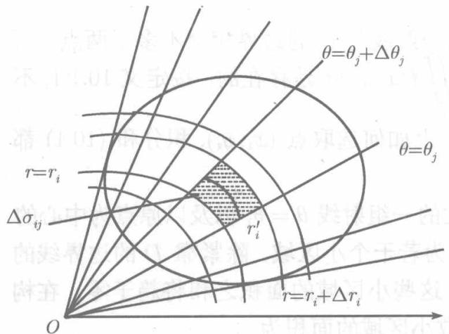
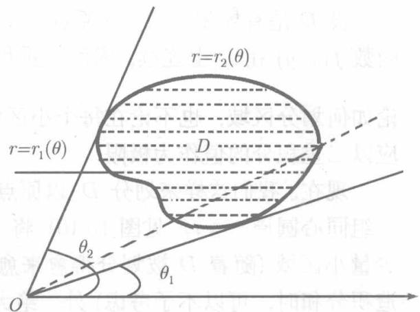
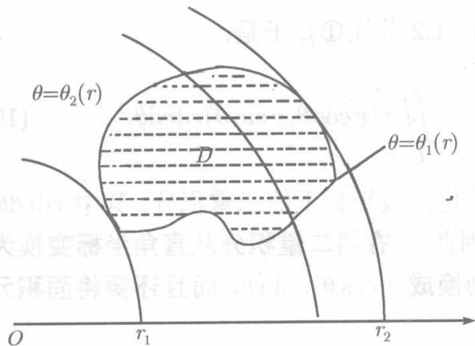
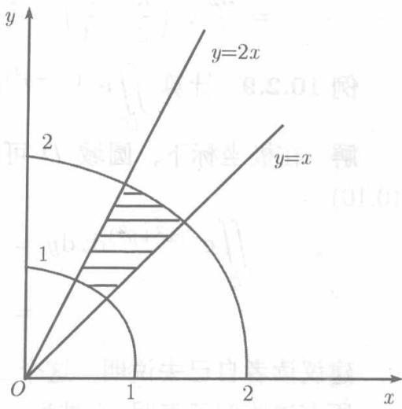
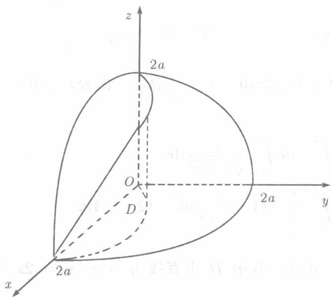
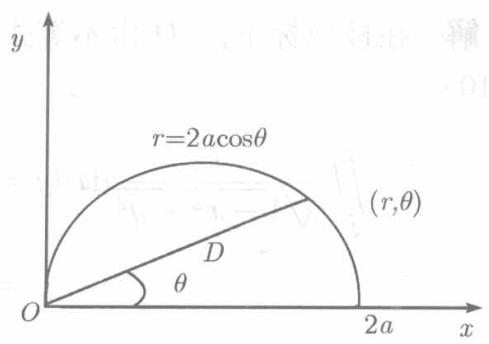

前面已经介绍了在直角坐标系中计算二重积分的方法，但对于某些被积函数及某些积分区域，用极坐标要方便得多，现在我们来说明如何在极坐标 $(r,\theta)$ 下计算二重积分.

设 $D$ 是有界闭区域，从原点出发的每一射线与 $D$ 的边界相交不多于两点．而函数 $f(x,y)$ 在 $D$ 上连续，因而二重积分 $\iint_{D} f(x,y) \, \mathrm{d}\sigma$ 是存在的．按定义10.1.1，不论如何划分区域，也不论在每个小区域 $\sigma_i$ 上如何选取点 $(x_i, y_i)$ ，积分和(10.1)都应以二重积分的值作为极限.

现在，我们这样来划分 $D$ ，以原点出发的一组射线 $\theta = \theta_{i}$ 以及以原点为中心的一组同心圆周 $r = r_i$ (见图10.10)，将 $D$ 分为若干个小区域，除紧靠 $D$ 的边界线的少量小区域（随着 $D$ 被划分得愈来愈细，这些小区域的面积之和将趋于零，在构造积分和时，可以不予考虑）外，绝大多数小区域的面积为

$$
\begin{array}{l} \Delta \sigma_ {i j} = \frac {1}{2} (r _ {i} + \Delta r _ {i}) ^ {2} \Delta \theta_ {j} - \frac {1}{2} r _ {i} ^ {2} \Delta \theta_ {j} \\ = \left(r _ {i} + \frac {1}{2} \Delta r _ {i}\right) \Delta r _ {i} \Delta \theta_ {j}, \\ \end{array}
$$

其中 $\Delta r_{i} = r_{i + 1} - r_{i},\Delta \theta_{j} = \theta_{j + 1} - \theta_{j}.$

将被积函数 $f(x,y)$ 以极坐标 $x = r\cos \theta, y = r\sin \theta$ 代入，记 $F(r,\theta) = f(r\cos \theta, r\sin \theta)$ . 又令 $r_i' = \frac{1}{2}(r_i + r_{i+1})$ ，即 $r_i' = \frac{1}{2}(r_i + r_i + \Delta r_i) = \left(r_i + \frac{\Delta r_i}{2}\right)$ ，在每个小区域 $\Delta \sigma_{ij}$ 内的圆弧 $r = r_i'$ 上随意取一点的函数值 $F(r_i', \theta_j')$ 并作成和数

$$
\sum_ {i, j} F \left(r _ {i} ^ {\prime}, \theta_ {j} ^ {\prime}\right) \Delta \sigma_ {i j} = \sum_ {i, j} F \left(r _ {i} ^ {\prime}, \theta_ {j} ^ {\prime}\right) r _ {i} ^ {\prime} \Delta r _ {i} \Delta \theta_ {j},
$$

则当一切小区域的直径的最大者趋于零时，这和数应以 $\iint_{D} f(x, y) \mathrm{d}x \mathrm{~d}y$ 为极限，而同时也应以 $\iint_{D} F(r, \theta) r \mathrm{~d}r \mathrm{~d}\theta$ 为极限（见10.1.2节注①），于是，

$$
\iint_ {D} f (x, y) \mathrm {d} x \mathrm {d} y = \iint_ {D} F (r, \theta) r \mathrm {d} r \mathrm {d} \theta = \iint_ {D} f (r \cos \theta , r \sin \theta) r \mathrm {d} r \mathrm {d} \theta . \tag {10.8}
$$

公式(10.8)把直角坐标下的二重积分化为极坐标下的二重积分，其中 $r\mathrm{d}r\mathrm{d}\theta$ 称为极坐标下的面积元素： $\mathrm{d}\sigma = r\mathrm{d}r\mathrm{d}\theta$ 因此，在将二重积分从直角坐标变换为极坐标时不但要将被积函数中的 $x,y$ 分别换成 $r\cos \theta ,r\sin \theta$ ，而且还要将面积元素 $\mathrm{d}x\mathrm{d}y$ 换为 $r\mathrm{d}r\mathrm{d}\theta$ ，因子 $r$ 切切不可遗漏！

作了这种变换以后，如何计算右端的重积分呢？这可以像10.2.1节所做的那样化为累次积分。需要注意，虽然(10.8)式两端的积分区域都记为 $D$ ，但在右端， $D$ 应该改用极坐标下的不等式组表示。

如果区域 $D$ 的点的最大极角为 $\theta_{2}$ , 最小极角为 $\theta_{1}$ , 且对区间 $(\theta_{1}, \theta_{2})$ 内的每个 $c$ , 射线 $\theta = c$ 与 $D$ 的边界相交不多于两点 (见图 10.11) 则 $D$ 可以用不等式表示为

$$
D: \theta_ {1} \leqslant \theta \leqslant \theta_ {2}, \quad r _ {1} (\theta) \leqslant r \leqslant r _ {2} (\theta).
$$

  
图10.10

  
图10.11

于是（10.8）右端的二重积分可化为累次积分：

$$
\iint_ {D} f (r \cos \theta , r \sin \theta) r \mathrm {d} r \mathrm {d} \theta = \int_ {\theta_ {1}} ^ {\theta_ {2}} \mathrm {d} \theta \int_ {r _ {1} (\theta)} ^ {r _ {2} (\theta)} f (r \cos \theta , r \sin \theta) r \mathrm {d} r, \tag {10.9}
$$

关于 $r$ 积分时，视 $\theta$ 为常数

极点 $O$ 在区域 $D$ 内部时，就属于这种情形．此时， $0\leqslant \theta \leqslant 2\pi ,r_1(\theta)\equiv 0,$ (10.9）成为

$$
\iint_ {D} f (r \cos \theta , r \sin \theta) r \mathrm {d} r \mathrm {d} \theta = \int_ {0} ^ {2 \pi} \mathrm {d} \theta \int_ {0} ^ {r (\theta)} f (r \cos \theta , r \sin \theta) r \mathrm {d} r, \tag {10.10}
$$

其中 $r = r(\theta)$ 是 $D$ 的周界的极坐标方程

  
图10.12

如果区域 $D$ 的最大极径为 $r_2$ ，最小极径为 $r_1$ ，且对于区间 $(r_1,r_2)$ 内的每个 $c,$ 圆周 $r = c$ 与区域 $D$ 的边界相交不多于两点(见图10.12)，则 $D$ 可以用不等式表示为

$$
D: r _ {1} \leqslant r \leqslant r _ {2}, \theta_ {1} (r) \leqslant \theta \leqslant \theta_ {2} (r).
$$

此时，(10.8)右端的重积分可化为累次积分：

$$
\iint_ {D} f (r \cos \theta , r \sin \theta) r \mathrm {d} r \mathrm {d} \theta = \int_ {r _ {1}} ^ {r _ {2}} r \mathrm {d} r \int_ {\theta_ {1} (r)} ^ {\theta_ {2} (r)} f (r \cos \theta , r \sin \theta) \mathrm {d} \theta , \tag {10.11}
$$

关于 $\theta$ 积分时视 $r$ 为常数

例10.2.6 计算 $\iint_{D} \frac{1}{\sqrt{1 - x^2 - y^2}} \mathrm{d}x \mathrm{d}y,$ 其中 $D$ 为圆域 $x^2 + y^2 \leqslant \frac{1}{4}$ .

解 在极坐标下， $D$ 由不等式 $0 \leqslant \theta \leqslant 2\pi, 0 \leqslant r \leqslant \frac{1}{2}$ 表示，由公式 (10.8) 和 (10.10)，

$$
\begin{array}{l} \iint_ {D} \frac {1}{\sqrt {1 - x ^ {2} - y ^ {2}}} \mathrm {d} x \mathrm {d} y = \int_ {0} ^ {2 \pi} \mathrm {d} \theta \int_ {0} ^ {\frac {1}{2}} \frac {r}{\sqrt {1 - r ^ {2}}} \mathrm {d} r \\ = \int_ {0} ^ {2 \pi} \left[ - \sqrt {1 - r ^ {2}} \right] _ {0} ^ {\frac {1}{2}} \mathrm {d} \theta = (2 - \sqrt {3}) \pi . \\ \end{array}
$$

例10.2.7 计算 $\iint_{D} \left(1 + \frac{y^2}{x^2}\right) \mathrm{e}^{\frac{y}{x}} \mathrm{d}x \mathrm{d}y$ ，其中 $D$ 由直线 $y = x, y = 2x$ ，圆 $x^2 + y^2 = 1, x^2 + y^2 = 4$ 所围成的位于第一象限的区域（见图10.13）

解 $D:1\leqslant r\leqslant 2,\frac{\pi}{4}\leqslant \theta \leqslant \arctan 2.$ 按公式(10.8)和(10.11),

$$
\begin{array}{l} \iint_ {D} \left(1 + \frac {y ^ {2}}{x ^ {2}}\right) \mathrm {e} ^ {\frac {y}{x}} \mathrm {d} x \mathrm {d} y = \int_ {1} ^ {2} r \mathrm {d} r \int_ {\frac {\pi}{4}} ^ {\arctan 2} (1 + \tan^ {2} \theta) \mathrm {e} ^ {\tan \theta} \mathrm {d} \theta \\ = \left[ \frac {r ^ {2}}{2} \right] _ {1} ^ {2} \cdot \left[ e ^ {\tan \theta} \right] _ {\frac {\pi}{4}} ^ {\arctan 2} = \frac {3}{2} e (e - 1). \\ \end{array}
$$

读者易见，利用公式（10.8）、（10.9）也可得同一结果.

例10.2.8 求球面 $x^{2} + y^{2} + z^{2} = 4a^{2}$ 与圆柱面 $x^{2} + y^{2} = 2ax(a > 0)$ 所围成的且在柱体内的那部分的体积

**解** 所述的立体关于 $xOy$ 平面以及 $xOz$ 平面都是对称的，因此，只需求出位于第一卦限的体积乘以4,即得所求体积 $V$ .而在第一卦限的立体是一个曲顶柱体(见图10.14)，曲顶方程为 $z = \sqrt{4a^2 - x^2 - y^2}$ ，底为 $xOy$ 平面内的区域 $D$ （见图10.15），

  
图10.13

$$
D: y \geqslant 0, x ^ {2} + y ^ {2} \leqslant 2 a x.
$$

在极坐标下，可以表示为

$$
D \colon 0 \leqslant \theta \leqslant \frac {\pi}{2}, 0 \leqslant r \leqslant 2 a \cos \theta .
$$

  
图10.14

  
图10.15

于是，由公式（10.8）、（10.9）得

$$
\begin{array}{l} V = 4 \iint_ {D} \sqrt {4 a ^ {2} - x ^ {2} - y ^ {2}} \mathrm {d} x \mathrm {d} y = 4 \int_ {0} ^ {\frac {\pi}{2}} \mathrm {d} \theta \int_ {0} ^ {2 a \cos \theta} \sqrt {4 a ^ {2} - r ^ {2}} r \mathrm {d} r \\ = 4 \int_ {0} ^ {\frac {\pi}{2}} \left[ - \frac {1}{3} (4 a ^ {2} - r ^ {2}) ^ {\frac {3}{2}} \right] _ {0} ^ {2 a \cos \theta} d \theta = \frac {32}{3} a ^ {3} \int_ {0} ^ {\frac {\pi}{2}} (1 - \sin^ {3} \theta) d \theta \\ = \frac {32}{3} a ^ {3} \left(\frac {\pi}{2} - \frac {2}{3}\right) = \frac {16 a ^ {3}}{3} \left(\pi - \frac {4}{3}\right). \\ \end{array}
$$

例10.2.9 计算 $\iint_{D} \mathrm{e}^{-(x^2 + y^2)} \, \mathrm{d}x \, \mathrm{d}y$ , $D$ 是圆域 $x^2 + y^2 \leqslant a^2 (a > 0)$ .

解 在极坐标下，圆域 $D$ 可表为 $0 \leqslant \theta \leqslant 2\pi, 0 \leqslant r \leqslant a$ 。由公式 (10.8) 和 (10.10)

$$
\begin{array}{l} \iint_ {D} \mathrm {e} ^ {- (x ^ {2} + y ^ {2})} \mathrm {d} x \mathrm {d} y = \int_ {0} ^ {2 \pi} \mathrm {d} \theta \int_ {0} ^ {a} r \mathrm {e} ^ {- r ^ {2}} \mathrm {d} r = 2 \pi \left[ - \frac {1}{2} \mathrm {e} ^ {- r ^ {2}} \right] _ {0} ^ {a} \\ = \pi (1 - e ^ {- a ^ {2}}). \\ \end{array}
$$

建议读者自己去说明，这个二重积分在直角坐标系中是无法计算的。

所有这些例子表明，当被积函数是 $f(x^{2} + y^{2}), f\left(\frac{y}{x}\right)$ ，或积分区域是圆形区域、圆环形区域、扇形区域时，采用极坐标计算，往往会比较方便.
