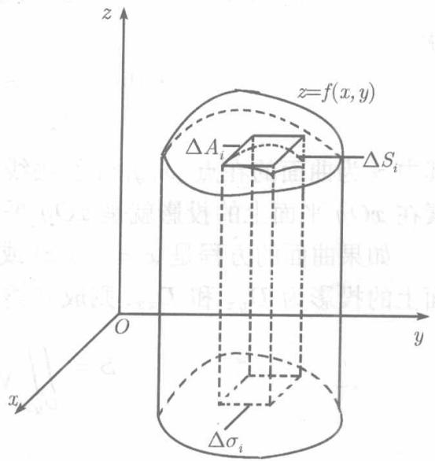

5.4.5节曾以定积分计算过一种特殊的曲面——旋转面的表面积，现在，利用二重积分定义一般曲面的面积并给出计算方法。

设 $S$ 是曲面 $z = f(x,y)$ 上的一块或全部，而函数 $f(x,y)$ 有一阶的连续偏导数 $f_{x}^{\prime}$ 和 $f_{y}^{\prime}$ ，因而在曲面 $S$ 的每一点都有切平面.

记 $S$ 在 $xOy$ 平面上的投影区域为 $D$ 用平行于 $Ox$ 轴及 $Oy$ 轴的两组直线将 $D$ 分为 $n$ 个小区域， $\Delta \sigma_{1},\Delta \sigma_{2},\dots ,\Delta \sigma_{n}$ ，以每个小区域的边界作为准线作母线平行于 $Oz$ 轴的柱面，这些柱面将 $S$ 分为 $n$ 个小块 $\Delta S_1,\Delta S_2,\dots ,\Delta S_n$ .在 $\Delta \sigma_{i}(i = 1,2,\dots ,$ n)内任取一点 $(x_{i},y_{i})$ ，在点 $(x_{i},y_{i},f(x_{i},y_{i}))$ 作曲面 $S$ 的切平面 $\pi_i$ ，则 $\pi_{i}$ 也被包围 $\Delta S_{i}$ 的那个柱面截下一块，记为 $\Delta A_{i}$ （见图10.16).在下文， $S,\Delta S_i,\Delta A_i$ 以及 $\Delta \sigma_{i}$ 的面积仍旧记为 $S,\Delta S_i,\Delta A_i,\Delta \sigma_i$ ，由于 $\Delta S_{i}$ 及 $\Delta A_{i}$

  
图10.16

在 $xOy$ 平面上的投影区域都是 $\Delta \sigma_{i}$ ，以小块切面的面积 $\Delta A_{i}$ 代替小块曲面的面积 $\Delta S_{i}$ ，则得到面积 $S$ 的近似值

$$
S \approx \sum_ {i = 1} ^ {n} \Delta A _ {i}.
$$

设 $S$ 在点 $(x_{i},y_{i},f(x_{i},y_{i}))$ 的法线与 $Oz$ 轴所成的锐角为 $\gamma_{i}$ ，由于这一法线的方向矢量为 $\{f_x'(x_i,y_i),f_y'(x_i,y_i), - 1\}$ ，故

$$
\cos \gamma_ {i} = \frac {1}{\sqrt {1 + f _ {x} ^ {\prime 2} (x _ {i} , y _ {i}) + f _ {y} ^ {\prime 2} (x _ {i} , y _ {i})}},
$$

又

$$
\Delta \sigma_ {i} = \Delta A _ {i} \cos \gamma_ {i},
$$

所以

$$
\Delta A _ {i} = \sqrt {1 + f _ {x} ^ {\prime 2} (x _ {i} , y _ {i}) + f _ {y} ^ {\prime 2} (x _ {i} , y _ {i})} \Delta \sigma_ {i},
$$

$$
S \approx \sum_ {i = 1} ^ {n} \sqrt {1 + f _ {x} ^ {\prime 2} (x _ {i} , y _ {i}) + f _ {y} ^ {\prime 2} (x _ {i} , y _ {i})} \Delta \sigma_ {i}.
$$

当每个 $\Delta \sigma_{i}$ 的直径都趋于零时，这个和数的极限就定义为曲面 $S$ 的面积. 按二重积分的定义，此即

$$
S = \iint_ {D} \sqrt {1 + f _ {x} ^ {\prime 2} + f _ {y} ^ {\prime 2}} \mathrm {d} x \mathrm {d} y, \tag {10.12}
$$

其中， $\sqrt{1 + f_x^{\prime 2} + f_y^{\prime 2}}\mathrm{d}x\mathrm{d}y$ 称为曲面面积元素，记为 $\mathrm{d}S$ 由 $\mathrm{d}S = \sqrt{1 + f_x'^2 + f_y'^2}\mathrm{d}x\mathrm{d}y$ 得

$$
\mathrm {d} x \mathrm {d} y = \frac {1}{\sqrt {1 + f _ {x} ^ {\prime 2} + f _ {y} ^ {\prime 2}}} \mathrm {d} S = \cos \gamma \mathrm {d} S,
$$

其中 $\gamma$ 为曲面的在点 $(x,y,z)$ 的法线与 $Oz$ 轴所成的锐角．由此可见，曲面面积元素在 $xOy$ 平面上的投影就是 $xOy$ 平面上的面积元素 $\mathrm{d}x\mathrm{d}y$ (也记为 $\mathrm{d}\sigma_{xy}$

如果曲面的方程是 $x = g(y,z)$ 或 $y = h(z,x)$ 分别记它们在 $yOz$ 平面、 $zOx$ 平面上的投影为 $D_{yz}$ 和 $D_{zx}$ ，则成立类似于(10.12)的面积计算公式：

$$
S = \iint_ {D _ {y z}} \sqrt {1 + g _ {y} ^ {\prime 2} + g _ {z} ^ {\prime 2}} \mathrm {d} y \mathrm {d} z, \tag {10.13}
$$

$$
S = \iint_ {D _ {z x}} \sqrt {1 + h _ {z} ^ {\prime 2} + h _ {x} ^ {\prime 2}} \mathrm {d} z \mathrm {d} x. \tag {10.14}
$$

例10.2.10 求球面 $x^{2} + y^{2} + z^{2} = 4a^{2}$ 的上半部被圆柱面 $x^{2} + y^{2} = 2ax(a > 0)$ 所截下的曲面面积（见图10.14）

解 曲面的方程为 $z = \sqrt{4a^2 - x^2 - y^2}$ , 它在 $xOy$ 平面的投影区域为圆形域 $x^2 + y^2 \leqslant 2ax$ . 考虑到曲面关于 $xOz$ 平面是对称的, 只需求出在第一卦限的面积乘以 2 即可. 若采用极坐标, 则 (见图 10.15) $0 \leqslant \theta \leqslant \frac{\pi}{2}, 0 \leqslant r \leqslant 2a\cos \theta$ .

由于

$$
\frac {\partial z}{\partial x} = - \frac {x}{\sqrt {4 a ^ {2} - x ^ {2} - y ^ {2}}}, \quad \frac {\partial z}{\partial y} = - \frac {y}{\sqrt {4 a ^ {2} - x ^ {2} - y ^ {2}}},
$$

$$
\sqrt {1 + \left(\frac {\partial z}{\partial x}\right) ^ {2} + \left(\frac {\partial z}{\partial y}\right) ^ {2}} = \frac {2 a}{\sqrt {4 a ^ {2} - x ^ {2} - y ^ {2}}},
$$

由公式（10.12）得

$$
\begin{array}{l} S = \iint_ {D _ {x y}} \frac {2 a}{\sqrt {4 a ^ {2} - x ^ {2} - y ^ {2}}} \mathrm {d} x \mathrm {d} y = \iint_ {D _ {x y}} \frac {2 a r}{\sqrt {4 a ^ {2} - r ^ {2}}} \mathrm {d} r \mathrm {d} \theta \\ = 2 \int_ {0} ^ {\frac {\pi}{2}} \mathrm {d} \theta \int_ {0} ^ {2 a \cos \theta} \frac {2 a r}{\sqrt {4 a ^ {2} - r ^ {2}}} \mathrm {d} r \\ = 4 a \int_ {0} ^ {\frac {\pi}{2}} \left[ - \sqrt {4 a ^ {2} - r ^ {2}} \right] _ {0} ^ {2 a \cos \theta} d \theta = 8 a ^ {2} \int_ {0} ^ {\frac {\pi}{2}} (1 - \sin \theta) d \theta = 4 a ^ {2} (\pi - 2). \\ \end{array}
$$
