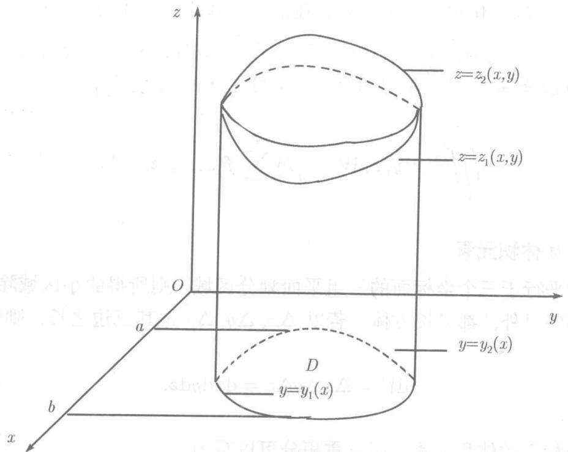
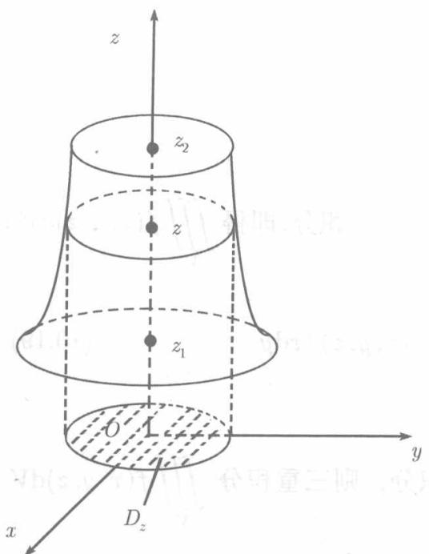
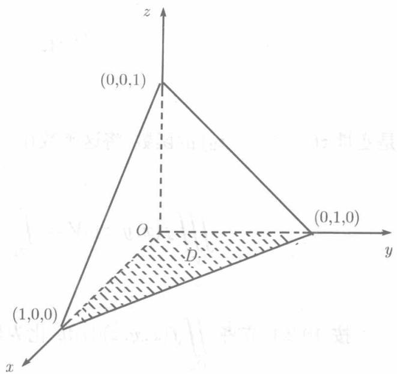

设函数 $f(x,y,z)$ 在空间的有界闭区域 $V$ 上连续，我们考虑几种常见的区域 $V$

首先设 $V$ 在 $xOy$ 平面上的投影区域为 $D$ . 而平行于 $Oz$ 轴且不在 $V$ 的边界面上的任何直线与 $V$ 的边界面相交不多于两点, 则以 $D$ 的边界线为准线而母线平行 $Oz$ 轴的柱面在 $V$ 的边界面上围起上、下两个曲面 (见图 10.17), 设它们的方程分别为 $z = z_{2}(x,y)$ 和 $z = z_{1}(x,y)$ , 它们都在 $D$ 上连续且 $z_{1}(x,y) \leqslant z_{2}(x,y)$ .

  
图10.17

为了计算 $f(x,y,z)$ 在 $V$ 上的积分，先视 $x,y$ 为常数，将 $f(x,y,z)$ 关于 $z$ 积分，积分下限取为 $z_{1}(x,y)$ ，上限取为 $z_{2}(x,y)$ ，得到 $x,y$ 的函数

$$
F (x, y) = \int_ {z _ {1} (x, y)} ^ {z _ {2} (x, y)} f (x, y, z) \mathrm {d} z, \tag {10.15}
$$

然后再计算这个函数在 $D$ 上的二重积分

$$
\iint_ {D} F (x, y) \mathrm {d} \sigma = \iint_ {D} \left[ \int_ {z _ {1} (x, y)} ^ {z _ {2} (x, y)} f (x, y, z) \mathrm {d} z \right] \mathrm {d} \sigma . \tag {10.16}
$$

而右端的二重积分可以按10.2.1节的办法化为累次积分．于是，视投影区域 $D$ 的形状．三重积分可化为各需积分三次的两个累次积分之一：

$$
\iiint_ {V} f (x, y, z) \mathrm {d} V = \int_ {a} ^ {b} \mathrm {d} x \int_ {y _ {1} (x)} ^ {y _ {2} (x)} \mathrm {d} y \int_ {z _ {1} (x, y)} ^ {z _ {2} (x, y)} f (x, y, z) \mathrm {d} z, \tag {10.17}
$$

或

$$
\iiint_ {V} f (x, y, z) \mathrm {d} V = \int_ {c} ^ {\mathrm {d}} \mathrm {d} y \int_ {x _ {1} (y)} ^ {x _ {2} (y)} \mathrm {d} x \int_ {z _ {1} (x, y)} ^ {z _ {2} (x, y)} f (x, y, z) \mathrm {d} z, \tag {10.18}
$$

其次，如图10.18，设立体 $V$ 位于两个平面 $z = z_{1}$ 及 $z = z_{2}$ 之间 $(z_{1} < z_{2})$ ，而位于这两个平面之间的且与它们平行的平面截立体 $V$ 得一平面图形，将这一平面

图形在 $xOy$ 平面上的投影记为 $D_z$ ，则

$$
\iint_ {D _ {z}} f (x, y, z) \mathrm {d} x \mathrm {d} y,
$$

是变量 $z(z_{1}\leqslant z\leqslant z_{2})$ 的函数，将这函数在区间 $[z_1,z_2]$ 上积分，即得 $\iiint_V f(x,y,z)\mathrm{d}V$

$$
\iiint_ {V} f (x, y, z) \mathrm {d} V = \int_ {z _ {1}} ^ {z _ {2}} \mathrm {d} z \iint_ {D _ {z}} f (x, y, z) \mathrm {d} x \mathrm {d} y. \tag {10.19}
$$

按10.2.1节将 $\iint_{D_z}f(x,y,z)\mathrm{d}x\mathrm{d}y$ 化为累次积分，则三重积分 $\iiint_{V}f(x,y,z)\mathrm{d}V$ 也将化为积分三次的累次积分.

特别, 若 $V$ 是长方体 $a_1 \leqslant x \leqslant a_2, b_1 \leqslant y \leqslant b_2, c_1 \leqslant c \leqslant c_2$ , 由 (10.16) 及 (10.19) 都可得到

$$
\iiint_ {V} f (x, y, z) \mathrm {d} V = \int_ {a _ {1}} ^ {a _ {2}} \mathrm {d} x \int_ {b _ {1}} ^ {b _ {2}} \mathrm {d} y \int_ {c _ {1}} ^ {c _ {2}} f (x, y, z) \mathrm {d} z,
$$

此时，三重积分 $\iiint_{V} f(x, y, z) \mathrm{d}V$ 也记为 $\int_{a_1}^{a_2} \int_{b_1}^{b_2} \int_{c_1}^{c_2} f(x, y, z) \mathrm{d}x \mathrm{d}y \mathrm{d}z$ .

类似地，若平行于 $Oy$ 轴或 $Ox$ 轴且不在 $V$ 的边界面上的任何直线与 $V$ 的边界相交不多于两点，则三重积分可以通过与(10.16)类似的公式化为其他次序的累次积分。若立体 $V$ 位于两个平面 $y = y_{1}$ 及 $y = y_{2}$ 之间，或两个平面 $x = x_{1}$ 及 $x = x_{2}$ 之间，可通过类似于(10.19)的公式化三重积分为累次积分。

最后，若坐标轴的某些平行线与 $V$ 的边界面的交点多于两个，则需将 $V$ 分为几个小区域，使每个小区域上的三重积分可以用适当次序的累次积分算出。再将所得结果相加，以得到整个 $V$ 上的积分。

例10.3.1 计算三重积分 $I = \iiint_{V} \frac{1}{(1 + x + y + z)^3} \mathrm{d}x \mathrm{d}y \mathrm{d}z,$ 其中区域 $V$ 为由平面 $x + y + z = 1$ 与三个坐标面所围成的四面体（见图10.19）

解 $V$ 在 $xOy$ 平面上的投影 $D$ 是由直线 $x = 0, y = 0, x + y = 1$ 所围成的三角形， $V$ 可以用不等式组表示为：

  
图10.18

  
图10.19

$$
0 \leqslant z \leqslant 1 - x - y, \quad 0 \leqslant y \leqslant 1 - x, \quad 0 \leqslant x \leqslant 1.
$$

在公式 (10.16) 中取 $z_{1}(x,y) = 0, z_{2}(x,y) = 1 - x - y,$ 再将 $D$ 上的二重积分化为累次积分 (即 (10.17)), 得

$$
I = \int_ {0} ^ {1} \mathrm {d} x \int_ {0} ^ {1 - x} \mathrm {d} y \int_ {0} ^ {1 - x - y} {\frac {1}{(1 + x + y + z) ^ {3}}} \mathrm {d} z.
$$

从 $z$ 开始逐一进行积分：

$$
\int_ {0} ^ {1 - x - y} \frac {1}{(1 + x + y + z) ^ {3}} \mathrm {d} z = \left[ - \frac {1}{2} \frac {1}{(1 + x + y + z) ^ {2}} \right] _ {0} ^ {1 - x - y} = \frac {1}{2} \left(\frac {1}{(1 + x + y) ^ {2}} - \frac {1}{4}\right),
$$

$$
\frac {1}{2} \int_ {0} ^ {1 - x} \left(\frac {1}{(1 + x + y) ^ {2}} - \frac {1}{4}\right) d y = \frac {1}{2} \left[ - \frac {1}{1 + x + y} - \frac {1}{4} y \right] _ {0} ^ {1 - x} = \frac {1}{2} \left(\frac {1}{1 + x} - \frac {3 - x}{4}\right),
$$

最后，

$$
\frac {1}{2} \int_ {0} ^ {1} \left(\frac {1}{1 + x} - \frac {3 - x}{4}\right) d x = \frac {1}{2} \left(\ln 2 - \frac {5}{8}\right).
$$

建议读者从(10.19)出发，计算例10.3.1中的积分 $I$
