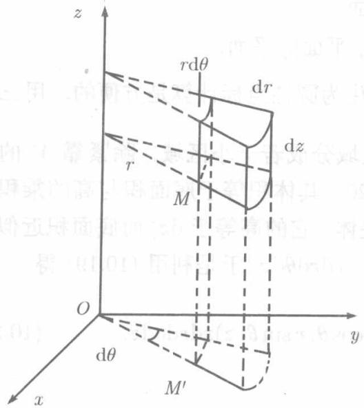
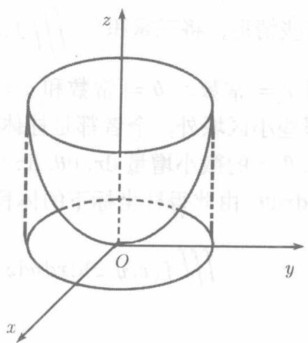

设空间的点 $M(x,y,z)$ 在 $xOy$ 平面上的投影为 $M^{\prime}$ , 若 $xOy$ 平面上以原点 $O$ 为极点 $Ox$ 轴为极轴时 $M^{\prime}$ 的极坐标为 $r,\theta$ , 则三个数的有序数组 $r,\theta,z$ 称为点 $M$

的圆柱坐标. 显然， $M$ 的直角坐标与圆柱坐标之间的关系是

$$
x = r \cos \theta , \quad y = r \sin \theta , \quad z = z. \tag {10.20}
$$

圆柱坐标系中的三组坐标面为：

$r =$ 常数 $(0\leqslant r <   + \infty)$ ， $r > 0$ 时，是以 $Oz$ 轴为轴的圆柱面；

$\theta =$ 常数 $(0\leqslant \theta \leqslant 2\pi)$ ，是过 $Oz$ 轴的半平面；

$z =$ 常数 $(-\infty < z < +\infty)$ , 是平行于 $xOy$ 平面的平面.

有些情形，将三重积分 $\iiint_{V} f(x, y, z) \mathrm{d}V$ 化为圆柱坐标计算是方便的。用三组坐标面 $r =$ 常数、 $\theta =$ 常数和 $z =$ 常数将区域分成若干小区域，除紧靠 $V$ 的边界的那些小区域外，余者都是柱体（见图10.20），其体积等于底面积与高的乘积。考察 $r, \theta, z$ 的微小增量 $\mathrm{d}r, \mathrm{d}\theta, \mathrm{d}z$ 所形成的柱体，它的高等于 $\mathrm{d}z$ ，而底面积近似地等于 $r \mathrm{~d}r \mathrm{~d}\theta$ 。由此得柱坐标下的体积元素 $\mathrm{d}V = r \mathrm{~d}r \mathrm{~d}\theta \mathrm{~d}z$ ，于是利用（10.19）得

$$
\iiint_ {V} f (x, y, z) \mathrm {d} x \mathrm {d} y \mathrm {d} z = \iiint_ {V} f (r \cos \theta , r \sin \theta , z) r \mathrm {d} r \mathrm {d} \theta \mathrm {d} z. \tag {10.21}
$$

即：在将三重积分从直角坐标变换为圆柱坐标时，不但要将被积函数中的 $x, y, z$ 用圆柱坐标表示，而且还要将体积元素 $\mathrm{d}x\mathrm{d}y\mathrm{d}z$ 换成 $\mathrm{r}\mathrm{d}r\mathrm{d}\theta\mathrm{d}z$

(10.21) 右端是圆柱坐标下的三重积分，可以仿照 10.3.1 节对直角坐标下的三重积分所做的那样，化为对 $r, \theta, z$ 的累次积分。例如，若积分区域 $V$ 在柱坐标下由不等式组表示为

$$
\alpha \leqslant \theta \leqslant \beta , \quad r _ {1} (\theta) \leqslant r \leqslant r _ {2} (\theta), \quad z _ {1} (r, \theta) \leqslant z \leqslant z _ {2} (r, \theta),
$$

则

$$
\iiint_ {V} f (x, y, z) \mathrm {d} x \mathrm {d} y \mathrm {d} z = \int_ {\alpha} ^ {\beta} \mathrm {d} \theta \int_ {r _ {1} (\theta)} ^ {r _ {2} (\theta)} r \mathrm {d} r \int_ {z _ {1} (r, \theta)} ^ {z _ {2} (r, \theta)} f (r \cos \theta , r \sin \theta , z) \mathrm {d} z.
$$

例10.3.2 计算三重积分 $\iiint_{V} z \, \mathrm{d}x \, \mathrm{d}y \, \mathrm{d}z$ , 其中 $V$ 由椭圆抛物面 $z = x^2 + y^2$ 和平面 $z = h^2$ 所围成（见图10.21）

解积分区域 $V$ 在 $xOy$ 平面上的投影是一个圆形域，这启发我们采用圆柱坐标，在圆柱坐标下， $V$ 可以用不等式组表示为

$$
0 \leqslant \theta \leqslant 2 \pi , \quad 0 \leqslant r \leqslant h, \quad r ^ {2} \leqslant z \leqslant h ^ {2},
$$

利用（10.21）变换为圆柱坐标后再化为累次积分得

$$
\begin{array}{l} \iiint_ {V} z \mathrm {d} x \mathrm {d} y \mathrm {d} z = \iiint_ {V} z r \mathrm {d} r \mathrm {d} \theta \mathrm {d} z = \int_ {0} ^ {2 \pi} \mathrm {d} \theta \int_ {0} ^ {h} r \mathrm {d} r \int_ {r ^ {2}} ^ {h ^ {2}} z \mathrm {d} z \\ = 2 \pi \int_ {0} ^ {h} r \left(\frac {h ^ {4}}{2} - \frac {r ^ {4}}{2}\right) d r = \pi \left(\frac {r ^ {2} h ^ {4}}{2} - \frac {r ^ {6}}{6}\right) \Bigg | _ {0} ^ {h} = \frac {1}{3} \pi h ^ {6}. \\ \end{array}
$$

  
图10.20

  
图10.21

读者不妨试行用其他顺序的累次积分计算圆柱坐标系中的三重积分
