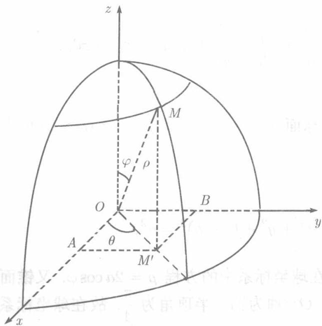
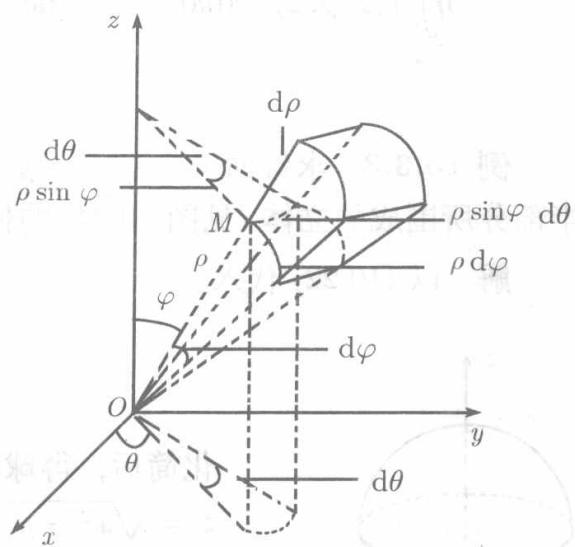
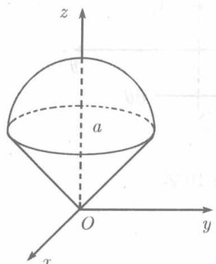

设 $M(x,y,z)$ 是空间的任意一点，以 $\rho$ 表示 $O$ 与 $M$ 之间的距离， $\varphi$ 表示 $\overrightarrow{OM}$ 与 $Oz$ 轴的正方向之间的夹角， $\theta$ 表示点 $M$ 在 $xOy$ 平面上的投影 $M'$ 以 $O$ 为极点， $Ox$ 为极轴时的极角，则三个数的有序数组 $\rho, \varphi, \theta$ 称为点 $M$ 的球坐标（见图10.22）

过 $M$ 作 $xOy$ 平面的垂线，记垂足为 $M^{\prime}$ ，过 $M^{\prime}$ 作 $Ox$ 轴及 $Oy$ 轴的垂线，垂足依次记为 $A$ 和 $B$

由于在直角三角形 $OMM^{\prime}$ 中， $OM^{\prime} = OM\sin \varphi$ ， $M^{\prime}M = OM\cos \varphi$ ，易得 $M$ 的直角坐标与球坐标之间的关系为：

$$
\left\{ \begin{array}{l} x = O A = O M ^ {\prime} \cos \theta = O M \sin \varphi \cos \theta = \rho \sin \varphi \cos \theta , \\ y = O B = O M ^ {\prime} \sin \theta = O M \sin \varphi \sin \theta = \rho \sin \varphi \sin \theta , \\ z = M ^ {\prime} M = O M \cos \varphi = \rho \cos \varphi . \end{array} \right. \tag {10.22}
$$

  
图10.22

  
图10.23

球坐标系中的三组坐标面为：

$\rho =$ 常数 $(0\leqslant \rho < + \infty)$ ， $\rho >0$ 时是以原点为球心的球面；

$\varphi =$ 常数 $(0\leqslant \varphi \leqslant \pi)$ ， $\varphi >0$ 时是以原点为顶点， $Oz$ 轴为轴的圆锥面；

$\theta =$ 常数 $(0\leqslant \theta \leqslant 2\pi)$ ，即过 $Oz$ 轴的半平面

为了把直角坐标下的三重积分化为球坐标下的三重积分，以三组坐标面 $\rho =$ 常数， $\varphi =$ 常数， $\theta =$ 常数将积分区域 $V$ 分成若干个小区域，除紧靠 $V$ 的边界的那些以外，都是六面体(见图10.23).

现在考虑由 $\rho, \varphi, \theta$ 各获得微小增量 $\mathrm{d}\rho, \mathrm{d}\varphi, \mathrm{d}\theta$ 所成的六面体，将它近似地看作从同一顶点出发的三棱之长为 $\mathrm{d}\rho, \rho \mathrm{d}\varphi, \rho \sin \varphi \mathrm{d}\theta$ 的长方体，则得球坐标系中的体积元素 $\mathrm{d}V = \rho^2 \sin \varphi \mathrm{d}\rho \mathrm{d}\varphi \mathrm{d}\theta$ . 利用关系式 (10.22) 得

$$
\iiint_ {V} f (x, y, z) \mathrm {d} x \mathrm {d} y \mathrm {d} z = \iiint_ {V} F (\rho , \varphi , \theta) \rho^ {2} \sin \varphi \mathrm {d} \rho \mathrm {d} \varphi \mathrm {d} \theta , \tag {10.23}
$$

其中 $F(\rho, \varphi, \theta) = f(\rho \sin \varphi \cos \theta, \rho \sin \varphi \sin \theta, \rho \cos \varphi)$ . 即：在将三重积分从直角坐标变换为球坐标时，不但要将被积函数中的 $x, y, z$ 用球坐标表示，而且还要将体积元素 $\mathrm{d}x\mathrm{d}y\mathrm{d}z$ 改换成 $\rho^2\sin \varphi \mathrm{d}\rho \mathrm{d}\varphi \mathrm{d}\theta$ .

(10.23) 右端是球坐标下的三重积分，也可仿照 10.3.1 节对直角坐标下的三重积分所做的那样，化为对 $\rho, \varphi, \theta$ 的累次积分。

例如，若积分区域 $V$ 在球面坐标下用不等式组表示为

$$
\alpha \leqslant \theta \leqslant \beta , \quad \varphi_ {1} (\theta) \leqslant \varphi \leqslant \varphi_ {2} (\theta), \quad \rho_ {1} (\varphi , \theta) \leqslant \rho \leqslant \rho_ {2} (\varphi , \theta),
$$

则

$$
\iint_ {V} f (x, y, z) \mathrm {d} x \mathrm {d} y \mathrm {d} z = \int_ {\alpha} ^ {\beta} \mathrm {d} \theta \int_ {\varphi_ {1} (\theta)} ^ {\varphi_ {2} (\theta)} \mathrm {d} \varphi \int_ {\rho_ {1} (\varphi , \theta)} ^ {\rho_ {2} (\varphi , \theta)} F (\rho , \varphi , \theta) \rho^ {2} \sin \varphi \mathrm {d} \rho .
$$

例10.3.3 求锥面 $z = \sqrt{x^2 + y^2}$ 与球面 $x^{2} + y^{2} + (z - a)^{2} = a^{2}(a > 0)$ 的上半部分所围成的立体（见图10.24）的体积

解 以 (10.22) 代入

  
图10.24

$$
x ^ {2} + y ^ {2} + (z - a) ^ {2} = a ^ {2},
$$

化简后，得球面在球坐标系中的方程 $\rho = 2a\cos \varphi$ 又锥面 $z = \sqrt{x^2 + y^2}$ 以 $Oz$ 轴为轴，半顶角为 $\frac{\pi}{4}$ . 故在球坐标系中其方程是 $\varphi = \frac{\pi}{4}$ . 于是积分区域 $V$ 在球坐标下可以用不等式组表示为

$$
V: 0 \leqslant \theta \leqslant 2 \pi , 0 \leqslant \varphi \leqslant \frac {\pi}{4}, 0 \leqslant \rho \leqslant 2 a \cos \varphi .
$$

于是所求的体积为

$$
\begin{array}{l} V = \iiint_ {V} \mathrm {d} V = \iiint_ {V} \rho^ {2} \sin \varphi \mathrm {d} \rho \mathrm {d} \theta \mathrm {d} \varphi \\ = \int_ {0} ^ {2 \pi} d \theta \int_ {0} ^ {\frac {\pi}{4}} d \varphi \int_ {0} ^ {2 a \cos \varphi} \rho^ {2} \sin \varphi d \rho \\ = 2 \pi \int_ {0} ^ {\frac {\pi}{4}} \frac {1}{3} (2 a \cos \varphi) ^ {3} \cdot \sin \varphi d \varphi \\ = \frac {16 \pi a ^ {3}}{3} \cdot \left(- \frac {\cos^ {4} \varphi}{4}\right) \Bigg | _ {0} ^ {\frac {\pi}{4}} = \frac {4}{3} \pi a ^ {3} \left(1 - \frac {1}{4}\right) = \pi a ^ {3}. \\ \end{array}
$$

例10.3.4 计算 $\iiint_{V} \sqrt{x^2 + y^2} \, \mathrm{d}x \, \mathrm{d}y \, \mathrm{d}z,$ $V$ 为半球 $x^2 + y^2 + z^2 \leqslant 1, z \geqslant 0$ .

解 在球坐标系中，球面 $x^{2} + y^{2} + z^{2} = 1$ 的方程为 $\rho = 1$ 。积分区域 $V$ 在球坐标下可以用不等式组表示为

$$
V \colon 0 \leqslant \rho \leqslant 1, 0 \leqslant \theta \leqslant 2 \pi , 0 \leqslant \varphi \leqslant \frac {\pi}{2},
$$

于是

$$
\begin{array}{l} \iiint_ {V} \sqrt {x ^ {2} + y ^ {2}} d x d y d z = \iiint_ {V} \rho \sin \varphi \cdot \rho^ {2} \sin \varphi d \rho d \theta d \varphi \\ = \int_ {0} ^ {2 \pi} d \theta \int_ {0} ^ {\frac {\pi}{2}} d \varphi \int_ {0} ^ {1} \rho^ {3} \sin^ {2} \varphi d \rho = \int_ {0} ^ {2 \pi} d \theta \cdot \int_ {0} ^ {\frac {\pi}{2}} \sin^ {2} \varphi d \varphi \cdot \int_ {0} ^ {1} \rho^ {3} d \rho \\ = 2 \pi \cdot \frac {\pi}{4} \cdot \frac {1}{4} = \frac {\pi^ {2}}{8}. \\ \end{array}
$$

被积函数 $\sqrt{x^2 + y^2}$ 暗示我们，圆柱坐标也是可取的

一般说来，当被积函数是 $f(x^{2} + y^{2} + z^{2})$ 或积分区域是球或球的一部分时，球坐标是有用的.
