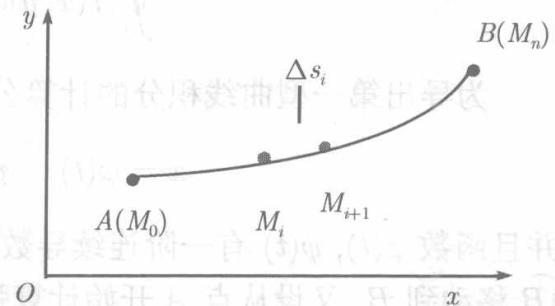

设沿 $xOy$ 平面上的曲线 $\widehat{AB}$ 分布有质量，一般说来，其分布不是均匀的，即线密度 $\rho$ 是 $x,y$ 的函数： $\rho = f(x,y)$ ，这里设 $f(x,y)$ 是 $\widehat{AB}$ 上的连续函数①.为了求整个曲线段 $\widehat{AB}$ 的质量 $m,$ 在 $\widehat{AB}$ 上从 $A$ 到

$B$ 依次取点 $M_{1}, M_{2}, \dots, M_{n-1}$ , 并记 $A = M_{0}$ , $B = M_{n}$ (见图11.1), 则 $\widehat{AB}$ 被分成 $n$ 个弧段, $\widehat{M_{i}M_{i+1}} (i = 0,1,\dots,n-1)$ , 记 $\widehat{M_{i}M_{i+1}}$ 之长为 $\Delta s_{i}$ , 并在 $\widehat{M_{i}M_{i+1}}$ 上任取一点 $(\xi_{i},\eta_{i})$ , 当 $\Delta s_{i}$ 很小时, 由于 $f(x,y)$ 的连续性, 它沿 $\widehat{M_{i}M_{i+1}}$ 变化不大, 可以近似地认为在整个 $\widehat{M_{i}M_{i+1}}$ 线密度为常数 $f(\xi_{i},\eta_{i})$ , 于是 $\widehat{M_{i}M_{i+1}}$ 的质量为 $f(\xi_{i},\eta_{i})\Delta s_{i}$ ,

  
图11.1

$$
m \approx \sum_ {i = 0} ^ {n - 1} f (\xi_ {i}, \eta_ {i}) \Delta s _ {i}.
$$

记 $|\Delta s| = \max_{0 \leqslant i \leqslant n-1} \Delta s_i$ , 容易想像, $|\Delta s|$ 充分小, 上式的精确性将充分高, 令 $|\Delta s| \to 0$ , 得

$$
m = \lim  _ {| \Delta s | \rightarrow 0} \sum_ {i = 0} ^ {n - 1} f (\xi_ {i}, \eta_ {i}) \Delta s _ {i}.
$$

撇开 $f(x,y)$ 的物理意义，数学上称上式右端的极限为 $f(x,y)$ 在曲线 $\widehat{AB}$ 上的第

一型曲线积分，也称为关于弧长的曲线积分，记为 $\int_{\widehat{AB}}f(x,y)\mathrm{d}s$

$$
\int_ {\widehat {A B}} f (x, y) \mathrm {d} s = \cdot \lim  _ {| \Delta s | \rightarrow 0} \sum_ {i = 0} ^ {n - 1} f \left(\xi_ {i}, \eta_ {i}\right) \Delta s _ {i}. \tag {11.1}
$$

于是，线密度为 $f(x,y)$ 的曲线 $\widehat{AB}$ 的质量为 $m = \int_{\widehat{AB}} f(x,y) \, \mathrm{d}s.$

按定义，显然有

$$
\begin{array}{l} \int_ {\widehat {A B}} f (x, y) \mathrm {d} s = \int_ {\widehat {B A}} f (x, y) \mathrm {d} s, \\ \int_ {\widehat {A B}} f (x, y) \mathrm {d} s + \int_ {\widehat {B C}} f (x, y) \mathrm {d} s = \int_ {\widehat {A C}} f (x, y) \mathrm {d} s. \\ \end{array}
$$

前一等式表示：函数在给定曲线 $\widehat{AB}$ 上的积分与 $\widehat{AB}$ 上的方向无关

沿空间曲线 $\widehat{AB}$ 的积分 $\int_{\widehat{AB}} f(x, y, z) \mathrm{d}s$ 可类似地定义.

第一型曲线积分的性质与二重积分类似

曲线 $\widehat{AB}$ 称为积分路径. 当积分路径为闭曲线 $L$ 时, 第一型曲线积分记为

$$
\oint_ {L} f (x, y) \mathrm {d} s, \quad \oint_ {L} f (x, y, z) \mathrm {d} s.
$$

为导出第一型曲线积分的计算公式，设 $\widehat{AB}$ 的参数方程为

$$
x = \varphi (t), \quad y = \psi (t) \quad (\alpha \leqslant t \leqslant \beta), \tag {11.2}
$$

并且函数 $\varphi(t), \psi(t)$ 有一阶连续导数①，当 $t$ 从 $\alpha$ 连续递增变到 $\beta$ 时，动点从 $A$ 沿 $\widehat{AB}$ 移动到 $B$ 。又设从点 $A$ 开始计算弧长，则对于 $\widehat{AB}$ 上的每一点 $M$ ，弧长 $s = \widehat{AM}$ 是参数 $t$ 的函数 $s = s(t)$ ， $s(\beta)$ 即 $\widehat{AB}$ 之长 $l$ 。反之， $t$ 也是弧长的函数 $t = t(s)$ 。因而 $x, y$ 既是 $t$ 的函数，也是 $s$ 的函数，设点 $(\xi_i, \eta_i)$ 对应于参数 $t_i$ 和弧长 $s_i$ ，则由(11.1)及定积分的定义，

$$
\begin{array}{l} \int_ {\widehat {A B}} f (x, y) \mathrm {d} s = \lim  _ {| \Delta s | \rightarrow 0} \sum_ {i = 0} ^ {n - 1} f (\xi_ {i}, \eta_ {i}) \Delta s _ {i} \\ = \lim  _ {| \Delta s | \rightarrow 0} \sum_ {i = 0} ^ {n - 1} f (x (s _ {i}), y (s _ {i})) \Delta s _ {i} = \int_ {0} ^ {l} f (x (s), y (s)) d s. \\ \end{array}
$$

在右端的定积分令 $s = s(t)$ ，则 $x(s(t)) = \varphi (t),y(s(t)) = \psi (t)$ （见(11.2)),又由第5章的(5.18)式知， $\mathrm{ds} = \sqrt{\varphi^{\prime 2}(t) + \psi^{\prime 2}(t)}\mathrm{dt}$ .于是，

$$
\int_ {\widehat {A B}} f (x, y) \mathrm {d} s = \int_ {\alpha} ^ {\beta} f (\varphi (t), \psi (t)) \sqrt {\varphi^ {\prime 2} (t) + \psi^ {\prime 2} (t)} \mathrm {d} t. \tag {11.3}
$$

即：为了将第一型曲线积分化为定积分，只需将被积函数中的变量代以参数表示式，同时将ds换成参数形式下的弧微分．而积分限应配置为下限小于上限.

如果曲线 $AB$ 是分段光滑的，则可将区间 $[\alpha, \beta]$ 分为若干个区间，使在每个区间上曲线是光滑的。在每个区间上应用 (11.3)，然后相加，即知，在 $[\alpha, \beta]$ 上公式 (11.3) 还是成立的。

若曲线 $\widehat{AB}$ 以直角坐标方程给出：

$$
y = y (x) \quad (a \leqslant x \leqslant b).
$$

且 $y(x)$ 在 $[a,b]$ 上有连续导数，则

$$
\int_ {\widehat {A B}} f (x, y) \mathrm {d} s = \int_ {a} ^ {b} f (x, y (x)) \sqrt {1 + y ^ {\prime 2} (x)} \mathrm {d} x. \tag {11.4}
$$

对于空间曲线

$$
x = \varphi (t), \quad y = \psi (t), \quad z = \omega (t) \quad (\alpha \leqslant t \leqslant \beta),
$$

类似于 (11.3), 有

$$
\int_ {\widehat {A B}} f (x, y, z) \mathrm {d} s = \int_ {\alpha} ^ {\beta} f (\varphi (t), \psi (t), \omega (t)) \sqrt {\varphi^ {\prime 2} (t) + \psi^ {\prime 2} (t) + \omega^ {\prime 2} (t)} \mathrm {d} t. \tag {11.5}
$$

例11.1.1 计算 $\int_{L} xy \, \mathrm{d}s$ , 其中 $L$ 为在第一象限的圆弧 $x^2 + y^2 = a^2 (a > 0)$ .

解法一 将 $L$ 用参数方程表示：

$$
x = a \cos t, \quad y = a \sin t \quad \left(0 \leqslant t \leqslant \frac {\pi}{2}\right).
$$

则

$$
\sqrt {x ^ {\prime 2} (t) + y ^ {\prime 2} (t)} = \sqrt {(- a \sin t) ^ {2} + (a \cos t) ^ {2}} = a,
$$

按公式 (11.3),

$$
\begin{array}{l} \int_ {L} x y \mathrm {d} s = \int_ {0} ^ {\frac {\pi}{2}} a ^ {3} \sin t \cos t \mathrm {d} t = \int_ {0} ^ {\frac {\pi}{2}} a ^ {3} \sin t \mathrm {d} \sin t \\ = \left. \frac {a ^ {3}}{2} \sin^ {2} t \right| _ {0} ^ {\frac {\pi}{2}} = \frac {a ^ {3}}{2}. \\ \end{array}
$$

解法二 将 $L$ 用直角坐标方程表示：

$$
y = \sqrt {a ^ {2} - x ^ {2}}, \quad 0 \leqslant x \leqslant a,
$$

则

$$
y ^ {\prime} = \frac {- x}{\sqrt {a ^ {2} - x ^ {2}}}, \quad \sqrt {1 + y ^ {\prime 2}} = \sqrt {\frac {a ^ {2}}{a ^ {2} - x ^ {2}}} = \frac {a}{\sqrt {a ^ {2} - x ^ {2}}},
$$

按公式 (11.4),

$$
\int_ {L} x y \mathrm {d} s = \int_ {0} ^ {a} a x \mathrm {d} x = \left. \frac {a x ^ {2}}{2} \right| _ {0} ^ {a} = \frac {a ^ {3}}{2}.
$$

建议读者将曲线 $L$ 的方程写为 $x = x(y)$ , 并将公式 (11.4) 写成相应的形式以计算积分 $\int_{L} xy \, \mathrm{d}s$ .

例11.1.2 计算 $\int_{L}xyz\mathrm{d}s$ ， $L$ 为螺旋线的一段：

$$
x = a \cos t, y = a \sin t, z = b t (0 \leqslant t \leqslant 2 \pi , a > 0).
$$

解

$$
\sqrt {x ^ {\prime 2} (t) + y ^ {\prime 2} (t) + z ^ {\prime 2} (t)} = \sqrt {(- a \sin t) ^ {2} + (a \cos t) ^ {2} + b ^ {2}} = \sqrt {a ^ {2} + b ^ {2}},
$$

按公式 (11.5),

$$
\begin{array}{l} \int_ {L} f (x, y, z) \mathrm {d} s = \int_ {0} ^ {2 \pi} \sqrt {a ^ {2} + b ^ {2}} a ^ {2} b \sin t \cos t \cdot t \mathrm {d} t \\ = \frac {a ^ {2} b \sqrt {a ^ {2} + b ^ {2}}}{2} \int_ {0} ^ {2 \pi} t \sin 2 t \mathrm {d} t = \frac {a ^ {2} b \sqrt {a ^ {2} + b ^ {2}}}{4} \int_ {0} ^ {2 \pi} - t \mathrm {d} \cos 2 t \\ = \frac {a ^ {2} b \sqrt {a ^ {2} + b ^ {2}}}{4} \left(- t \cos 2 t + \frac {1}{2} \sin 2 t\right) \Big | _ {0} ^ {2 \pi} = - \frac {a ^ {2} b \sqrt {a ^ {2} + b ^ {2}}}{2} \pi . \\ \end{array}
$$
