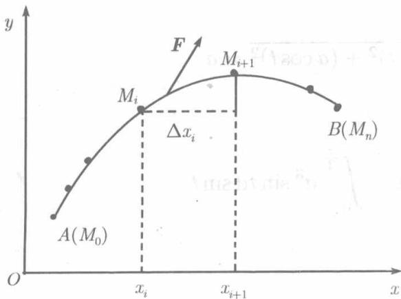
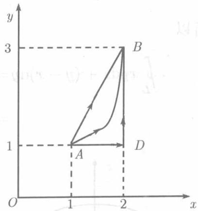
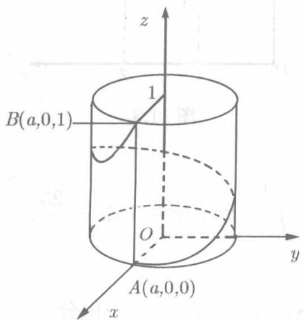

  
图11.2

我们知道，力沿直线所做的功可以表为定积分，现在考察力沿曲线所做的功，这将导致另一种类型的曲线积分.

设函数 $P(x,y)$ 和 $Q(x,y)$ 在平面曲线 $L$ 上连续，质点 $M$ 在力

$$
\boldsymbol {F} = P (x, y) \boldsymbol {i} + Q (x, y) \boldsymbol {j}
$$

的作用下沿 $L$ 从点 $A$ 移动到 $B$ . 为了求力 $\pmb{F}$ 沿 $\widehat{AB}$ 所做的功, 像11.1.1节所作的

那样，以点 $M_{i}(x_{i},y_{i})$ 将 $\widehat{AB}$ 分成长为 $\Delta s_i$ 的弧段 $\widehat{M_iM_{i + 1}} (i = 0,1,\dots ,n - 1)$ ，在 $\widehat{M_iM_{i + 1}}$ 上任取 $M_i^{\prime}(\xi_i,\eta_i)$ ，在 $\widehat{M_iM_{i + 1}}$ 上将力 $\pmb{F}$ 视为常力

$$
\boldsymbol {F} (\xi_ {i}, \eta_ {i}) = P (\xi_ {i}, \eta_ {i}) \boldsymbol {i} + Q (\xi_ {i}, \eta_ {i}) \boldsymbol {j},
$$

并用弦 $M_{i}M_{i + 1}$ 的长度近似地代替弧 $\widehat{M_iM_{i + 1}}$ 之长，于是 $\pmb{F}$ 在 $\widehat{M_iM_{i + 1}}$ 上所做的功 $\Delta W_{i}$ 近似地等于 $F(\xi_i,\eta_i)$ 与 $\overrightarrow{M_iM_{i + 1}}$ 的数积，但

$$
\overrightarrow {M _ {i} M _ {i + 1}} = (x _ {i + 1} - x _ {i}) \boldsymbol {i} + (y _ {i + 1} - y _ {i}) \boldsymbol {j} = \Delta x _ {i} \boldsymbol {i} + \Delta y _ {i} \boldsymbol {j}
$$

故

$$
\Delta W _ {i} = \boldsymbol {F} (\xi_ {i}, \eta_ {i}) \cdot \overrightarrow {M _ {i} M _ {i + 1}} = P (\xi_ {i}, \eta_ {i}) \Delta x _ {i} + Q (\xi_ {i}, \eta_ {i}) \Delta y _ {i},
$$

于是沿 $\widehat{AB}$ 所做的功的近似值为

$$
W \approx \sum_ {i = 0} ^ {n - 1} [ P (\xi_ {i}, \eta_ {i}) \Delta x _ {i} + Q (\xi_ {i}, \eta_ {i}) \Delta y _ {i} ].
$$

且当 $|\Delta s| = \max_{0 \leqslant i \leqslant n-1} \Delta s_i$ 充分小时，上式的精确性将充分高，因此，当 $|\Delta s| \to 0$ 时，得

$$
W = \lim  _ {| \Delta s | \rightarrow 0} \sum_ {i = 0} ^ {n - 1} [ P (\xi_ {i}, \eta_ {i}) \Delta x _ {i} + Q (\xi_ {i}, \eta_ {i}) \Delta y _ {i} ].
$$

与11.1.1节一样，撇开函数 $P(x,y),Q(x,y)$ 的物理意义，数学上将上式右端的极限称为函数 $P,Q$ 沿曲线 $\widehat{AB}$ 的第二型曲线积分，也称关于坐标的曲线积分，记为

$$
\begin{array}{l} \int_ {\widehat {A B}} P (x, y) \mathrm {d} x + Q (x, y) \mathrm {d} y \quad \text {或} \quad \int_ {\widehat {A B}} P \mathrm {d} x + Q \mathrm {d} y, \\ \int_ {\widehat {A B}} P (x, y) \mathrm {d} x + Q (x, y) \mathrm {d} y = \lim  _ {| \Delta s | \rightarrow 0} \sum_ {i = 0} ^ {n - 1} [ P (\xi_ {i}, \eta_ {i}) \Delta x _ {i} + Q (\xi_ {i}, \eta_ {i}) \Delta y _ {i} ]. \tag {11.6} \\ \end{array}
$$

于是，上面所讨论的功可表示为

$$
W = \int_ {\widehat {A B}} P \mathrm {d} x + Q \mathrm {d} y.
$$

特别需要强调的是，对于同一段弧 $\widehat{AB}$ 考虑从 $B$ 到 $A$ 的第二型曲线积分时，(11.6)右端的 $\Delta x_{i},\Delta y_{i}$ 都保持绝对值而改变了符号，因此

$$
\int_ {\widehat {A B}} P \mathrm {d} x + Q \mathrm {d} y = - \int_ {\widehat {B A}} P \mathrm {d} x + Q \mathrm {d} y.
$$

即：对于同一条积分路径，若改变路径的方向（终点改为起点，起点改为终点），第二型曲线积分保持绝对值而改变符号。

这是与第一型曲线积分不同的。为了强调指明起点和终点，起点为 $A(x_{1},y_{1})$ 终点为 $B(x_{2},y_{2})$ 的积分 $\int_{\widehat{AB}}P\mathrm{d}x + Q\mathrm{d}y$ 在与路径无关时也写为

$$
\int_ {(x _ {1}, y _ {1})} ^ {(x _ {2}, y _ {2})} P \mathrm {d} x + Q \mathrm {d} y.
$$

另一性质，与第一型曲线积分是相同的：

$$
\int_ {\widehat {A B}} P \mathrm {d} x + Q \mathrm {d} y + \int_ {\widehat {B C}} P \mathrm {d} x + Q \mathrm {d} y = \int_ {\widehat {A C}} P \mathrm {d} x + Q \mathrm {d} y.
$$

其余性质，与定积分类似．但第二型曲线积分无中值定理

类似于(11.6)，可以定义连续函数 $P(x,y,z),Q(x,y,z),R(x,y,z)$ 沿空间曲线 $\widehat{AB}$ 的第二型曲线积分：

$$
\int_ {\widehat {A B}} P \mathrm {d} x + Q \mathrm {d} y + R \mathrm {d} z = \lim  _ {| \Delta s | \rightarrow 0} \sum_ {i = 0} ^ {n - 1} [ P (\xi_ {i}, \eta_ {i}, \zeta_ {i}) \Delta x _ {i} + Q (\xi_ {i}, \eta_ {i}, \zeta_ {i}) \Delta y _ {i} + R (\xi_ {i}, \eta_ {i}, \zeta_ {i}) \Delta z _ {i} ],
$$

其中 $(\xi_{i},\eta_{i},\zeta_{i})$ 是 $\widehat{M_iM_{i + 1}}$ 上的任意一点， $\Delta x_{i},\Delta y_{i},\Delta z_{i}$ 是 $\overrightarrow{M_iM_{i + 1}}$ 在坐标轴上的分量.

第二型曲线积分的计算，也可化为计算定积分。设平面曲线 $L$ 的参数方程为

$$
x = \varphi (t), y = \psi (t),
$$

其中函数 $\varphi (t),\psi (t)$ 有一阶连续导数(即 $L$ 是光滑曲线)，当参数 $t$ 由 $\alpha$ 单调连续地变到 $\beta$ 时，点 $(x,y)$ 沿曲线 $L$ 从 $A$ 移动到 $B,$ 则

$$
\int_ {\widehat {A B}} P (x, y) \mathrm {d} x + Q (x, y) \mathrm {d} y = \int_ {\alpha} ^ {\beta} [ P (\varphi (t), \psi (t)) \varphi^ {\prime} (t) + Q (\varphi (t), \psi (t)) \psi^ {\prime} (t) ] \mathrm {d} t. \tag {11.7}
$$

即：为计算第二型曲线积分，需将被积函数中的变量 $x, y$ 用它们的参数表达式代替，而 $\mathrm{dx}, \mathrm{dy}$ 分别以 $x, y$ 作为参数的函数时的微分代替，并且积分下限对应于积分路径的起点，上限对应于终点。

如果曲线的方程写成直角坐标的形式 $y = y(x), y(x)$ 有连续导数， $A, B$ 分别对应于 $x = a$ 和 $x = b$ ，则视 $x$ 为参数，(11.7) 成为

$$
\int_ {\widehat {A B}} P (x, y) \mathrm {d} x + Q (x, y) \mathrm {d} y = \int_ {a} ^ {b} [ P (x, y (x)) + Q (x, y (x)) y ^ {\prime} (x) ] \mathrm {d} x. \tag {11.8}
$$

如果曲线的直角坐标方程为 $x = x(y), x(y)$ 有连续导数， $A, B$ 分别对应于 $y = c$ 和 $y = d$ ，则视 $y$ 为参数，(11.7) 成为

$$
\int_ {\widehat {A B}} P (x, y) \mathrm {d} x + Q (x, y) \mathrm {d} y = \int_ {c} ^ {\mathrm {d}} [ P (x (y), y) x ^ {\prime} (y) + Q (x (y), y) ] \mathrm {d} y. \tag {11.9}
$$

沿着空间曲线

$$
x = \varphi (t), y = \psi (t), z = \omega (t)
$$

的第二型曲线积分有与 (11.7) 类似的公式:

$$
\begin{array}{l} \int_ {\widehat {A B}} P (x, y, z) \mathrm {d} x + Q (x, y, z) \mathrm {d} y + R (x, y, z) \mathrm {d} z \\ = \int_ {\alpha} ^ {\beta} [ P (\varphi (t), \psi (t), \omega (t)) \varphi^ {\prime} (t) + Q (\varphi (t), \psi (t), \omega (t)) \psi^ {\prime} (t) + R (\varphi (t), \psi (t), \omega (t)) \omega^ {\prime} (t) ] d t. \tag {11.10} \\ \end{array}
$$

在应用公式 $(11.7)\sim (11.10)$ 时，如果出现于曲线方程中的那些函数的导数有间断点，可以把积分路径分为几段，使每一段上所论导数是连续的，对每一段算出积分的值而后相加．即：这些公式对于逐段光滑的曲线也是成立的.

沿着闭曲线 $L$ 的第二型曲线积分记作

$$
\oint_ {L} P \mathrm {d} x + Q \mathrm {d} y, \quad \oint_ {L} P \mathrm {d} x + Q \mathrm {d} y + R \mathrm {d} z.
$$

但这些记号没有表明积分按什么方向进行。对于空间的情形，需对积分方向另加说明。而对于平面的情形，记号 $\oint P \mathrm{d}x + Q \mathrm{d}y$ 总是指沿着 $L$ 的正方向的积分。所谓 $L$ 的正方向是指沿着 $L$ 前进时 $L$ 所围成的有界区域保持在左侧的那个方向。对于圆、椭圆、三角形等图形的边界这些简单的闭曲线而言，就是逆时针的方向。

**例11.1.3** 计算 $\int_{L}xy\mathrm{d}x + (y - x)\mathrm{d}y,$ 其中 $L$ 分为图11.3中的路径

1) 线段 $AB$ ;  
2) 连接 $A, B$ 的曲线 $y = 2(x - 1)^2 + 1$ ;  
3) 折线 $ADB$ ;  
4) 三角形 $ADB$ 周界，沿正向

**解** 1) 线段 $AB$ 的参数方程为

$$
x = 1 + t, y = 1 + 2 t (0 \leqslant t \leqslant 1),
$$

  
图11.3

按公式 (11.7),

$$
\int_ {A B} x y \mathrm {d} x + (y - x) \mathrm {d} y = \int_ {0} ^ {1} [ (1 + t) (1 + 2 t) + 2 t ] \mathrm {d} t = \int_ {0} ^ {1} (2 t ^ {2} + 5 t + 1) \mathrm {d} t = \frac {25}{6}.
$$

建议读者写出 $AB$ 的直角坐标方程分别应用 (11.8), (11.9) 计算同一积分.

2) 弧 $\widehat{AB}$ 的方程为 $y = 2(x - 1)^2 + 1$ ( $1 \leqslant x \leqslant 2$ ), 由公式 (11.7),

$$
\int_ {A B} x y \mathrm {d} x + (y - x) \mathrm {d} y
$$

$$
\begin{array}{l} = \int_ {1} ^ {2} [ x (2 (x - 1) ^ {2} + 1) + (2 (x - 1) ^ {2} + 1 - x) \cdot 4 (x - 1) ] d x \\ = \int_ {1} ^ {2} (10 x ^ {3} - 32 x ^ {2} + 35 x - 12) d x = \frac {10}{3}. \\ \end{array}
$$

3) 折线 $ADB$ 上的积分等于 $AD$ 与 $DB$ 上的积分之和.

沿线段 $AD$ ： $1\leqslant x\leqslant 2,y = 1,\mathrm{d}y = 0,$ 故

$$
\int_ {A D} x y \mathrm {d} x + (y - x) \mathrm {d} y = \int_ {A D} x y \mathrm {d} x = \int_ {1} ^ {2} x \mathrm {d} x = \frac {3}{2},
$$

沿线段 $DB$ ： $x = 2,1\leqslant y\leqslant 3,\mathrm{d}x = 0,$ 故

$$
\int_ {D B} x y \mathrm {d} x + (y - x) \mathrm {d} y = \int_ {D B} (y - x) \mathrm {d} y = \int_ {1} ^ {3} (y - 2) \mathrm {d} y = 0.
$$

所以

$$
\int_ {A D B} x y \mathrm {d} x + (y - x) \mathrm {d} y = \frac {3}{2}.
$$

4) 已经算出

$$
\int_ {A D B} x y \mathrm {d} x + (y - x) \mathrm {d} y = \frac {3}{2}, \quad \int_ {A B} x y \mathrm {d} x + (y - x) \mathrm {d} y = \frac {25}{6},
$$

所以

$$
\begin{array}{l} \oint_ {L} x y \mathrm {d} x + (y - x) \mathrm {d} y = \int_ {A D B} x y \mathrm {d} x + (y - x) \mathrm {d} y + \int_ {B A} x y \mathrm {d} x + (y - x) \mathrm {d} y \\ = \frac {3}{2} - \frac {25}{6} = - \frac {8}{3}. \\ \end{array}
$$

  
图11.4

**例11.1.4** 设在 $F = y\mathbf{i} - x\mathbf{j} + (x + y + z)\mathbf{k}$ 的作用下，

1) 质点沿螺旋线 $x = a\cos t, y = a\sin t, z = \frac{1}{2\pi} t (a > 0)$ （见图11.4）自点 $A(t = 0)$ 移动到 $B(t = 2\pi)$ ，求 $\pmb{F}$ 所做的功；  
2) 质点沿直线 $x = a, y = 0$ 自 $A$ 移动到 $B$ , 求 $\pmb{F}$ 的所做之功.

**解** 1) 因为

$$
P (x, y, z) = y, \quad Q (x, y, z) = - x, \quad R (x, y, z) = x + y + z,
$$

$$
x = a \cos t, y = a \sin t, z = \frac {1}{2 \pi} t,
$$

$$
\mathrm {d} x = - a \sin t \mathrm {d} t, \mathrm {d} y = a \cos t \mathrm {d} t,
$$

$$
\mathrm {d} z = \frac {1}{2 \pi} \mathrm {d} t,
$$

按公式 (11.10)

$$
\begin{array}{l} W = \int_ {\widehat {A B}} P \mathrm {d} x + Q \mathrm {d} y + R \mathrm {d} z \\ = \int_ {0} ^ {2 \pi} \left[ - a ^ {2} \sin t - a ^ {2} \cos^ {2} t + \left(a \cos t + a \sin t + \frac {1}{2 \pi} t\right) \cdot \frac {1}{2 \pi} \right] d t \\ = \int_ {0} ^ {2 \pi} \left(- a ^ {2} + \frac {a}{2 \pi} \cos t + \frac {a}{2 \pi} \sin t + \frac {1}{4 \pi^ {2}} t\right) d t \\ = \left. \left(- a ^ {2} t + \frac {a}{2 \pi} \sin t - \frac {a}{2 \pi} \cos t + \frac {1}{8 \pi^ {2}} t ^ {2}\right) \right| _ {0} ^ {2 \pi} \\ = \frac {1}{2} - 2 \pi a ^ {2}. \\ \end{array}
$$

2) 沿着线段 $AB: x = a, y = 0, 0 \leqslant z \leqslant 1, \mathrm{d}x = 0, \mathrm{d}y = 0,$ 故

$$
W = \int_ {A B} P \mathrm {d} x + Q \mathrm {d} y + R \mathrm {d} z = \int_ {0} ^ {1} (a + z) \mathrm {d} z = \left. \frac {1}{2} (a + z) ^ {2} \right| _ {0} ^ {1} = a + \frac {1}{2}.
$$
