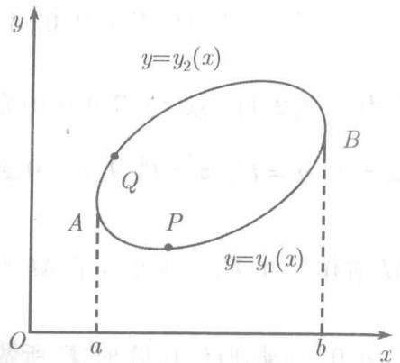
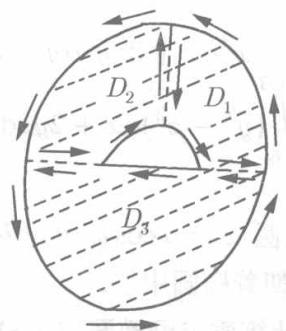
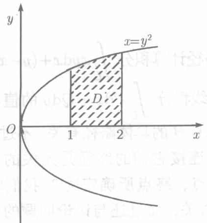
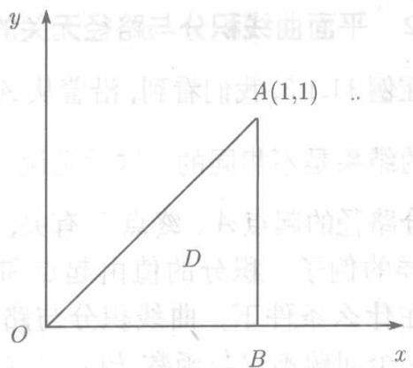

现在要证明一个公式，它把某种平面区域上的二重积分与该区域的边界线上第二类曲线积分联系了起来。我们把这一公式写成定理的形式。

定理11.2.1（格林（Green）定理）设1）有界闭区域的边界线 $L$ 是分段光滑的，且与平行于坐标轴穿过区域内部的任何直线相交时交点不多于两个；2)函数 $P(x,y)$ 、 $Q(x,y)$ 的一阶偏导数在 $D$ 上连续．则成立格林公式

$$
\oint_ {L} P \mathrm {d} x + Q \mathrm {d} y = \iint_ {D} \left(\frac {\partial Q}{\partial x} - \frac {\partial P}{\partial y}\right) \mathrm {d} x \mathrm {d} y, \tag {11.11}
$$

等式左端是沿着 $L$ 的正向的积分.

证 按条件1), $D$ 既可以用不等式组

$$
a \leqslant x \leqslant b, \quad y _ {1} (x) \leqslant y \leqslant y _ {2} (x)
$$

表示，也可以用不等式组

$$
c \leqslant y \leqslant d, \quad x _ {1} (y) \leqslant x \leqslant x _ {2} (y)
$$

表示 (见图11.5). 按二重积分的计算法,

$$
\begin{array}{l} \iint_ {D} \frac {\partial P}{\partial y} \mathrm {d} x \mathrm {d} y = \int_ {a} ^ {b} \mathrm {d} x \int_ {y _ {1} (x)} ^ {y _ {2} (x)} \frac {\partial P}{\partial y} \mathrm {d} y \\ = \int_ {a} ^ {b} [ P (x, y _ {2} (x)) - P (x, y _ {1} (x)) ] d x; \\ \end{array}
$$

  
图11.5

  
图11.6

另一方面，按第二型曲线积分的计算法，

$$
\begin{array}{l} \int_ {L} P \mathrm {d} x = \int_ {\widehat {A P B}} P \mathrm {d} x + \int_ {\widehat {B Q A}} P \mathrm {d} x \\ = \int_ {a} ^ {b} P (x, y _ {1} (x)) \mathrm {d} x + \int_ {b} ^ {a} P (x, y _ {2} (x)) \mathrm {d} x \\ = - \int_ {a} ^ {b} [ P (x, y _ {2} (x)) - P (x, y _ {1} (x)) ] d x. \\ \end{array}
$$

比较所得的两个结果，即知

$$
- \iint_ {D} \frac {\partial P}{\partial y} \mathrm {d} x \mathrm {d} y = \oint_ {L} P \mathrm {d} x,
$$

同样可以证明

$$
\iint_ {D} \frac {\partial Q}{\partial x} d x d y = \oint_ {L} Q d y.
$$

两式相加，即得(11.11).此即格林公式

现在考察区域 $D$ 不满足定理11.2.1的条件1)的情形，也就是平行于坐标轴的某些直线与 $D$ 的边界相交多于两个交点的情形。例如，图11.6的阴影部分所示，有内外两条边界的区域 $D$ 就是如此。

设在 $D$ 上定理11.2.1的条件2)成立，适当引进几条辅助的直线或曲线，将 $D$ 分成若干满足条件1)的小区域．在图11.6,即 $D_{1},D_{2},D_{3}$ 三个区域．在这些区域上格林公式是可以应用的，以 $C_1,C_2,C_3$ 记 $D_{1},D_{2},D_{3}$ 的边界，则

$$
\iint_ {D} \left(\frac {\partial Q}{\partial x} - \frac {\partial P}{\partial y}\right) d x d y = \iint_ {D _ {1}} + \iint_ {D _ {2}} + \iint_ {D _ {3}} = \oint_ {C _ {1}} + \oint_ {C _ {2}} + \oint_ {C _ {3}},
$$

在右端的三个积分中，沿着辅助线的积分相互抵消了，结果仍然如（11.11）所示：

$$
\iint_ {D} \left(\frac {\partial Q}{\partial x} - \frac {\partial P}{\partial y}\right) = \oint_ {L} P \mathrm {d} x + Q \mathrm {d} y.
$$

注意，出现在右端的积分路径 $L$ 是 $D$ 的总边界，既包括外边界线，也包括内边界线，并且 $L$ 的正向保持 $D$ 在 $L$ 的左侧，就图11.6而言，外边界上逆时针为正，内边界上顺时针为正

在公式 (11.11) 中取 $P = -y, Q = x$ ，得到区域 $D$ 的面积

$$
S = \iint_ {D} \mathrm {d} x \mathrm {d} y = \frac {1}{2} \oint x \mathrm {d} y - y \mathrm {d} x. \tag {11.12}
$$

即：平面区域 $D$ 的面积可以由沿其边界正向的曲线积分表示为（11.12）

例11.2.1 求星形线（见图5.17） $L$ ：

$$
x = a \cos^ {3} t, \quad y = a \sin^ {3} t \quad (0 \leqslant t \leqslant 2 \pi)
$$

所围的面积 $S$

解 由公式 (11.12),

$$
\begin{array}{l} S = \frac {1}{2} \oint_ {L} x \mathrm {d} y - y \mathrm {d} x = \frac {1}{2} \int_ {0} ^ {2 \pi} [ a \cos^ {3} t \cdot 3 a \sin^ {2} t \cos t - a \sin^ {3} t \cdot 3 a \cos^ {2} t (- \sin t) ] \mathrm {d} t \\ = \frac {3 a ^ {2}}{2} \int_ {0} ^ {2 \pi} \sin^ {2} t \cos^ {2} t \mathrm {d} t = \frac {3 a ^ {2}}{2} \int_ {0} ^ {2 \pi} \frac {1 - \cos 2 t}{2} \cdot \frac {1 + \cos 2 t}{2} \mathrm {d} t \\ = \frac {3 a ^ {2}}{8} \int_ {0} ^ {2 \pi} \left(1 - \frac {1 + \cos 4 t}{2}\right) d t = \frac {3 \pi a ^ {2}}{8}. \\ \end{array}
$$

借助于格林公式，可以将计算困难的线积分化为二重积分，也可以将计算困难的二重积分化为线积分。试看下面的两例。

例11.2.2 求

$$
I = \oint_ {L} \sqrt {x ^ {2} + y ^ {2}} \mathrm {d} x + y [ x y + \ln (x + \sqrt {x ^ {2} + y ^ {2}}) ] \mathrm {d} y,
$$

其中 $L$ 为 $x = y^2, x = 1, x = 2, y = 0$ 所围成的位于第一象限的区域 $D$ 的边界（见图11.7）

  
图11.7

  
图11.8

解记

$$
P = \sqrt {x ^ {2} + y ^ {2}}, \quad Q = y [ x y + \ln (x + \sqrt {x ^ {2} + y ^ {2}}) ]
$$

则

$$
\frac {\partial P}{\partial y} = \frac {y}{\sqrt {x ^ {2} + y ^ {2}}},
$$

$$
\begin{array}{l} \frac {\partial Q}{\partial x} = y ^ {2} + \frac {y}{x + \sqrt {x ^ {2} + y ^ {2}}} \cdot \left(1 + \frac {x}{\sqrt {x ^ {2} + y ^ {2}}}\right) \\ = y ^ {2} + \frac {y}{\sqrt {x ^ {2} + y ^ {2}}}, \\ \end{array}
$$

由格林公式得

$$
\begin{array}{l} I = \iint_ {D} \left(\frac {\partial Q}{\partial x} - \frac {\partial P}{\partial y}\right) d x d y = \iint_ {D} y ^ {2} d x d y = \int_ {1} ^ {2} d x \int_ {0} ^ {\sqrt {x}} y ^ {2} d y \\ = \int_ {1} ^ {2} \frac {1}{3} x ^ {\frac {3}{2}} \mathrm {d} x = \frac {1}{3} \cdot \frac {2}{5} x ^ {\frac {5}{2}} \Big | _ {1} ^ {2} = \frac {2}{15} (4 \sqrt {2} - 1). \\ \end{array}
$$

例11.2.3 求 $I = \iint_{D} \mathrm{e}^{-x^2} \, \mathrm{d}x \, \mathrm{d}y$ , 其中 $D$ 是以 $O(0,0)$ , $A(1,1)$ , $B(1,0)$ 为顶点的三角形区域 (见图11.8).

解取 $Q = 0$ ， $P = -y\mathrm{e}^{-x^2}$ ，则 $Q_{x}^{\prime} - P_{y}^{\prime} = \mathrm{e}^{-x^{2}}$ .由格林公式，

$$
\begin{array}{l} I = \oint_ {L} P \mathrm {d} x + Q \mathrm {d} y = - \oint_ {L} y \mathrm {e} ^ {- x ^ {2}} \mathrm {d} x \\ = \int_ {O A} + \int_ {A B} + \int_ {B O} = \int_ {O A} x \mathrm {e} ^ {- x ^ {2}} \mathrm {d} x \\ = \left. \frac {1}{2} \mathrm {e} ^ {- x ^ {2}} \right| _ {1} ^ {0} = \frac {1}{2} \left(1 - \frac {1}{\mathrm {e}}\right). \\ \end{array}
$$

下面，我们还将看到格林公式用于曲线积分的研究
