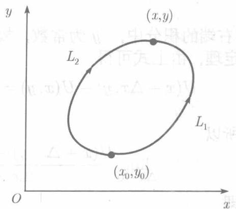
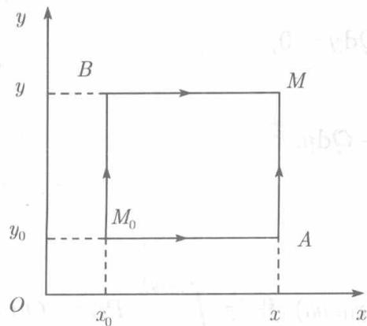

在例11.1.3，我们看到，沿着从 $A$ 到 $B$ 的不同路径计算积分 $\int_{L} xy \, \mathrm{d}x + (y - x) \, \mathrm{d}y$，得到的结果是不相同的。这就是说，一般说来，曲线积分 $\int_{L} P \, \mathrm{d}x + Q \, \mathrm{d}y$ 的值不但与积分路径的起点 $A$、终点 $B$ 有关，而且还与连接 $A,B$ 的具体路径有关。不过，也有那样的例子，积分的值由起点和终点决定而与连接它们的路径是无关的。那么，在什么条件下，曲线积分与路径无关而由起点、终点所确定呢？我们将看到，这个问题不仅与函数 $P(x,y)$、$Q(x,y)$ 的性质有关，而且还与讨论问题的区域的性质有关。

如果平面区域 $D$ 内的任何封闭曲线，都可不经过 $D$ 外的点而连续地收缩成 $D$ 内的一点，则称 $D$ 为单连通域。只有一条闭路所围成的区域是单连通域，而图11.6中的阴影区域就不是单连通域。

有几个与曲线积分与路径无关的条件等价的事实，概括在下述定理中。

**定理11.2.2** 设 1) 区域 $D$ 是单连通域；2) 函数 $P(x,y)$ 与 $Q(x,y)$ 在 $D$ 上连续且有连续的一阶偏导数。则下述事实是彼此等价的：

(1) 在 $D$ 上处处成立 $\frac{\partial P}{\partial y} = \frac{\partial Q}{\partial x}$。

(2) 对于 $D$ 内的任意的分段光滑的封闭曲线 $L$，$\oint_{L} P \mathrm{d}x + Q \mathrm{d}y = 0$。

(3) 对于 $D$ 内的任意两点 $(x_0, y_0)$ 和 $(x, y)$，积分 $\int_{(x_0, y_0)}^{(x, y)} P \mathrm{d}x + Q \mathrm{d}y$ 与路径无关。

(4) $P \mathrm{d}x + Q \mathrm{d}y$ 为全微分，即存在可微函数 $U(x, y)$，使 $\mathrm{d}U = P \mathrm{d}x + Q \mathrm{d}y$。

  
图11.9

**证明** $(1) \Rightarrow (2)$ 记 $L$ 所围成的区域为 $R$，则由条件 (1) 知 $R$ 在 $D$ 内。由条件 2)，$P(x,y)$，$Q(x,y)$ 的偏导数在 $R$ 连续，利用格林公式得

$$
\oint_ {L} P \mathrm {d} x + Q \mathrm {d} y = \iint_ {R} \left(\frac {\partial Q}{\partial x} - \frac {\partial P}{\partial y}\right) \mathrm {d} x \mathrm {d} y = \iint_ {R} 0 \mathrm {d} x \mathrm {d} y = 0.
$$

$(2) \Rightarrow (3)$ 设 $L_{1}, L_{2}$ 是自 $(x_0, y_0)$ 到 $(x, y)$ 的两条路径（见图 11.9）。因 (2) 成立，故在 $L_{1}$ 和 $-L_{2}$ 所成的闭曲线上积分为 0，即

$$
\int_ {L _ {1}} P \mathrm {d} x + Q \mathrm {d} y - \int_ {L _ {2}} P \mathrm {d} x + Q \mathrm {d} y = 0,
$$

因而 $\int_{L_1}P\mathrm{d}x + Q\mathrm{d}y = \int_{L_2}P\mathrm{d}x + Q\mathrm{d}y$。

这表明，积分 $\int_{(x_0,y_0)}^{(x,y)}P\mathrm{d}x + Q\mathrm{d}y$ 与路径无关。

$(3) \Rightarrow (4)$ 既然积分与路径无关，对于固定的 $(x_0, y_0)$，积分 $\int_{(x_0, y_0)}^{(x, y)} P \mathrm{d}x + Q \mathrm{d}y$ 由终点 $(x, y)$ 确定，因而是 $x,y$ 的函数，以 $U(x, y)$ 表示，即

$$
U (x, y) = \int_ {(x _ {0}, y _ {0})} ^ {(x, y)} P \mathrm {d} x + Q \mathrm {d} y. \tag {11.13}
$$

若终点是 $(x + \Delta x, y)$，则

$$
U (x + \Delta x, y) = \int_ {(x _ {0}, y _ {0})} ^ {(x + \Delta x, y)} P \mathrm {d} x + Q \mathrm {d} y. \tag {11.14}
$$

由于积分与路径无关，在计算积分 (11.14) 时，可以取连接两点 $(x_0,y_0),(x,y)$ 的任何连线以及连接两点 $(x,y),(x + \Delta x,y)$ 的与 $Ox$ 轴平行的线段作为积分路径，于是由 (11.13)，(11.14) 得到

$$
U (x + \Delta x, y) = U (x, y) + \int_ {(x, y)} ^ {(x + \Delta x, y)} P \mathrm {d} x + Q \mathrm {d} y.
$$

右端的积分中，$y$ 为常数，故 $\mathrm{d}y = 0$。将曲线积分化为定积分，并利用积分中值定理，由上式可得

$$
U (x + \Delta x, y) - U (x, y) = \int_ {x} ^ {x + \Delta x} P \mathrm {d} x = P (x + \theta \Delta x, y) \Delta x \quad (0 \leqslant \theta \leqslant 1),
$$

所以

$$
\lim  _ {\Delta x \rightarrow 0} \frac {U (x + \Delta x , y) - U (x , y)}{\Delta x} = \lim  _ {\Delta x \rightarrow 0} P (x + \theta \Delta x, y) = P (x, y),
$$

即

$$
\frac {\partial U}{\partial x} = P (x, y). \tag {11.15}
$$

同理可证

$$
\frac {\partial U}{\partial y} = Q (x, y). \tag {11.16}
$$

这就证明了 $P\mathrm{d}x + Q\mathrm{d}y$ 是函数 $U(x,y)$ 的全微分。

$(4)\Rightarrow (1)$ 由 (11.15)，(11.16) 立刻可得

$$
\frac {\partial Q}{\partial x} = \frac {\partial^ {2} U}{\partial x \partial y} = \frac {\partial P}{\partial y}.
$$

既然证明了 $(1)\Rightarrow (2)\Rightarrow (3)\Rightarrow (4)\Rightarrow (1)$，就证明了 (1)，(2)，(3)，(4) 彼此都是等价的。□

由上述证明可知，当条件 $\frac{\partial Q}{\partial x} = \frac{\partial P}{\partial y}$ 满足时，若不计常数之差，函数 $U(x,y)$（称为 $P\mathrm{d}x + Q\mathrm{d}y$ 的原函数）可表示为曲线积分 (11.13)。而为了将这一曲线积分表示为定积分并最终算出函数 $U(x,y)$，注意到积分与路径无关，我们可以在 $D$ 内任意取定一点 $M_0(x_0,y_0)$，取以 $M_0(x_0,y_0)$ 和点 $M(x,y)$ 为对顶的且边平行于坐标轴的矩形的相邻两边作为积分路径（见图11.10），于是由 (11.13)

  
图11.10

得

$$
\begin{array}{l} U (x, y) = \int_ {M _ {0} A M} P \mathrm {d} x + Q \mathrm {d} y \\ = \int_ {x _ {0}} ^ {x} P (x, y _ {0}) \mathrm {d} x + \int_ {y _ {0}} ^ {y} Q (x, y) \mathrm {d} y \tag {11.17} \\ \end{array}
$$

或

$$
U (x, y) = \int_ {M _ {0} B M} P \mathrm {d} x + Q \mathrm {d} y = \int_ {y _ {0}} ^ {y} Q \left(x _ {0}, y\right) \mathrm {d} y + \int_ {x _ {0}} ^ {x} P (x, y) \mathrm {d} x. \tag {11.18}
$$
