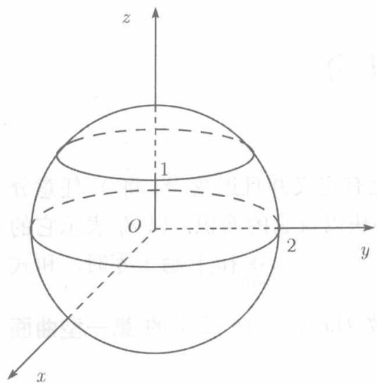

设 $\Sigma$ 是有界曲面，而函数 $f(x,y,z)$ 在 $\Sigma$ 上有定义并且连续 ① ，将 $\Sigma$ 任意分为 $n$ 个小块，以 $\Delta S_{i}(i = 1,2,\dots ,n)$ 表示这些小块以及它的面积，以 $d_{i}$ 表示它的直径．在小块 $\Delta S_{i}$ 上任取一点 $(x_{i},y_{i},z_{i})$ ，如果当 $d = \max_{1\leqslant i\leqslant n}\{d_i\}$ 趋于零时，和式 $\sum_{i = 1}^{n}f(x_{i},y_{i},z_{i})\Delta S_{i}$ 有极限，则称这个极限为函数 $f(x,y,z)$ 在 $\Sigma$ 上的第一型曲面积分或对面积的曲面积分，记为

$$
\int_ {\Sigma} f (x, y, z) \mathrm {d} S = \lim  _ {d \rightarrow 0} \sum_ {i = 1} ^ {n} f (x _ {i}, y _ {i}, z _ {i}) \Delta S _ {i}.
$$

回忆11.1.1节讨论曲线的质量时引出第一型曲线积分，立刻可以明白，如果讨论曲面的质量，将引出第一型曲面积分。

如果 $\Sigma$ 在 $xOy$ 平面上的投影为 $D_{xy}$ ，而 $\Sigma$ 的方程为 $z = z(x,y)$ ，且函数 $z(x,y)$ 在 $D_{xy}$ 上有连续的一阶偏导数②，则对于曲面 $\Sigma$ 上连续函数 $f(x,y,z)$ 第一型曲面

积分是存在的，且可通过二重积分来计算：

$$
\iint_ {\Sigma} f (x, y, z) \mathrm {d} S = \iint_ {D _ {x y}} f (x, y, z (x, y)) \sqrt {1 + z _ {x} ^ {\prime 2} + z _ {y} ^ {\prime 2}} \mathrm {d} x \mathrm {d} y. \tag {11.25}
$$

即：为计算第一型曲面积分 $\iint_{\Sigma} f(x, y, z) \mathrm{d}S$ ，只需以表示 $\Sigma$ 的函数 $z(x, y)$ 代替被积函数中的变量 $z$ ，以 $\sqrt{1 + z_x^2 + z_y'^2} \mathrm{d}x \mathrm{d}y$ 代替曲面上的面积元素 $\mathrm{d}S$ ，在 $D_{xy}$ （ $\Sigma$ 在 $xOy$ 平面上投影区域）计算二重积分。

如果曲面 $\Sigma$ 的方程为 $x = x(y,z)$ 或 $y = y(x,z)$ , 则成立与 (11.25) 类似的公式:

$$
\iint_ {\Sigma} f (y, y, z) \mathrm {d} S = \iint_ {D _ {y z}} (x (y, z), y, z) \sqrt {1 + x _ {y} ^ {\prime 2} + x _ {z} ^ {\prime 2}} \mathrm {d} y \mathrm {d} z, \tag {11.26}
$$

$$
\iint_ {\Sigma} f (y, y, z) \mathrm {d} S = \iint_ {D _ {x z}} f (x, y (x, z), z) \sqrt {1 + y _ {x} ^ {\prime 2} + y _ {z} ^ {\prime 2}} \mathrm {d} x \mathrm {d} z. \tag {11.27}
$$

  
图11.11

第一型曲面积分有与二重积分类似的性质，建议读者自己去复述一遍

例11.3.1 计算 $\iint_{\Sigma} \frac{\mathrm{d}S}{z}$ , 其中 $\Sigma$ 是球面 $x^{2} + y^{2} + z^{2} = 4$ 在平面 $z = 1$ 上方的部分（见图11.11）

解 $\Sigma$ 的方程为 $z = \sqrt{4 - x^2 - y^2}$ ，它在 $xOy$ 平面的投影区域为 $D_{xy}:x^{2} + y^{2}\leqslant 3.$ 由

$$
\begin{array}{l} 1 + z _ {x} ^ {\prime 2} + z _ {y} ^ {\prime 2} \\ = 1 + \left(\frac {x}{\sqrt {4 - x ^ {2} - y ^ {2}}}\right) ^ {2} + \left(\frac {y}{\sqrt {4 - x ^ {2} - y ^ {2}}}\right) ^ {2} \\ = \frac {4}{4 - x ^ {2} - y ^ {2}}, \\ \end{array}
$$

利用（11.25）并对右端的二重积分引进极坐标，得

$$
\begin{array}{l} \iint_ {\Sigma} \frac {\mathrm {d} S}{z} = \iint_ {D _ {x y}} \frac {1}{\sqrt {4 - x ^ {2} - y ^ {2}}} \cdot \frac {2}{\sqrt {4 - x ^ {2} - y ^ {2}}} \mathrm {d} x \mathrm {d} y \\ = \int_ {0} ^ {2 \pi} \mathrm {d} \theta \int_ {0} ^ {\sqrt {3}} \frac {2 r}{4 - r ^ {2}} \mathrm {d} r = - 2 \pi \ln (4 - r ^ {2}) \Big | _ {0} ^ {\sqrt {3}} \\ = 2 \pi \ln 4 = 4 \pi \ln 2. \\ \end{array}
$$

如果曲面 $\Sigma$ 是闭曲面，则曲面积分记为 $\oiint_{\Sigma} f(x, y, z) \, \mathrm{d}S.$

例11.3.2 计算曲面积分 $\oiint_{\Sigma} yz \, \mathrm{d}s$ ，其中 $\Sigma$ 为球面 $x^2 + y^2 + z^2 = a^2 (a > 0)$

解

$$
\oiint_ {\Sigma} y z \mathrm {d} S = \iint_ {\Sigma_ {1}} y z \mathrm {d} S + \iint_ {\Sigma_ {2}} y z \mathrm {d} S,
$$

其中 $\Sigma_{1}$ 为上半球面 $z = \sqrt{a^{2} - x^{2} - y^{2}}$ ， $\Sigma_{2}$ 为下半球面 $z = -\sqrt{a^{2} - x^{2} - y^{2}}$ .它们在 $xOy$ 平面上的投影区域都是 $D_{xy}:x^2 +y^2\leqslant a^2$ ，所以由(11.25)，

$$
\begin{array}{l} \iint_ {\Sigma_ {1}} y z \mathrm {d} S = \iint_ {D _ {x y}} y \sqrt {a ^ {2} - x ^ {2} - y ^ {2}} \cdot \frac {a}{\sqrt {a ^ {2} - x ^ {2} - y ^ {2}}} \mathrm {d} x \mathrm {d} y = a \iint_ {D _ {x y}} y \mathrm {d} x \mathrm {d} y, \\ \iint_ {\Sigma_ {2}} y z \mathrm {d} S = \iint_ {D _ {x y}} y (- \sqrt {a ^ {2} - x ^ {2} - y ^ {2}}) \cdot \frac {a}{\sqrt {a ^ {2} - x ^ {2} - y ^ {2}}} \mathrm {d} x \mathrm {d} y = - a \iint_ {D _ {x y}} y \mathrm {d} x \mathrm {d} y, \\ \end{array}
$$

两式相加得 $\oiint_{\Sigma} yz \, \mathrm{d}S = 0.$
