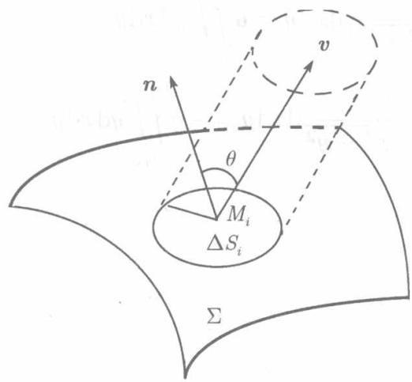
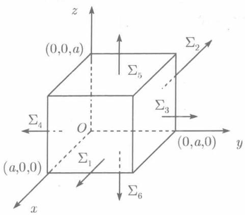
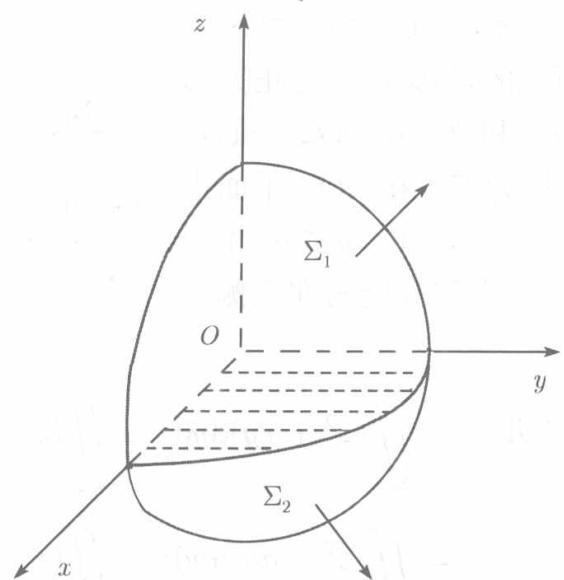

**(1) 曲面的侧与方向**

在研究第二型曲线积分时曾对曲线规定方向，与此类似，在下面讨论第二型曲面积分时，则需对曲面规定方向，而这与曲面的侧有关.

假设曲面有两个不同的侧面（例如：上侧和下侧，左侧和右侧，前侧和后侧）. 设想将一侧涂为红色，另一侧涂为蓝色．于是，不论动点沿着红侧的什么曲线运动，都不可能不通过曲面的边界而到达蓝侧．曲面上任一点处的法线都有两个相反的方向，我们把两个方向中不穿过蓝侧的方向规定为红侧的法线正向，不穿过红侧的方向规定为蓝侧的法线正向．这样，两个相反的方向就对应于曲面的两个不同的侧．若取其中一侧为正侧，则另一侧就是负侧，曲面的正侧也称为正向，负侧也称为负向．双侧曲面也就是有向曲面

最常见的双侧曲面是 $z = z(x,y)$ 所表示的曲面. 通常取其上侧 (即法线的正向与 $Oz$ 轴的正向之间的夹角不超过 $\frac{\pi}{2}$ 的一侧) 为正侧, 下侧为负侧.

能用 $y = y(z, x)$ 或 $x = x(y, z)$ 表示的曲面也是双侧曲面。对于 $y = y(z, x)$ 通常取其右侧（即法线正向与 $Oy$ 轴正向之间的夹角不超过 $\frac{\pi}{2}$ 的一侧）为正侧，左侧为负侧；对于 $x = x(y, z)$ ，取其前侧（法线正向与 $Ox$ 轴正向所成夹角不超过 $\frac{\pi}{2}$ 的一侧）为正侧，后侧为负侧。

对于封闭曲面，以外侧为正侧，内侧为负侧

今后，用 $(- \Sigma)$ 表示与正侧 $\Sigma$ 相反的一侧

**(2) 流量问题**

设有流体在空间流动，流速 $v$ 与点的位置有关：

$$
\boldsymbol {v} = \left\{P (x, y, z), Q (x, y, z), R (x, y, z) \right\},
$$

其中函数 $P, Q, R$ 是连续函数。现在要计算单位时间内从曲面 $\Sigma$ 的负侧经 $\Sigma$ 流向正侧的流量。为此，将 $\Sigma$ 分成 $n$ 个小块，以 $\Delta S_{i}$ （ $i = 1,2,\dots,n$ ）记这些小块及其面积，以 $d_{i}$ 记其直径，设 $\Sigma$ 的正侧上任一点 $(x,y,z)$ 处的单位法向量为

$$
\boldsymbol {n} = \{\cos \alpha , \cos \beta , \cos \gamma \},
$$

  
图11.12

显然，它随 $x,y,z$ 的变动而变动，不妨记为 $\pmb {n} = \pmb {n}(x,y,z)$ .在小块 $\Delta S_{i}$ 上任取点 $M_{i}(x_{i},y_{i},z_{i})$ ，则如图11.12所示，在单位时间内流过 $\Delta S_{i}$ 的流量 $\Delta q_{i}$ 近似地等于 $|v(x_i,y_i,z_i)|\cos \theta (x_i,y_i,z_i)$ 为高 $\Delta S_{i}$ 为底的柱体的体积 $|\pmb {v}(x_i,y_i,z_i)|\cos \theta (x_i,y_i,z_i)$ $\Delta S_{i}$ ，其中 $\theta$ 为流速 $\pmb{v}$ 和 $\pmb{n}$ 的夹角．于是

$$
\begin{array}{l} \Delta q _ {i} \approx \boldsymbol {v} \left(x _ {i}, y _ {i}, z _ {i}\right) \cdot \boldsymbol {n} \left(x _ {i}, y _ {i}, z _ {i}\right) \Delta S _ {i} \\ = \left[ P \left(x _ {i}, y _ {i}, z _ {i}\right) \cos \alpha_ {i} \right. \\ + Q \left(x _ {i}, y _ {i}, z _ {i}\right) \cos \beta_ {i} \\ + R \left(x _ {i}, y _ {i}, z _ {i}\right) \cos \gamma_ {i} ] \Delta S _ {i}, \\ \end{array}
$$

其中 $\cos \alpha_{i},\cos \beta_{i},\cos \gamma_{i}$ 是 $\Sigma$ 在 $M_{i}(x_{i},y_{i},z_{i})$ 的正侧法线的方向余弦.因而 $\Delta S_{i}\cos \alpha_{i}$ $\Delta S_{i}\cos \beta_{i},\Delta S_{i}\cos \gamma_{i}$ 就绝对值而言分别是 $\Delta S_{i}$ 在 $yOz$ 平面、 $zOx$ 平面和 $xOy$ 平面上的投影区域的面积的近似值，若分别以 $\Delta \sigma_{i,yz},\Delta \sigma_{i,zx},\Delta \sigma_{i,xy}$ 表示，则

$$
\Delta q _ {i} \approx P (x _ {i}, y _ {i}, z _ {i}) \Delta \sigma_ {i, y z} + Q (x _ {i}, y _ {i}, z _ {i}) \Delta \sigma_ {i, z x} + R (x _ {i}, y _ {i}, z _ {i}) \Delta \sigma_ {i, x y},
$$

而在单位时间内从 $\Sigma$ 负侧经 $\Sigma$ 流向正侧的总流量 $q$ 为 $\sum_{i=1}^{n} \Delta q_i$ , 其近似值为

$$
q \approx \sum_ {i = 1} ^ {n} [ P (x _ {i}, y _ {i}, z _ {i}) \Delta \sigma_ {i, y z} + Q (x _ {i}, y _ {i}, z _ {i}) \Delta \sigma_ {i, z x} + R (x _ {i}, y _ {i}, z _ {i}) \Delta \sigma_ {i, x y} ].
$$

令 $d = \max_{1\leqslant i\leqslant n}\{d_i\} \to 0,$

$$
q = \lim  _ {d \rightarrow 0} \sum_ {i = 1} ^ {n} [ P (x _ {i}, y _ {i}, z _ {i}) \Delta \sigma_ {i, y z} + Q (x _ {i}, y _ {i}, z _ {i}) \Delta \sigma_ {i, z x} + R (x _ {i}, y _ {i}, z _ {i}) \Delta \sigma_ {i, x y} ]
$$

就是单位时间内流经 $\Sigma$ 的总流量

(3) 第二型曲面积分

和以往一样，撇开函数 $P, Q, R$ 的物理意义，数学上称上式右端的极限为函数 $P, Q, R$ 在曲面 $\Sigma$ 的正侧上的第二型曲面积分或对坐标的曲面积分.记作

$$
\begin{array}{l} \iint_ {\Sigma} P (x, y, z) \mathrm {d} y \mathrm {d} z + Q (x, y, z) \mathrm {d} z \mathrm {d} x + R (x, y, z) \mathrm {d} x \mathrm {d} y \\ = \lim  _ {d \rightarrow 0} \sum_ {i = 1} ^ {n} [ P (x _ {i}, y _ {i}, z _ {i}) \Delta \sigma_ {i, y z} + Q (x _ {i}, y _ {i}, z _ {i}) \Delta \sigma_ {i, z x} + R (x _ {i}, y _ {i}, z _ {i}) \Delta \sigma_ {i, x y} ]. \tag {11.28} \\ \end{array}
$$

按照这个定义，以流速 $\pmb{v} = \{P(x,y,z),Q(x,y,z),R(x,y,z)\}$ 流动的流体，在单位时间内由 $\Sigma$ 的负侧经 $\Sigma$ 流向正侧的流量 $q$ 为

$$
q = \iint_ {\Sigma} P \mathrm {d} y \mathrm {d} z + Q \mathrm {d} z \mathrm {d} x + R \mathrm {d} x \mathrm {d} y.
$$

注意在 (11.28) 右端出现的诸投影 $\sigma_{i,yz}, \sigma_{i,zx}, \sigma_{i,xy}$ 既可能是正的也可能是负的，取决于法线的方向余弦的符号。由于 $(- \Sigma)$ 与 $\Sigma$ 在同一点的法线方向相反，因而它们的方向余弦也都相差一个符号，因而

$$
\iint_ {- \Sigma} P \mathrm {d} y \mathrm {d} z + Q \mathrm {d} z \mathrm {d} x + R \mathrm {d} x \mathrm {d} y = - \iint_ {\Sigma} P \mathrm {d} y \mathrm {d} z + Q \mathrm {d} z \mathrm {d} x + R \mathrm {d} x \mathrm {d} y.
$$

这是与第一型曲面积分不相同的。第一型曲面积分不涉及侧的概念，无论在哪一侧，结果都相同。

其余的性质，与二重积分相类似，但曲面积分没有中值定理

(4) 第二型曲面积分的计算

首先考虑 $P = 0, Q = 0$ 的情形，此时（11.28）成为

$$
\iint_ {\Sigma} R (x, y, z) \mathrm {d} x \mathrm {d} y = \lim  _ {d \rightarrow 0} \sum_ {i = 1} ^ {n} R (x _ {i}, y _ {i}, z _ {i}) \Delta \sigma_ {i, x y}.
$$

设 $\Sigma$ 可以表示为 $z = z(x,y)$ ，令 $D_{xy}$ 表示 $\Sigma$ 在 $xOy$ 平面上的投影区域，如果函数 $z(x,y)$ 在区域 $D_{xy}$ 上连续且函数 $R(x,y,z)$ 在 $\Sigma$ 上连续，则复合函数 $R(x,y,z(x,y))$ 也在 $D_{xy}$ 上连续.由于 $\Delta S_{i}$ 在曲面 $\Sigma$ 上,故点 $(x_{i},y_{i},z_{i})$ 的竖坐标 $z_{i}$ 应等于 $z(x_{i},y_{i})$ 于是

$$
\sum_ {i = 1} ^ {n} R \left(x _ {i}, y _ {i}, z _ {i}\right) \Delta \sigma_ {i, x y} = \sum_ {i = 1} ^ {n} R \left(x _ {i}, y _ {i}, z \left(x _ {i}, y _ {i}\right)\right) \Delta \sigma_ {i, x y},
$$

由于在 $\Sigma$ 上侧 $\cos \gamma_{i} > 0$ , 故 $\Delta \sigma_{i,xy} = \cos \gamma_{i}\Delta S_{i} > 0$ , 在上式两端令 $d \to 0$ 取极限, 按定义, 左边是曲面积分, 右边是二重积分:

$$
\iint_ {\Sigma} R (x, y, z) \mathrm {d} x \mathrm {d} y = \iint_ {D _ {x y}} R (x, y, z (x, y)) \mathrm {d} x \mathrm {d} y. \tag {11.29}
$$

如果积分取在 $\Sigma$ 的下侧，则

$$
\iint_ {- \Sigma} R (x, y, z) \mathrm {d} x \mathrm {d} y = - \iint_ {\Sigma} R \mathrm {d} x \mathrm {d} y = - \iint_ {D _ {x y}} R (x, y, z (x, y)) \mathrm {d} x \mathrm {d} y. \tag {11.30}
$$

即：为计算第二型曲面积分 $\iint_{\pm \Sigma} R(x, y, z) \mathrm{d}x \mathrm{d}y$ ，只需把被积函数中的变量 $z$ 换成表示曲面 $\Sigma$ 的函数 $z(x, y)$ ，在 $\Sigma$ 的投影区域 $D_{xy}$ 上计算二重积分。若曲面积分在 $\Sigma$ 上侧，重积分前冠以正号；若曲面积分在 $\Sigma$ 的下侧，重积分前冠以负号。

同理，如果曲面 $\Sigma$ 可以表示为 $x = x(y,z)$ 或 $y = y(z,x)$ ，则有类似于(11.29)、(11.30)的公式：

$$
\iint_ {\pm \Sigma} P (x, y, z) \mathrm {d} y \mathrm {d} z = \pm \iint_ {D _ {y z}} P (x (y, z), y, z) \mathrm {d} y \mathrm {d} z, \tag {11.31}
$$

$$
\iint_ {\pm \Sigma} Q (x, y, z) \mathrm {d} z \mathrm {d} x = \pm \iint_ {D _ {z x}} Q (x, y (z, x), z) \mathrm {d} z \mathrm {d} x. \tag {11.32}
$$

在(11.31)， $+\Sigma$ 表示前侧，右端取正号； $-\Sigma$ 表示后侧，右端取负号

在(11.32)， $+\Sigma$ 表示右侧，右端取正号； $-\Sigma$ 表示左侧，右端取负号

如果曲面 $\Sigma$ 不满足所述条件，例如，平行于 $Oz$ 轴的某些直线与曲面的交点多于一个时， $\Sigma$ 就不能用方程 $z = z(x, y)$ 表示，此时，可以将 $\Sigma$ 分为几部分，使得每个部分能用如此形式的方程表示，分别应用 (11.29) 或 (11.30) 计算出每一部分的积分而将结果相加，即得整个曲面上的积分。

对于 $P, Q, R$ 都不为零的积分，可按

$$
\iint_ {\Sigma} P \mathrm {d} y \mathrm {d} z + Q \mathrm {d} z x + R \mathrm {d} x \mathrm {d} y = \iint_ {\Sigma} P \mathrm {d} y \mathrm {d} z + \iint_ {\Sigma} Q \mathrm {d} z \mathrm {d} x + \iint_ {\Sigma} R \mathrm {d} x \mathrm {d} y
$$

分别计算右端的三个积分而将结果相加

如果 $\Sigma$ 是封闭曲面，则积分记为 $\iint_{\Sigma} P \mathrm{d}y \mathrm{~d}z + Q \mathrm{~d}z \mathrm{~d}x + R \mathrm{~d}x \mathrm{~d}y.$

例11.3.3 计算第二型曲面积分 $I = \iint_{\Sigma} (z^2 + xy) \, \mathrm{d}y \, \mathrm{d}z + z(y - x) \, \mathrm{d}z \, \mathrm{d}x + y^2 \, \mathrm{d}x \, \mathrm{d}y.$ 其中 $\Sigma$ 为正方体 $0 \leqslant x \leqslant a, 0 \leqslant y \leqslant a, 0 \leqslant z \leqslant a$ 的外表面（见图11.13）

解 $\Sigma$ 由正方体的六个面 $\Sigma_{1},\Sigma_{2},\dots ,\Sigma_{6}$ 组成，其中 $\Sigma_{1}$ 和 $\Sigma_{2}$ 在 $xOy$ 平面以及 $zOx$ 平面上的投影是一个线段，故面积为零，在 $yOz$ 平面上的投影 $D_{yz}$ 为正方形 $0\leqslant y\leqslant a,0\leqslant z\leqslant a.$ 同样， $\Sigma_3$ 和 $\Sigma_4$ 在 $xOy$ 平面及 $yOz$ 面上投影的面积为零，在 $zOx$ 平面上的投影 $D_{zx}$ 为正方形 $0\leqslant z\leqslant a,0\leqslant x\leqslant a.\Sigma_5$ 和 $\Sigma_6$ 在 $yOz$ 平面及 $zOx$ 平面上的投影的面积为零，在 $xOy$ 平面上的投影 $D_{xy}$ 为正方形 $0\leqslant x\leqslant a,0\leqslant y\leqslant a.$ 由于 $\Sigma$ 的正向为外侧，故在 $\Sigma_{2}$ 上积分展布在后侧，所以由公式(11.31)，

  
图11.13

$$
\begin{array}{l} \oiint_ {\Sigma} (z ^ {2} + x y) \mathrm {d} y \mathrm {d} z = \iint_ {\Sigma_ {1}} (z ^ {2} + x y) \mathrm {d} y \mathrm {d} z + \iint_ {\Sigma_ {2}} (z ^ {2} + x y) \mathrm {d} y \mathrm {d} z \\ = \iint_ {D _ {y z}} (z ^ {2} + a y) d y d z - \iint_ {D _ {y z}} (z ^ {2} + 0 \cdot y) d y d z \\ = \iint_ {D y z} a y \mathrm {d} y \mathrm {d} z = a \int_ {0} ^ {a} \mathrm {d} z \int_ {0} ^ {a} y \mathrm {d} y = \frac {a ^ {4}}{2}; \\ \end{array}
$$

同理，由公式 (11.32),

$$
\begin{array}{l} \oiint_ {\Sigma} z (y - x) \mathrm {d} z \mathrm {d} x = \iint_ {\Sigma_ {3}} z (y - x) \mathrm {d} z \mathrm {d} x + \iint_ {\Sigma_ {4}} z (y - x) \mathrm {d} z \mathrm {d} x \\ = \iint_ {D _ {z x}} z (a - x) d z d x - \iint_ {D _ {z x}} z (0 - x) d z d x \\ = \iint_ {D _ {z x}} a z \mathrm {d} z \mathrm {d} x = a \int_ {0} ^ {a} \mathrm {d} x \int_ {0} ^ {a} z \mathrm {d} z = \frac {a ^ {4}}{2}. \\ \end{array}
$$

由公式（11.29）和（11.30），

$$
\oiint_ {\Sigma} y ^ {2} \mathrm {d} x \mathrm {d} y = \iint_ {\Sigma_ {5}} y ^ {2} \mathrm {d} x \mathrm {d} y + \iint_ {\Sigma_ {6}} y ^ {2} \mathrm {d} x \mathrm {d} y = \iint_ {D _ {x y}} y ^ {2} \mathrm {d} x \mathrm {d} y - \iint_ {D _ {x y}} y ^ {2} \mathrm {d} x \mathrm {d} y = 0.
$$

将所得三个结果相加得

$$
\oiint_ {\Sigma} (z ^ {2} + x y) \mathrm {d} y \mathrm {d} z + z (y - x) \mathrm {d} z \mathrm {d} x + y ^ {2} \mathrm {d} x \mathrm {d} y = a ^ {4}.
$$

例11.3.4 计算 $\iint_{\Sigma} xyz \, \mathrm{d}x \, \mathrm{d}y$ ，其中 $\Sigma$ 为球面 $x^2 + y^2 + z^2 = 1$ 的外表面在第一、第五卦限的部分（见图11.14）

解 $\Sigma$ 由 $\Sigma_{1}:z = \sqrt{1 - x^{2} - y^{2}}$ 的上侧及 $\Sigma_{2}:z = -\sqrt{1 - x^{2} - y^{2}}$ 的下侧组成，它们在 $xOy$ 平面上的投影区域 $D_{xy}$ 都是圆 $x^{2} + y^{2}\leqslant 1$ 在第一象限的部分.按公式(11.29)和(11.30)，化为重积分后再引用极坐标，得

  
图11.14

$$
\begin{array}{l} \iint_ {\Sigma} x y z \mathrm {d} x \mathrm {d} y = \iint_ {\Sigma_ {1}} x y z \mathrm {d} x \mathrm {d} y + \iint_ {\Sigma_ {2}} x y z \mathrm {d} x \mathrm {d} y \\ [ 6 m m ] = \iint_ {D _ {x y}} x y \sqrt {1 - x ^ {2} - y ^ {2}} d x d y - \iint_ {D _ {x y}} - x y \sqrt {1 - x ^ {2} - y ^ {2}} d x d y \\ = 2 \iint_ {D _ {x y}} x y \sqrt {1 - x ^ {2} - y ^ {2}} \mathrm {d} x \mathrm {d} y \\ = 2 \int_ {0} ^ {\frac {\pi}{2}} \mathrm {d} \theta \int_ {0} ^ {1} r ^ {3} \cos \theta \sin \theta \sqrt {1 - r ^ {2}} \mathrm {d} r \\ = 2 \int_ {0} ^ {\frac {\pi}{2}} \sin \theta \cos \theta d \theta \cdot \int_ {0} ^ {1} r ^ {3} \sqrt {1 - r ^ {2}} d r, \\ \end{array}
$$

在最后的积分中，令 $r = \sin t$ ，得

$$
\begin{array}{l} \int_ {0} ^ {1} r ^ {3} \sqrt {1 - r ^ {2}} \mathrm {d} r = \int_ {0} ^ {\frac {\pi}{2}} \sin^ {3} t \cos^ {2} t \mathrm {d} t \\ = - \int_ {0} ^ {\frac {\pi}{2}} (1 - \cos^ {2} t) \cos^ {2} t d \cos t = \frac {2}{15}, \\ \end{array}
$$

所以

$$
\iint_ {\Sigma} x y z \mathrm {d} x \mathrm {d} y = 2 \cdot \frac {2}{15} \int_ {0} ^ {\frac {\pi}{2}} \sin \theta \cos \theta \mathrm {d} \theta = \frac {2}{15}.
$$
