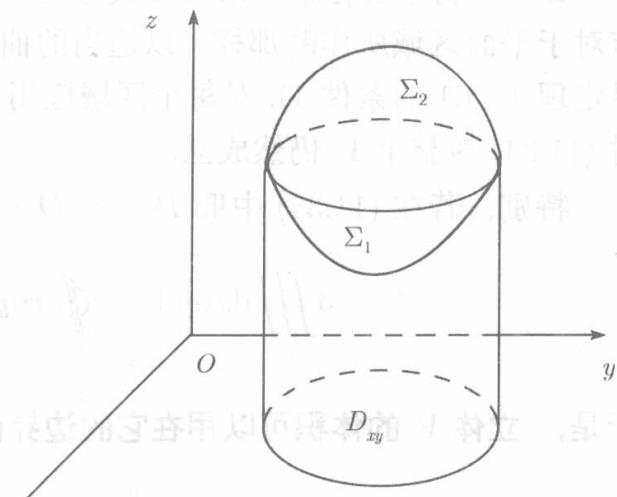
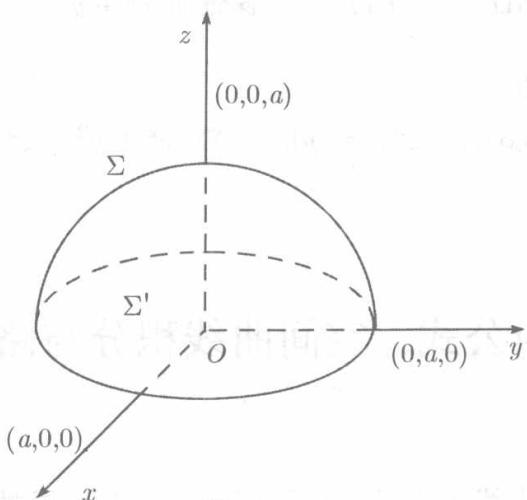

11.2 节所建立的格林公式把平面区域上的二重积分与它的边界上的曲线积分联系了起来，与之相仿，空间区域上的三重积分与它的边界面上的曲面积分也可以用一个公式联系起来。这个公式称为奥-高公式，是由数学家高斯（Gauss）和奥斯特洛格拉德斯基（Ostrovski）创立的。

**定理11.4.1（奥-高定理）** 设 1) 空间的有界闭区域 $V$ 的边界曲面 $\Sigma$ 是分片光滑的，与平行于坐标轴且不在 $\Sigma$ 上的任何直线的交点不多于两个；2) 函数 $P(x,y,z)$，$Q(x,y,z)$，$R(x,y,z)$ 在 $V$ 上有一阶连续偏导数，则

$$
\iiint_ {V} \left(\frac {\partial P}{\partial x} + \frac {\partial Q}{\partial y} + \frac {\partial R}{\partial z}\right) d x d y d z = \oiint_ {\Sigma} P d y d z + Q d z d x + R d x d y \tag {11.34}
$$

或

$$
\iiint_ {V} \left(\frac {\partial P}{\partial x} + \frac {\partial Q}{\partial y} + \frac {\partial R}{\partial z}\right) d x d y d z = \oiint_ {\Sigma} (P \cos \alpha + Q \cos \beta + R \cos \gamma) d S, \tag {11.35}
$$

(11.34)右端的曲面积分取在 $\Sigma$ 的外侧，(11.35)右端的 $\cos \alpha ,\cos \beta ,\cos \gamma$ 是 $\boldsymbol{\Sigma}$ 的外法线的方向余弦.

公式（11.34）、（11.35）称为奥-高公式。

**证明** 由（11.33）可知，（11.34）、(11.35）右端是相等的，因此只需证明 (11.34) 即可。

按条件1)，设 $V$ 的边界曲面的下部 $\Sigma_{1}$ 及上部 $\Sigma_{2}$ 分别由方程 $z = z_{1}(x,y)$

  
图11.15

及 $z = z_{2}(x,y)$ 表示，又设 $V$ 在 $xOy$ 平面上的投影为 $D_{xy}$ (见图11.15)，按三重积分的计算方法(参阅公式(9.16))

$$
\begin{array}{l} \iiint_ {V} \frac {\partial R}{\partial z} \mathrm {d} x \mathrm {d} y \mathrm {d} z = \iint_ {D _ {x y}} \mathrm {d} x \mathrm {d} y \int_ {z _ {1} (x, y)} ^ {z _ {2} (x, y)} \frac {\partial R}{\partial z} \mathrm {d} z \\ = \iint_ {D _ {x y}} [ R (x, y, z _ {2}) - R (x, y, z _ {1}) ] \mathrm {d} x \mathrm {d} y, \\ \end{array}
$$

另一方面，按第二型曲面积分的计算公式（11.29）及（11.30），

$$
\begin{array}{l} \oiint_ {\Sigma} R \mathrm {d} x \mathrm {d} y = \iint_ {\Sigma_ {2 \text {上}}} R \mathrm {d} x \mathrm {d} y + \iint_ {\Sigma_ {1 \text {下}}} R \mathrm {d} x \mathrm {d} y \\ = \iint_ {D _ {x y}} R (x, y, z _ {2}) \mathrm {d} x \mathrm {d} y - \iint_ {D _ {x y}} R (x, y, z _ {1}) \mathrm {d} x \mathrm {d} y \\ = \iint_ {D _ {x y}} [ R (x, y, z _ {2}) - R (x, y, z _ {1}) ] d x d y. \\ \end{array}
$$

比较所得两式的右端，即知

$$
\iiint_ {V} \frac {\partial R}{\partial z} \mathrm {d} x \mathrm {d} y \mathrm {d} z = \iint_ {\Sigma} R \mathrm {d} x \mathrm {d} y,
$$

同样，分别考虑 $\Sigma$ 的前部和后部、左部和右部，又可证明

$$
\iiint_ {V} \frac {\partial P}{\partial x} \mathrm {d} x \mathrm {d} y \mathrm {d} z = \oiint_ {\Sigma} P \mathrm {d} y \mathrm {d} z, \quad \iiint_ {V} \frac {\partial Q}{\partial y} \mathrm {d} x \mathrm {d} y \mathrm {d} z = \oiint_ {\Sigma} Q \mathrm {d} x \mathrm {d} z.
$$

将这三式相加，即得（11.34）

如果平行于坐标轴的某些直线与边界曲面 $\Sigma$ 的交点多于2个，则可以像11.2.1节对于平面区域所作的那样，以适当的曲面将 $V$ 分成几个区域，使得每个区域满足定理11.4.1的条件1)，对每个区域应用(11.34)，然后，将所得结果相加，即知此时(11.34)对整个 $V$ 仍然成立

特别，若在（11.34）中取 $P = x$ ， $Q = y$ ， $R = z$ ，则得

$$
3 \iiint_ {V} \mathrm {d} x \mathrm {d} y \mathrm {d} z = \oiint_ {\Sigma} x \mathrm {d} y \mathrm {d} z + y \mathrm {d} z \mathrm {d} x + z \mathrm {d} x \mathrm {d} y,
$$

于是，立体 $V$ 的体积可以用在它的边界曲面外侧的曲面积分表示为：

$$
V = \frac {1}{3} \oiint_ {\Sigma} x \mathrm {d} y \mathrm {d} z + y \mathrm {d} z \mathrm {d} x + z \mathrm {d} x \mathrm {d} y.
$$

例11.4.1 设 $\Sigma$ 是正方体 $0 \leqslant x \leqslant a, 0 \leqslant y \leqslant a, 0 \leqslant z \leqslant a$ 的外表面，对于曲面积分

$$
I = \oiint_ {\Sigma} (z ^ {2} + x y) \mathrm {d} y \mathrm {d} z + z (y - x) \mathrm {d} z \mathrm {d} x + y ^ {2} \mathrm {d} x \mathrm {d} y
$$

验证奥-高公式。

**解** 在例11.3.3已经算出 $I = a^4$，现在利用奥-高公式通过三重积分计算 $I$

$$
P = z ^ {2} + x y, Q = z (y - x), R = y ^ {2}, \frac {\partial P}{\partial x} + \frac {\partial Q}{\partial y} + \frac {\partial R}{\partial z} = y + z,
$$

$$
\begin{array}{l} \iiint_ {V} \left(\frac {\partial P}{\partial x} + \frac {\partial Q}{\partial y} + \frac {\partial R}{\partial z}\right) d x d y d z = \iiint_ {V} (y + z) d x d y d z \\ = \int_ {0} ^ {a} d x \int_ {0} ^ {a} d y \int_ {0} ^ {a} (y + z) d z = \int_ {0} ^ {a} d x \int_ {0} ^ {a} \left[ \frac {1}{2} (y + z) ^ {2} \right] _ {0} ^ {a} d y \\ = \int_ {0} ^ {a} d x \int_ {0} ^ {a} \frac {1}{2} [ (y + a) ^ {2} - y ^ {2} ] d y = a ^ {4}. \\ \end{array}
$$

与例11.3.3所求的结果是相同的，

□

**例11.4.2** 利用奥-高公式计算曲面积分

$$
I = \iint_ {\Sigma} x ^ {3} \mathrm {d} y \mathrm {d} z + y ^ {3} \mathrm {d} z \mathrm {d} x + z ^ {3} \mathrm {d} x \mathrm {d} y,
$$

其中 $\Sigma$ 为上半球面 $z = \sqrt{a^2 - x^2 - y^2} (a > 0)$ 的上侧

**解** $\Sigma$ 不是封闭曲面。为了应用奥-高公式，引进辅助平面 $\Sigma': x^2 + y^2 \leqslant a^2$，$z = 0$，则 $\Sigma$ 与 $\Sigma'$ 一起围成一半球体 $V$（见图11.16），按奥-高公式，

  
图11.16

$$
\begin{array}{l} \iint_ {\Sigma_ {\text {上}}} x ^ {3} \mathrm {d} y \mathrm {d} z + y ^ {3} \mathrm {d} z \mathrm {d} x + z ^ {3} \mathrm {d} x \mathrm {d} y + \iint_ {\Sigma_ {\text {下}} ^ {\prime}} x ^ {3} \mathrm {d} y \mathrm {d} z + y ^ {3} \mathrm {d} z \mathrm {d} x + z ^ {3} \mathrm {d} x \mathrm {d} y \\ = 3 \iiint_ {V} (x ^ {2} + y ^ {2} + z ^ {2}) \mathrm {d} x \mathrm {d} y \mathrm {d} z. \\ \end{array}
$$

但 $\Sigma^{\prime}$ 在 $yOz$ 及 $zOx$ 平面上的投影为一个线段，其面积为零，且在 $\Sigma^{\prime}$ 上 $z = 0$ 故上式左端的第二个积分为零．将右端的三重积分化为球坐标，

$$
\begin{array}{l} \iiint_ {V} \left(x ^ {2} + y ^ {2} + z ^ {2}\right) \mathrm {d} V = \iiint_ {V} r ^ {4} \sin \varphi \mathrm {d} \theta \mathrm {d} \varphi \mathrm {d} r \\ = \int_ {0} ^ {2 \pi} \mathrm {d} \theta \int_ {0} ^ {\frac {\pi}{2}} \sin \varphi \mathrm {d} \varphi \int_ {0} ^ {a} r ^ {4} \mathrm {d} r = \frac {2 \pi}{5} a ^ {5}. \\ \end{array}
$$

所以

$$
\iint_ {\Sigma} x ^ {3} \mathrm {d} y \mathrm {d} z + y ^ {3} \mathrm {d} z \mathrm {d} x + z ^ {3} \mathrm {d} x \mathrm {d} y = 3 \cdot \frac {2}{5} \pi a ^ {5} = \frac {6}{5} \pi a ^ {5}.
$$
