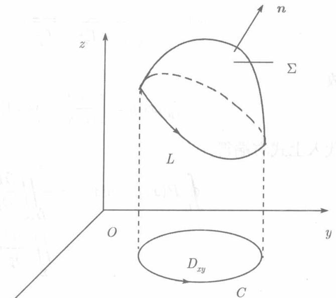
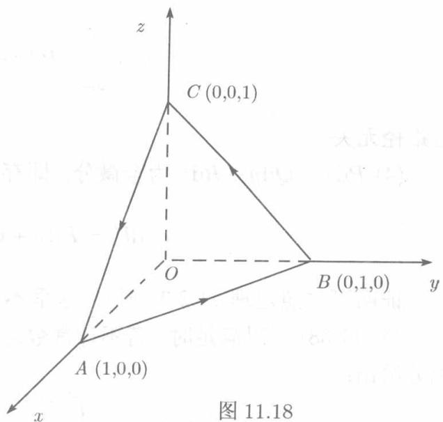

格林公式建立了沿曲线 $L$ 的曲线积分与以 $L$ 为边界的平面区域上的二重积分之间的联系。如果以 $L$ 为边界的不是平面区域而是空间曲面，那么这个曲面上的曲面积分与沿 $L$ 的曲线积分之间有没有联系呢？这就是这里所要介绍的斯托克斯（Stokes）定理。

在介绍定理本身之前，先要按曲面的侧对边界的正向作出规定。设有界的非封闭的双侧曲面 $\Sigma$ 以曲线 $L$ 为边界。如果观测者站在 $\Sigma$ 的指定一侧，并沿 $L$ 前行时， $\Sigma$ 的指定一侧始终保持于观测者的左方，则观测者前进的方向规定为 $L$ 的正

向；反之，若 $\Sigma$ 指定一侧始终保持在右方，则观测者前进的方向规定为 $L$ 的负向。这种定向法则称为右手定向法则。

定理11.5.1（斯托克斯定理）设函数 $P(x,y,z),Q(x,y,z),R(x,y,z)$ 在空间区域 $V$ 内有连续的一阶偏导数， $V$ 内的分片光滑的双侧曲面 $\Sigma$ 的边界是分段光滑的曲线 $L,$ 则

$$
\begin{array}{l} \oint_ {L} P \mathrm {d} x + Q \mathrm {d} y + R \mathrm {d} z \\ = \iint_ {\Sigma} \left(\frac {\partial R}{\partial y} - \frac {\partial Q}{\partial z}\right) d y d z + \left(\frac {\partial P}{\partial z} - \frac {\partial R}{\partial x}\right) d z d x + \left(\frac {\partial Q}{\partial x} - \frac {\partial P}{\partial y}\right) d x d y \tag {11.36} \\ \end{array}
$$

或

$$
\begin{array}{l} \oint_ {L} P \mathrm {d} x + Q \mathrm {d} y + R \mathrm {d} z \\ = \iint_ {\Sigma} \left[ \left(\frac {\partial R}{\partial y} - \frac {\partial Q}{\partial z}\right) \cos \alpha + \left(\frac {\partial P}{\partial z} - \frac {\partial R}{\partial x}\right) \cos \beta + \left(\frac {\partial Q}{\partial x} - \frac {\partial P}{\partial y}\right) \cos \gamma \right] d S, \tag {11.37} \\ \end{array}
$$

其中 $\Sigma$ 的正侧与 $L$ 的正向按右手定向法则确定， $\cos \alpha, \cos \beta, \cos \gamma$ 为 $\Sigma$ 的正侧法线的方向余弦.

证 先设 $\Sigma$ 的方程可以写为 $z = z(x, y)$ , 今证

$$
\oint_ {L} P \mathrm {d} x = \iint_ {\Sigma} \frac {\partial P}{\partial z} \mathrm {d} z \mathrm {d} x - \frac {\partial P}{\partial y} \mathrm {d} x \mathrm {d} y.
$$

记 $\Sigma$ 在 $xOy$ 平面上的投影区域为 $D_{xy}$ ， $L$ 在 $xOy$ 平面上的投影曲线为 $C$ （见图11.17).为确定起见，考虑 $\Sigma$ 的上侧，则法线的方向以及曲线 $L,C$ 的正向如图11.17所示

设 $C$ 的参数方程为

  
图11.17

$$
C: x = x (t), y = y (t) \quad (a \leqslant t \leqslant b),
$$

则 $L$ 的参数方程为

$$
\begin{array}{l} L: \quad x = x (t), y = y (t), \\ z = f (x (t), y (t)) = z (t) \quad (a \leqslant t \leqslant b), \\ \end{array}
$$

于是由曲线积分的计算公式（11.10）、（11.7）得

$$
\begin{array}{l} \oint_ {L} P (x, y, z) \mathrm {d} x = \int_ {a} ^ {b} P (x (t), y (t), z (t)) x ^ {\prime} (t) \mathrm {d} t \\ = \int_ {a} ^ {b} P [ x (t), y (t), f (x (t), y (t)) ] x ^ {\prime} (t) d t \\ = \oint_ {c} P (x, y, f (x, y)) d x, \\ \end{array}
$$

对最后的曲线积分应用格林公式，得

$$
\begin{array}{l} \oint_ {L} P (x, y, f (x, y)) \mathrm {d} x = - \iint_ {D _ {x y}} \left(\frac {\partial P}{\partial y} + \frac {\partial P}{\partial z} \cdot f _ {y} ^ {\prime}\right) \mathrm {d} x \mathrm {d} y \\ = - \iint_ {D _ {x y}} \frac {\partial P}{\partial y} d x d y - \iint_ {D _ {x y}} \frac {\partial P}{\partial z} \cdot f _ {y} ^ {\prime} d x d y, \\ \end{array}
$$

由于 $\Sigma$ 上侧法线的法向余弦为

$$
\begin{array}{l} \cos \alpha = \frac {- f _ {x} ^ {\prime}}{\sqrt {1 + f _ {x} ^ {\prime 2} + f _ {y} ^ {\prime 2}}}, \quad \cos \beta = \frac {- f _ {y} ^ {\prime}}{\sqrt {1 + f _ {x} ^ {\prime 2} + f _ {y} ^ {\prime 2}}}, \\ \cos \gamma = \frac {1}{\sqrt {1 + f _ {x} ^ {\prime 2} + f _ {y} ^ {\prime 2}}}. \\ \end{array}
$$

故

$$
- f _ {y} ^ {\prime} \mathrm {d} x \mathrm {d} y = \frac {\cos \beta}{\cos \gamma} \cdot \cos \gamma \mathrm {d} S = \cos \beta \mathrm {d} S = \mathrm {d} z \mathrm {d} x,
$$

代入上式右端得

$$
\begin{array}{l} \oint_ {L} P (x, y, z) \mathrm {d} x = - \iint_ {D _ {x y}} \frac {\partial P}{\partial y} \mathrm {d} x \mathrm {d} y + \iint_ {D _ {x y}} \frac {\partial P}{\partial z} \mathrm {d} z \mathrm {d} x \\ = \iint_ {\Sigma} \frac {\partial P}{\partial z} d z d x - \frac {\partial P}{\partial y} d x d y. \\ \end{array}
$$

对于 $\Sigma$ 的下侧，等式两端都改变符号，因而仍然成立

如果 $\Sigma$ 不能以 $z = z(x,y)$ 表示，则将 $\Sigma$ 分成若干小块，使每一块能如此表示，如同格林公式一样，已经证明的等式也仍然成立.

同样，将曲面 $\Sigma$ 分片表示为 $x = x(y,z)$ 和 $y = y(z,x)$ 可以证明

$$
\begin{array}{l} \oint_ {L} Q \mathrm {d} y = \iint_ {\Sigma} \frac {\partial Q}{\partial x} \mathrm {d} x \mathrm {d} y - \frac {\partial Q}{\partial z} \mathrm {d} y \mathrm {d} z, \\ \oint_ {L} R \mathrm {d} z = \iint_ {\Sigma} \frac {\partial R}{\partial y} \mathrm {d} y \mathrm {d} z - \frac {\partial R}{\partial x} \mathrm {d} z \mathrm {d} x, \\ \end{array}
$$

将所得三个等式相加，即得(11.36).利用两类曲面积分之间的关系(11.33)，关系式(11.36)又可写为(11.37). □

(11.36) 和 (11.37) 称为斯托克斯公式，为便于记忆，可书写为如下形式：

$$
\oint_ {L} P \mathrm {d} x + Q \mathrm {d} y + R \mathrm {d} z = \iint_ {\Sigma} \left| \begin{array}{c c c} \mathrm {d} y \mathrm {d} z & \mathrm {d} z \mathrm {d} x & \mathrm {d} x \mathrm {d} y \\ \frac {\partial}{\partial x} & \frac {\partial}{\partial y} & \frac {\partial}{\partial z} \\ P & Q & R \end{array} \right| = \iint_ {\Sigma} \left| \begin{array}{c c c} \cos \alpha & \cos \beta & \cos \gamma \\ \frac {\partial}{\partial x} & \frac {\partial}{\partial y} & \frac {\partial}{\partial z} \\ P & Q & R \end{array} \right| \mathrm {d} S.
$$

将积分号下的行列式形式地按第一行展开，即得（11.36）和（11.37）

例11.5.1 利用斯托克斯公式计算

$$
\oint_ {L} (z - y) \mathrm {d} x + (2 z + x) \mathrm {d} y + (y - x) \mathrm {d} z,
$$

其中 $L$ 是平面 $x + y + z = 1$ 与各坐标面的交线，正向如图11.18所示

解 以 $\Sigma$ 记 $\triangle ABC$ 法线方向余弦为正的一侧，则

  
图11.18

$$
\begin{array}{l} \oint_ {L} (z - y) \mathrm {d} x + (2 z + x) \mathrm {d} y + (y - x) \mathrm {d} z \\ = \iint_ {\Sigma} (1 - 2) d y d z + (1 + 1) d z d x + (1 + 1) d x d y \\ = - \iint_ {D _ {y z}} \mathrm {d} y \mathrm {d} z + 2 \iint_ {D _ {z x}} \mathrm {d} z \mathrm {d} x + 2 \iint_ {D _ {x y}} \mathrm {d} x \mathrm {d} y \\ = - \frac {1}{2} + 1 + 1 = \frac {3}{2}. \\ \end{array}
$$
