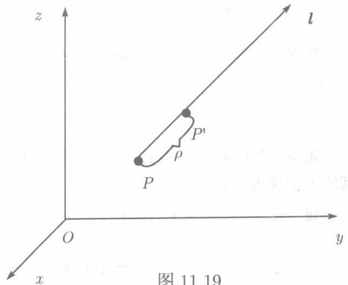

研究数量场内的数量随点的位置的变化而变化时，沿着每一方向的变化率在实用上是极为重要的。例如，在水坝上有温度场，温度的变化导致热涨冷缩。如果在某一点处温度沿某一方向发生剧烈变化，那么，在这一方向上产生裂缝的可能性就较其大方向为大。

定义11.6.1(方向导数）设函数 $u(x,y,z)$ 的定义域为 $V, P_0(x_0,y_0,z_0)$ 为 $V$ 内的一点， $l$ 是从 $P_0$ 出发的射线， $P(x_0 + \Delta x,y_0 + \Delta y,z_0 + \Delta z)$ 是此射线上含于 $V$ 的任一点，以 $\rho$ 表示 $P$ 与 $P_0$ 之间的距离，如果极限

$$
\lim  _ {\rho \rightarrow 0} \frac {u (P) - u \left(P _ {0}\right)}{\rho} = \lim  _ {\rho \rightarrow 0} \frac {u \left(x _ {0} + \Delta x , y + \Delta y , z _ {0} + \Delta z\right) - u \left(x _ {0} , y _ {0} , z _ {0}\right)}{\rho}
$$

存在，则称此极限值为 $u(x,y,z)$ 在点 $P_0$ 沿 $\iota$ 的方向导数，记为

$$
\left. \frac {\partial u}{\partial l} \right| _ {P _ {0}}, \quad u _ {l} (P _ {0}) \quad \text {或} \quad u _ {l} (x _ {0}, y _ {0}, z _ {0}).
$$

如果函数 $u$ 在 $V$ 的每一点沿方向 $\iota$ 都有方向导数，则这一导数也是 $x,y,z$ 的函数，记为

$$
\frac {\partial u}{\partial l} \quad \text {或} \quad u _ {l} (x, y, z).
$$

下面的定理指出了方向导数的存在性及计算方法

定理11.6.1 若函数 $u(x,y,z)$ 在点 $P(x,y,z)$ 可微，则函数 $u$ 在点 $P$ 处沿每一方向 $\pmb{l}$ 的方向导数存在，且

$$
\frac {\partial u}{\partial l} = \frac {\partial u}{\partial x} \cos \alpha + \frac {\partial u}{\partial y} \cos \beta + \frac {\partial u}{\partial z} \cos \gamma , \tag {11.39}
$$

其中 $\cos \alpha, \cos \beta, \cos \gamma$ 为 $l$ 的方向余弦.

证设 $P^{\prime}(x + \Delta x,y + \Delta y,z + \Delta z)$ 是射线 $l$ 上的任一点(见图11.19)，记 $P$ 与 $P^{\prime}$ 之间的距离为 $\rho$ ，由

$$
\overrightarrow {P P ^ {\prime}} = \{\Delta x, \Delta y, \Delta z \}
$$

可知

$$
\cos \alpha = \frac {\Delta x}{\rho}, \cos \beta = \frac {\Delta y}{\rho}, \cos \gamma = \frac {\Delta z}{\rho}.
$$

  
图11.19

按假设， $u(x,y,z)$ 在点 $P$ 可微，故

$$
\begin{array}{l} u (x + \Delta x, y + \Delta y, z + \Delta z) - u (x, y, z) \\ = \frac {\partial u}{\partial x} \Delta x + \frac {\partial u}{\partial z} \Delta y + \frac {\partial u}{\partial z} \Delta z + o (\rho) (\rho \rightarrow 0), \\ \end{array}
$$

所以

$$
\begin{array}{l} \frac {u (x + \Delta x , y + \Delta y , z + \Delta z) - u (x , y , z)}{\rho} \\ = \frac {\partial u}{\partial x} \cos \alpha + \frac {\partial u}{\partial y} \cos \beta + \frac {\partial u}{\partial z} \cos \gamma + \frac {o (\rho)}{\rho}, \\ \end{array}
$$

令 $\rho \to 0$ 即得

$$
\frac {\partial u}{\partial l} = \frac {\partial u}{\partial x} \cos \alpha + \frac {\partial u}{\partial y} \cos \beta + \frac {\partial u}{\partial z} \cos \gamma .
$$

对于二元函数 $f(x,y)$ ，可仿照定义11.6.1定义方向导数，并且相应于（11.39）有

$$
\frac {\partial f}{\partial l} = \frac {\partial f}{\partial x} \cos \alpha + \frac {\partial f}{\partial y} \cos \beta = \frac {\partial f}{\partial x} \cos \alpha + \frac {\partial f}{\partial y} \sin \alpha ,
$$

其中 $\alpha, \beta$ 分别是 $l$ 的方向矢量与 $Ox$ 轴、 $Oy$ 轴正向的夹角.

例11.6.1 设 $u(x,y,z) = x^3 + y + z^2$ 求 $u$ 在点 $(1,1,1)$ 沿方向 $l = \{1,2,-2\}$ 的方向导数.

解 方向 $l$ 的方向余弦为

$$
\cos \alpha = \frac {1}{3}, \quad \cos \beta = \frac {2}{3}, \quad \cos \gamma = \frac {- 2}{3}.
$$

而

$$
\left. \frac {\partial u}{\partial x} \right| _ {(1, 1, 1)} = 3, \quad \left. \frac {\partial u}{\partial y} \right| _ {(1, 1, 1)} = 1, \quad \left. \frac {\partial u}{\partial z} \right| _ {(1, 1, 1)} = 2,
$$

所以

$$
\frac {\partial u}{\partial l} = 3 \cdot \frac {1}{3} + 1 \cdot \frac {2}{3} - 2 \cdot \frac {2}{3} = \frac {1}{3}.
$$
