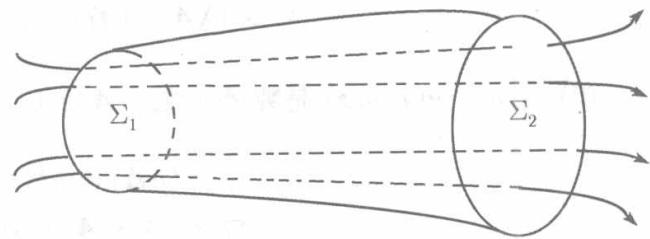

定义11.6.3(散度）设在空间区域 $V$ 上给出一个向量函数

$$
\boldsymbol {A} (x, y, z) = \left\{P (x, y, z), Q (x, y, z), R (x, y, z) \right\},
$$

称数量函数 $\frac{\partial P}{\partial x} + \frac{\partial Q}{\partial y} + \frac{\partial R}{\partial z}$ 为向量函数 $A(x, y, z)$ 的散度，记为 $\operatorname{div} A(x, y, z)$ ，即：

$$
\operatorname {d i v} \boldsymbol {A} (x, y, z) = \frac {\partial P}{\partial x} + \frac {\partial Q}{\partial y} + \frac {\partial R}{\partial z}.
$$

引用算符 $\nabla$ ，散度可以写为

$$
\operatorname {d i v} \boldsymbol {A} = \nabla \cdot \boldsymbol {A}.
$$

按定义，易于直接证明散度的下列性质：

(1) 若 $A(x, y, z), B(x, y, z)$ 是向量函数，而 $\lambda, \mu$ 是常数，则

$$
\bigtriangledown \cdot (\lambda A + \mu B) = \lambda \bigtriangledown \cdot A + \mu \bigtriangledown \cdot B;
$$

(2) 若 $A(x, y, z)$ 是向量函数， $u(x, y, z)$ 是数量函数，则

$$
\bigtriangledown \cdot (u A) = u \bigtriangledown \cdot A + A \cdot \bigtriangledown u;
$$

(3) 若 $u(x, y, z)$ 是数量函数，则

$$
\nabla \cdot \nabla u = \frac {\partial^ {2} u}{\partial x ^ {2}} + \frac {\partial^ {2} u}{\partial y ^ {2}} + \frac {\partial^ {2} u}{\partial z ^ {2}}.
$$

若引用算符 ${}^{(1)}\Delta = \frac{\partial^2}{\partial x^2} +\frac{\partial^2}{\partial y^2} +\frac{\partial^2}{\partial z^2}$ 则上式可写为

$$
\nabla \cdot \nabla u = \Delta u.
$$

由向量场 $A(x,y,z)$ 的散度 $\operatorname{div} A$ 所构成的数量场，称为散度场

以 $\cos \alpha, \cos \beta, \cos \gamma$ 记曲面 $\Sigma$ 指定一侧的方向余弦，则 $n^0 = \{\cos \alpha, \cos \beta, \cos \gamma\}$ 是曲面在该侧的单位法向量。曲面上的面积元素记为 $\mathrm{d}S$ ，则向量

$$
\boldsymbol {n} ^ {0} \mathrm {d} S = \left\{\cos \alpha , \cos \beta , \cos \gamma \right\} \mathrm {d} S
$$

称为曲面的面积元素向量，记为 $\mathrm{d}S = n^0\mathrm{d}S$，于是，奥-高公式可以写为

$$
\iiint_ {V} \operatorname {d i v} \boldsymbol {A} \mathrm {d} V = \oiint_ {\Sigma} \boldsymbol {A} \cdot \mathrm {d} S. \tag {11.40}
$$

对左端的三重积分利用中值定理，将立体 $V$ 的体积也记成 $V$ ，则得

$$
\operatorname {d i v} A (M ^ {*}) V = \oiint_ {\Sigma} A \cdot \mathrm {d} S,
$$

其中 $M^{*}$ 是 $V$ 中某点．两端除以 $V,$ 得

$$
\operatorname {d i v} A (M ^ {*}) = \frac {\iint_ {\Sigma} A \cdot \mathrm {d} S}{V}.
$$

现在令立体 $V$ 收缩到 $V$ 内的定点 $M_0$ , 则 $M^*$ 也趋于点 $M_0$ , 因此, 由函数 $P, Q, R$ 的偏导数的连续性, 得

$$
\operatorname {d i v} A \left(M _ {0}\right) = \lim  _ {V \rightarrow M _ {0}} \frac {\oiint_ {V} \boldsymbol {A} \cdot \mathrm {d} \boldsymbol {S}}{V}. \tag {11.41}
$$

这可以看作散度的定义的另一种形式。在这里，分母中的体积 $V$ 是与坐标系无关的，分子中的曲面积分表示流过曲面 $\Sigma$ 的流量，这是场 $A$ 本身的属性，也与坐标系的选取无关。可见散度也是与坐标系的选取无关的。

(11.41) 表明, 散度是流量对于体积的变化率. $\operatorname{div} A(M_0) > 0$ 表示在每个单位时间内有流体自 $M_0$ 流出, 点 $M_0$ 称为源; 反之, $\operatorname{div} A(M_0) < 0$ 表示流体在这一点被吸收, 点 $M_0$ 称之为汇.

如果在向量场 $A$ 的每一点都成立 $\mathrm{div}A = 0$ ，则称 $A$ 为无源场

例11.6.3 按照万有引力定律，两个质点之间的引力的大小与它们的质量乘积成正比，与距离平方成反比。若质量为 $m$ 的质点位于原点，质量为1的质点位于点 $M(x,y,z)$ ，若比例常数为1，这两个质点间的引力为

$$
\boldsymbol {F} = - \frac {m}{r ^ {2}} \left\{\frac {x}{r}, \frac {y}{r}, \frac {z}{r} \right\},
$$

其中 $r = \sqrt{x^2 + y^2 + z^2}$ 。场 $F$ 称为引力场。试证引力场是无源场。

证 由于 $r^2 = x^2 + y^2 + z^2$ , 所以

$$
\boldsymbol {F} = - \frac {m}{r ^ {3}} \{x, y, z \} = - \frac {m}{(x ^ {2} + y ^ {2} + z ^ {2}) ^ {3 / 2}} \{x, y, z \},
$$

可直接算得

$$
\begin{array}{l} \nabla \cdot \boldsymbol {F} = - m \left[ \frac {\partial}{\partial x} \left(\frac {x}{(x ^ {2} + y ^ {2} + z ^ {2}) ^ {3 / 2}}\right) + \frac {\partial}{\partial y} \left(\frac {y}{(x ^ {2} + y ^ {2} + z ^ {2}) ^ {3 / 2}}\right) \right. \\ \left. + \frac {\partial}{\partial z} \left(\frac {z}{\left(x ^ {2} + y ^ {2} + z ^ {2}\right) ^ {3 / 2}}\right) \right] = 0, \\ \end{array}
$$

即引力场内每一点处散度为零，因而为无源场

设向量场 $\pmb{A}$ 是无源场，在 $A$ 中任意作一个向量管，即由向量线围成的管状曲面（见图11.20），并以断面 $\Sigma_1, \Sigma_2$ 截它，以 $\Sigma_3$ 表示所截得的一段管的外表面，则 $\Sigma_1, \Sigma_2, \Sigma_3$ 组成一个封闭曲面 $\Sigma$ ， $\Sigma$ 围成立体 $V$ ，由(11.40) 得 $\iint_{\Sigma} \boldsymbol{A} \cdot \mathrm{d}\boldsymbol{S} = 0$ ，即

  
图11.20

$$
\iint_ {\Sigma_ {1}} \boldsymbol {A} \cdot \mathrm {d} \boldsymbol {S} + \iint_ {\Sigma_ {2}} \boldsymbol {A} \cdot \mathrm {d} \boldsymbol {S} + \iint_ {\Sigma_ {3}} \boldsymbol {A} \cdot \mathrm {d} \boldsymbol {S} = 0,
$$

其中三个曲面积分都在曲面外侧。但向量线在曲面 $\Sigma_3$ 上，因而与 $\Sigma_3$ 的法线正交，又 $\mathbf{A}$ 的方向与向量线方向相同， $\mathrm{d}S$ 的方向与曲面的法矢量方向相同，因而在 $\Sigma_3$ 上 $A \cdot dS = 0$ ，于是 $\iint_{\Sigma_3} A \cdot dS = 0$ ，所以

$$
\iint_ {\Sigma_ {1} \text {外 侧}} \boldsymbol {A} \cdot \mathrm {d} \boldsymbol {S} + \iint_ {\Sigma_ {2} \text {外 侧}} \boldsymbol {A} \cdot \mathrm {d} \boldsymbol {S} = 0,
$$

即

$$
\iint_ {\Sigma_ {1} \text {内 侧}} \boldsymbol {A} \cdot \mathrm {d} \boldsymbol {S} = \iint_ {\Sigma_ {2} \text {外 侧}} \boldsymbol {A} \cdot \mathrm {d} \boldsymbol {S}.
$$

这表明，流体通过同一向量管的任何断面的流量都是相同的，而在向量管的侧面流量为零，流体恰如在管子内流动一般。因为这个原因，无源场也称作管量场。
