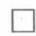

我们来讨论二元一次联立方程组

$$
\left\{ \begin{array}{l} a _ {1} x + b _ {1} y = c _ {1}, \\ a _ {2} x + b _ {2} y = c _ {2}. \end{array} \right. \tag {8.1}
$$

大家知道，解这个方程组，可以采用消元法。为了消去 $y$ ，以 $b_{2}$ 乘第一个方程，以 $b_{1}$ 乘第二个方程，然后两者相减得：

$$
\left(b _ {2} a _ {1} - b _ {1} a _ {2}\right) x = b _ {2} c _ {1} - b _ {1} c _ {2}. \tag {8.2}
$$

用同样方法可消去 $x$ ，得

$$
\left(a _ {2} b _ {1} - a _ {1} b _ {2}\right) y = a _ {2} c _ {1} - a _ {1} c _ {2}. \tag {8.3}
$$

由此，当 $a_1b_2 - a_2b_1 \neq 0$ 时，方程组（8.1）有唯一的解

$$
x = \frac {c _ {1} b _ {2} - c _ {2} b _ {1}}{a _ {1} b _ {2} - a _ {2} b _ {1}}, \quad y = \frac {a _ {1} c _ {2} - a _ {2} c _ {1}}{a _ {1} b _ {2} - a _ {2} b _ {1}}. \tag {8.4}
$$

(8.4)实际上就是方程组(8.1)的求解公式．为了使这个公式便于记忆，我们引用记号

$$
\left| \begin{array}{c c} A _ {1} & B _ {1} \\ A _ {2} & B _ {2} \end{array} \right|,
$$

并称之为二阶行列式. 它的值定义为 $A_{1}B_{2} - A_{2}B_{1}$ . 即

$$
\left| \begin{array}{c c} A _ {1} & B _ {1} \\ A _ {2} & B _ {2} \end{array} \right| = A _ {1} B _ {2} - A _ {2} B _ {1},
$$

其中数 $A_{1},B_{1},A_{2},B_{2}$ 称为行列式的元素，横排称为行，从上向下依次为第一行、第二行；纵排叫列，从左到右依次为第一列、第二列，二阶行列式含有两行两列共4个元素．按定义，二阶行列式的值是两个积的代数和，其构成方法可通过下图来记忆：

$$
\left| \begin{array}{c} A _ {1} \\ A _ {2} \end{array} \right| \begin{array}{l} B _ {1} \\ B _ {2} \end{array}
$$

一个积由图中实线相连的两个元素相乘，冠以正号；另一个积由图中虚线相连的两个元素相乘，冠以负号。例如：

$$
\begin{array}{r l} & \left| \begin{array}{l l} 1 & 2 \\ - 3 & 4 \end{array} \right| = 1 \times 4 - (- 3) \times 2 = 10, \\ & \left| \begin{array}{l l} a _ {1} & b _ {1} \\ a _ {2} & b _ {2} \end{array} \right| = a _ {1} b _ {2} - a _ {2} b _ {1}, \\ & \left| \begin{array}{l l} c _ {1} & b _ {1} \\ c _ {2} & b _ {2} \end{array} \right| = c _ {1} b _ {2} - c _ {2} b _ {1}, \\ & \left| \begin{array}{l l} a _ {1} & c _ {1} \\ a _ {2} & c _ {2} \end{array} \right| = a _ {1} c _ {2} - a _ {2} c _ {1}. \end{array}
$$

于是，利用二阶行列式，方程组（8.1）的解（8.4）可以写为

$$
x = \frac {\left| \begin{array}{c c} c _ {1} & b _ {1} \\ c _ {2} & b _ {2} \end{array} \right|}{\left| \begin{array}{c c} a _ {1} & b _ {1} \\ a _ {2} & b _ {2} \end{array} \right|}, \qquad y = \frac {\left| \begin{array}{c c} a _ {1} & c _ {1} \\ a _ {2} & c _ {2} \end{array} \right|}{\left| \begin{array}{c c} a _ {1} & b _ {1} \\ a _ {2} & b _ {2} \end{array} \right|}.
$$

这些公式中的分母是方程组 (8.1) 中 $x, y$ 的系数按原来位置组成的二阶行列式 (称为系数行列式), 不妨记为 $\Delta$ . 而 $x$ 的右端分子中的行列式是把 $\Delta$ 中的 $a_{1}, a_{2}$ (组 (8.1) 右端中 $x$ 的系数) 换成 (8.1) 的常数项 $c_{1}, c_{2}$ 而成, 不妨记为 $\Delta_{x}$ . 同样, $y$ 右端分子中的行列式是把 $\Delta$ 中的 $b_{1}, b_{2}$ (组 (8.1) 中 $y$ 的系数) 换成常数项 $c_{1}, c_{2}$ 而成, 记为 $\Delta_{y}$ . 于是, 组 (8.1) 的解可以写成简单明了便于记忆而且还便于推广的形式:

$$
x = \frac {\Delta x}{\Delta}, \quad y = \frac {\Delta y}{\Delta} \quad (\Delta \neq 0). \tag {8.5}
$$

公式 (8.5) 要求 $\Delta \neq 0$ ，当 $\Delta = 0$ 情形又如何呢？采用记号 $\Delta, \Delta_x$ 和 $\Delta_y$ ，(8.2) 和 (8.3) 可写为

$$
x \Delta = \Delta_ {x}, \quad y \Delta = \Delta_ {y}.
$$

如果 $\Delta = 0$ ，而 $\Delta_x, \Delta_y$ 不都为零，则无论 $x$ 和 $y$ 取什么值，上两式都不能同时成立，故此时方程组 (8.1) 无解。

如果 $\Delta, \Delta_x$ 以及 $\Delta_y$ 都等于零，即同时成立

$$
a _ {1} b _ {2} - a _ {2} b _ {1} = 0, \quad c _ {1} b _ {2} - c _ {2} b _ {1} = 0, \quad a _ {1} c _ {2} - a _ {2} c _ {1} = 0,
$$

于是

$$
\frac {a _ {1}}{a _ {2}} = \frac {b _ {1}}{b _ {2}} = \frac {c _ {1}}{c _ {2}}.
$$

因而方程组 (8.1) 中的一个方程可由另一方程乘以适当常数得到。两个方程实质上成了一个方程，但未知数却是两个，因而方程组有无穷多组解。

综上所述，可得下述结论：

1) 若 $\Delta \neq 0$ , 则方程组 (8.1) 有唯一的解:

$$
x = \frac {\Delta_ {x}}{\Delta}, \quad y = \frac {\Delta_ {y}}{\Delta}.
$$

2) 若 $\Delta = 0$ ，但 $\Delta_x, \Delta_y$ 不全为零，则方程组（8.1）无解  
3) 若 $\Delta = \Delta_{x} = \Delta_{y} = 0$ ，则方程组（8.1）有无穷多组解

**例** 8.1.1 解方程组

$$
\left\{ \begin{array}{l} 3 x + 4 y = - 1 \\ 2 x - 3 y = 5. \end{array} \right.
$$

**解**

$$
\Delta = \left| \begin{array}{c c} 3 & 4 \\ 2 & - 3 \end{array} \right| = - 9 - 8 = -17 \neq 0,
$$

故方程有唯一的一组解：

$$
x = \frac {1}{\Delta} \left| \begin{array}{c c} - 1 & 4 \\ 5 & - 3 \end{array} \right| = \frac {-17}{-17} = 1, \quad y = \frac {1}{\Delta} \left| \begin{array}{c c} 3 & - 1 \\ 2 & 5 \end{array} \right| = \frac {17}{-17} = - 1.
$$

**例** 8.1.2 解方程组

$$
\left\{ \begin{array}{l} 2 x + y + 1 = 0 \\ 4 x + 2 y = - 2. \end{array} \right.
$$

**解**

$$
\Delta = \left| \begin{array}{l l} 2 & 1 \\ 4 & 2 \end{array} \right| = 0, \quad \Delta_ {x} = \left| \begin{array}{l l} - 1 & 1 \\ - 2 & 2 \end{array} \right| = 0, \quad \Delta_ {y} = \left| \begin{array}{l l} 2 & - 1 \\ 4 & - 2 \end{array} \right| = 0,
$$

故方程组有无穷多组解. 实际上, 方程组只含一个方程

$$
2 x + y = - 1,
$$

由此可知，方程的解可表为 $y = -(2x + 1)$ ， $x$ 取任意值

**例** 8.1.3 讨论方程组

$$
\left\{ \begin{array}{l} 3 x + 2 y + 1 = 0, \\ 6 x + 4 y - 1 = 0 \end{array} \right.
$$

是否有解.

**解**

$$
\Delta = \left| \begin{array}{l l} 3 & 2 \\ 6 & 4 \end{array} \right| = 0, \quad \Delta_ {x} = \left| \begin{array}{c c} - 1 & 2 \\ 1 & 4 \end{array} \right| = - 6 \neq 0,
$$

可见方程组无解. 事实上由第一个方程得 $6x + 4y = -2$ , 与第二方程 $6x + 4y = 1$ 是矛盾的. $\square$

彼此矛盾的方程称为不相容的方程
