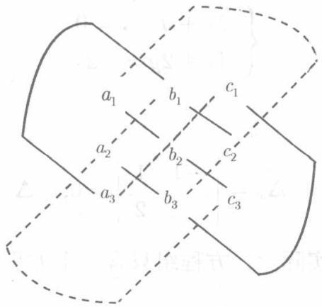

现在，我们来推广8.1.1的结果．称记号

$$
\left| \begin{array}{c c c} a _ {1} & b _ {1} & c _ {1} \\ a _ {2} & b _ {2} & c _ {2} \\ a _ {3} & b _ {3} & c _ {3} \end{array} \right|
$$

为一个三阶行列式，它的值定义为

$$
\left| \begin{array}{l l l} a _ {1} & b _ {1} & c _ {1} \\ a _ {2} & b _ {2} & c _ {2} \\ a _ {3} & b _ {3} & c _ {3} \end{array} \right| = a _ {1} b _ {2} c _ {3} + a _ {2} b _ {3} c _ {1} + a _ {3} b _ {1} c _ {2} - a _ {1} b _ {3} c _ {2} - a _ {2} b _ {1} c _ {3} - a _ {3} b _ {2} c _ {1}. \tag {8.6}
$$

(8.6) 的右端是 6 个积的代数和, 可按下图所示的对角线法则记忆:

凡用实线相连的三个数的积，均冠以正号，而凡以虚线相连的三个数的积，均冠以负号．例如：

$$
\begin{array}{l} \left| \begin{array}{r r r} 1 & 0 & 2 \\ - 1 & 2 & 3 \\ 2 & - 2 & 1 \end{array} \right| = 1 \cdot 2 \cdot 1 + (- 1) \cdot (- 2) \cdot 2 \\ + 2 \cdot 3 \cdot 0 - 2 \cdot 2 \cdot 2 - 1 \cdot (- 2) \cdot 3 - 1 \cdot (- 1) \cdot 0 \\ = 2 + 4 + 0 - 8 + 6 - 0 = 4. \\ \end{array}
$$

和二阶行列式一样，三阶行列式的横排自上而下称为第一行、第二行、第三行，竖排自左到右称为第一列、第二列、第三列，三阶行列式由三行三列共9个元素组成.

利用二阶行列式的定义，(8.6)的右端可以变形为：

$$
\begin{array}{l} a _ {1} b _ {2} c _ {3} + a _ {2} b _ {3} c _ {1} + a _ {3} b _ {1} c _ {2} - a _ {1} b _ {3} c _ {2} - a _ {2} b _ {1} c _ {3} - a _ {3} b _ {2} c _ {1} \\ = a _ {1} \left(b _ {2} c _ {3} - b _ {3} c _ {2}\right) - b _ {1} \left(a _ {2} c _ {3} - a _ {3} c _ {2}\right) + c _ {1} \left(a _ {2} b _ {3} - a _ {3} b _ {2}\right) \\ = a _ {1} \left| \begin{array}{c c} b _ {2} & c _ {2} \\ b _ {3} & c _ {3} \end{array} \right| - b _ {1} \left| \begin{array}{c c} a _ {2} & c _ {2} \\ a _ {3} & c _ {3} \end{array} \right| + c _ {1} \left| \begin{array}{c c} a _ {2} & b _ {2} \\ a _ {3} & b _ {3} \end{array} \right|. \\ \end{array}
$$

于是 (8.6) 可以写为

$$
\left| \begin{array}{l l l} a _ {1} & b _ {1} & c _ {1} \\ a _ {2} & b _ {2} & c _ {2} \\ a _ {3} & b _ {3} & c _ {3} \end{array} \right| = a _ {1} \left| \begin{array}{c c} b _ {2} & c _ {2} \\ b _ {3} & c _ {3} \end{array} \right| - b _ {1} \left| \begin{array}{c c} a _ {2} & c _ {2} \\ a _ {3} & c _ {3} \end{array} \right| + c _ {1} \left| \begin{array}{c c} a _ {2} & b _ {2} \\ a _ {3} & b _ {3} \end{array} \right|. \tag {8.7}
$$

用公式 (8.7) 计算三阶行列式的值称为按行列式的第一行展开. 其规则是:

将第一行的三个数各自乘以一个二阶行列式，而这个二阶行列式是由原三阶行列式划去该数所在的行和列后留下的4个元素保持原有的相对位置构成的。在如此得到的三个积中，第一个、第三个冠以正号，第二个冠以负号，求它们的代数和。例如：

$$
\left| \begin{array}{r r r} 1 & 0 & 2 \\ - 1 & 2 & 3 \\ 2 & - 2 & 1 \end{array} \right| = 1 \cdot \left| \begin{array}{c c} 2 & 3 \\ - 2 & 1 \end{array} \right| - 0 \cdot \left| \begin{array}{c c} - 1 & 3 \\ 2 & 1 \end{array} \right| + 2 \left| \begin{array}{c c} - 1 & 2 \\ 2 & - 2 \end{array} \right| = 8 - 4 = 4.
$$

两种算法算出的结果相同.

类似地，还可以按第三行展开：

$$
\left| \begin{array}{l l l} a _ {1} & b _ {1} & c _ {1} \\ a _ {2} & b _ {2} & c _ {2} \\ a _ {3} & b _ {3} & c _ {3} \end{array} \right| = a _ {3} \left| \begin{array}{l l} b _ {1} & c _ {1} \\ b _ {2} & c _ {2} \end{array} \right| - b _ {3} \left| \begin{array}{l l} a _ {1} & c _ {1} \\ a _ {2} & c _ {2} \end{array} \right| + c _ {3} \left| \begin{array}{l l} a _ {1} & b _ {1} \\ a _ {2} & b _ {2} \end{array} \right|.
$$

第12章将指出按任何一行或任何一列展开行列式的一般方法

现在，对于三元一次联立方程组

$$
\left\{ \begin{array}{l} a _ {1} x + b _ {1} y + c _ {1} z = d _ {1}, \\ a _ {2} x + b _ {2} y + c _ {2} z = d _ {2}, \\ a _ {3} x + b _ {3} y + c _ {3} z = d _ {3} \end{array} \right. \tag {8.8}
$$

陈述若干结果. 称

$$
\Delta = \left| \begin{array}{c c c} a _ {1} & b _ {1} & c _ {1} \\ a _ {2} & b _ {2} & c _ {2} \\ a _ {3} & b _ {3} & c _ {3} \end{array} \right|
$$

为方程组 (8.8) 的系数行列式，类似于二元一次方程组，在 (8.8) 的 3 个方程中，以常数项分别代替 $x, y, z$ 的系数得行列式：

$$
\Delta_ {x} = \left| \begin{array}{l l l} d _ {1} & b _ {1} & c _ {1} \\ d _ {2} & b _ {2} & c _ {2} \\ d _ {3} & b _ {3} & c _ {3} \end{array} \right|, \quad \Delta_ {y} = \left| \begin{array}{l l l} a _ {1} & d _ {1} & c _ {1} \\ a _ {2} & d _ {2} & c _ {2} \\ a _ {3} & d _ {3} & c _ {3} \end{array} \right|, \quad \Delta_ {z} = \left| \begin{array}{l l l} a _ {1} & b _ {1} & d _ {1} \\ a _ {2} & b _ {2} & d _ {2} \\ a _ {3} & b _ {3} & d _ {3} \end{array} \right|.
$$

1) 若 $\Delta \neq 0$ , 则方程组(8.8)有唯一的解

$$
x = \frac {\Delta_ {x}}{\Delta}, \quad y = \frac {\Delta_ {y}}{\Delta}, \quad z = \frac {\Delta_ {z}}{\Delta}.
$$

2) 若 $\Delta = 0$ , 而 $\Delta_x, \Delta_y, \Delta_z$ 不全为 0, 则组 (8.8) 无解.  
3) 若 $\Delta = \Delta_{x} = \Delta_{y} = \Delta_{z} = 0$ , 则组(8.8)可能无解也可能有无穷多组解（这与二元的情形不同！）

我们暂时不来证明这些结论。这一节所讲的一切都是第12章所要讲到的 $n$ 阶行列式及 $n$ 元线性方程组的特例，在那里，我们将较深入地讨论 $n$ 阶行列式的丰富多彩的性质及 $n$ 元线性方程组的基本理论。
