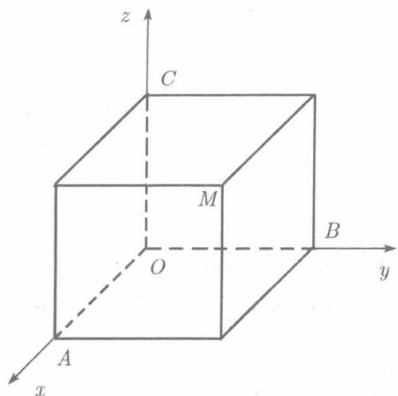

在平面解析几何中，为了确定平面上任意一点的位置，曾经建立起平面直角坐标系。这实际上就是两条互相垂直的有相同单位长度的数轴。借助于这两条数轴，平面上任何一点的位置可以用一对有序实数 $(x, y)$ 表示出来。可是对于空间的点，单有两个有序实数 $(x, y)$ 已经不能确定其位置了。粗糙地说，还需要知道所讨论的点离开“地面”多少高度。为此，我们在平面直角坐标的基础上，再增加一条数轴，建立空间直角坐标系。

具体地说，在空间某点 $O$ 引三条两两垂直的具有共同单位长度的数轴 $Ox, Oy$ 和 $Oz$ (称之为坐标轴，它们的交点 $O$ 称为坐标原点)，各轴的正向通常按右手法则确定：即以右手握住 $Oz$ 轴，让握轴的四指从 $Ox$ 轴的正向转向 $Oy$ 轴的正向所经过的角度为 $\frac{\pi}{2}$ ，则拇指伸直所指的方向规定为 $Oz$ 轴的正向。这样就确定了一个空间直角坐标系（见图8.1）， $Ox$ 轴， $Oy$ 轴， $Oz$ 轴分别称为横轴、纵轴和竖轴。为了在平面上作出立体图，习惯上让 $Ox$ 轴的正向指向前方（即指向阅读者）， $Oy$ 轴

  
图8.1

的正向指向右方，而 $Oz$ 轴的正向指向上方.三个坐标轴两两决定一个平面，这三个平面称为坐标平面． $Ox$ 轴与 $Oy$ 轴所确定的平面记为 $xOy$ 平面，类似地有 $yOz$ 平面和 $zOx$ 平面.三个坐标平面把整个空间分成8个部分，称之为卦限，在 $xOy$ 平面第一、第二、第三、第四象限上方的那4个卦限依次称为第一卦限、第二卦限、第三卦限和第四卦限，而在它们下方的那些卦限则依次称为第五、六、七、八卦限。

设 $M$ 为空间一点，过 $M$ 作三个平面分别垂直于三个坐标轴，依次以 $A, B, C$ 记这些平面与 $Ox, Oy$ 轴， $Oz$ 轴的交点，则 $A, B, C$ 在各自所在的坐标轴（数轴）上有确定的坐标 $x, y, z$ ，于是 $M$ 唯一地决定一组有序实数 $x, y, z$ ；反之，给定三个有序实数 $x, y, z$ ，在坐标轴 $Ox, Oy, Oz$ 上可以各自确定一点 $A, B, C$ ，它们在各自所在的轴上分别以 $x, y, z$ 为坐标，于是依次过 $A, B, C$ 作与轴 $Ox, Oy, Oz$ 垂直的三个平面交于唯一的一点 $M$ 。这样一来，空间的点就与三个有序实数 $x, y, z$ 建立了一一对应的关系。这三个实数称为点 $M$ 的直角坐标，也简称坐标。 $x$ 称作横标， $y$ 称作纵标， $z$ 称作竖标或立标，横标为 $x$ ，纵标为 $y$ ，竖标为 $z$ 的点 $M$ 记作 $M(x, y, z)$ 。

如果点 $M$ 在坐标面上，则它的三个坐标至少有一个为0. $xOy$ 平面上 $z = 0, yOz$ 平面上 $x = 0, zOx$ 平面上 $y = 0$ . 如果点 $M$ 在坐标轴上，则它的三个坐标至少有两个为 $0: Ox$ 轴上 $y = z = 0, Oy$ 轴上 $z = x = 0, Oz$ 轴上 $x = y = 0$ . 原点 $O$ 的三个坐标均为0.
