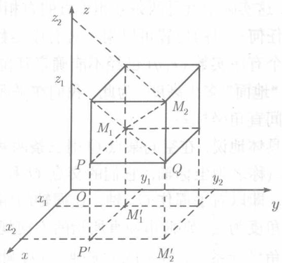

设已知空间两点 $M_{1}(x_{1},y_{1},z_{1})$ 和 $M_2(x_2,y_2,z_2)$ ，为了利用这两点的坐标计算

它们的距离 $|M_1M_2|$ ，过 $M_{1}$ 和 $M_2$ 各作三个平面分别垂直于三个坐标轴，这六个平面构成一个长方体(见图8.2)，线段 $M_1M_2$ 就是这长方体的对角线.由于 $\Delta M_1QM_2$ 和 $\Delta M_1PQ$ 都是直角三角形，利用勾股定理，得

$$
\begin{array}{l} \left| M _ {1} M _ {2} \right| ^ {2} = \left| M _ {1} Q \right| ^ {2} + \left| Q M _ {2} \right| ^ {2} \\ = | M _ {1} P | ^ {2} + | P Q | ^ {2} + | Q M _ {2} | ^ {2} \\ = \left| M _ {1} ^ {\prime} P ^ {\prime} \right| ^ {2} + \left| P ^ {\prime} M _ {2} ^ {\prime} \right| ^ {2} + \left| Q M _ {2} \right| ^ {2} \\ = (x _ {2} - x _ {1}) ^ {2} + (y _ {2} - y _ {1}) ^ {2} \\ + (z _ {2} - z _ {1}) ^ {2}. \\ \end{array}
$$

  
图8.2

于是，若 $d$ 表示点 $M_{1}, M_{2}$ 之间的距离，则

$$
d = \sqrt {(x _ {2} - x _ {1}) ^ {2} + (y _ {2} - y _ {1}) ^ {2} + (z _ {2} - z _ {1}) ^ {2}}.
$$

特别，点 $M(x,y,z)$ 与原点 $O(0,0,0)$ 的距离为

$$
d = \sqrt {x ^ {2} + y ^ {2} + z ^ {2}}.
$$

这两个公式称为两点之间的距离公式

**例** 8.2.1 若 $M(x,y,z)$ 到三个坐标轴的距离相等，则它到三个坐标面的距离也相等.

证 设 $M$ 到 $Ox, Oy, Oz$ 轴的距离为 $d_x, d_y$ 及 $d_z$ , 到坐标面 $xOy, yOz, zOx$ 的距离为 $d_{xy}, d_{yz}$ 及 $d_{zx}$ . 则由 $d_x = d_y = d_z$ 得 $\sqrt{y^2 + z^2} = \sqrt{z^2 + x^2} = \sqrt{x^2 + y^2}$ , 平方化简得 $y^2 = x^2 = z^2$ , $|y| = |x| = |z|$ , 此即 $d_{zx} = d_{yz} = d_{xy}$ .

**例** 8.2.2 试证以 $A(4,1,9), B(10,-1,6), C(2,4,3)$ 为顶点的三角形是等腰直角三角形.

**解** 由距离公式

$$
\begin{array}{l} | A B | = \sqrt {(10 - 4) ^ {2} + (- 1 - 1) ^ {2} + (6 - 9) ^ {2}} = \sqrt {49} = 7, \\ | B C | = \sqrt {(2 - 10) ^ {2} + (4 + 1) ^ {2} + (3 - 6) ^ {2}} = \sqrt {98}, \\ \left| C A \right| = \sqrt {(4 - 2) ^ {2} + (1 - 4) ^ {2} + (9 - 3) ^ {2}} = \sqrt {49} = 7. \\ \end{array}
$$

由此可知 $|AB| = |AC|$ ，且 $|AB|^2 +|AC|^2 = |BC|^2$ ，故 $\Delta ABC$ 是等腰直角三角形. □

**例** 8.2.3 已知 $A(4,1,7)$ ， $B(-3,5,0)$ ，试在 $Oy$ 轴上求一点 $M$ ，使 $|MA| = |MB|$

**解** 因点 $M$ 在 $Oy$ 轴上，其横标 $x$ 及竖标 $z$ 都为0，设 $M = M(0,y,0)$ ，则由距离公式得

$$
16 + (y - 1) ^ {2} + 49 = 9 + (y - 5) ^ {2},
$$

由此解得 $y = -4$ ，故所求的点为 $M(0, - 4,0)$
