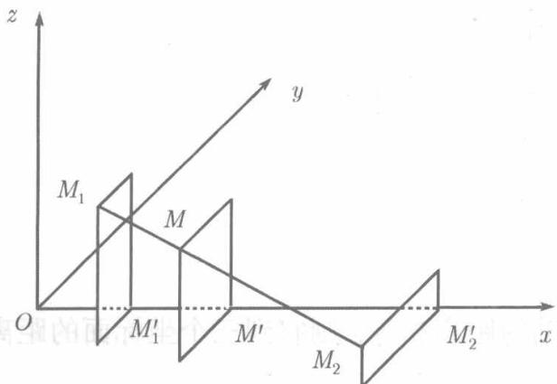

设 $L$ 是空间的一条赋有正向的直线，而 $M_{1}, M_{2}$ 是位于 $L$ 上的两点，现在我们来定义 $L$ 上的有向线段及有向线段的值。在线段的两个端点中认定一个为起点而另一个为终点，称从起点指向终点的方向为该线段的方向，有方向的线段称为有向线段。以 $M_{1}$ 为起点 $M_{2}$ 为终点的有向线段记为 $\overline{M_{1}M_{2}}$ 。因此， $\overline{M_{1}M_{2}}$ 和 $\overline{M_{2}M_{1}}$ 虽然有共同的端点，但却是两条不同的有向线段。有向直线 $L$ 上的有向线段 $\overline{M_{1}M_{2}}$ 的值是一个数，记为 $M_{1}M_{2}$ ，其绝对值等于 $\overline{M_{1}M_{2}}$ 的长度 $|\overline{M_{1}M_{2}}|$ ，在

  
图8.3

$\overline{M_1M_2}$ 的方向与 $L$ 正向相同时冠以正号，否则冠以负号.由此可见 $\left|M_{1}M_{2}\right| = \left|M_{2}M_{1}\right|$ ，而 $M_{1}M_{2} = -M_{2}M_{1}$

若 $M_{1}(x_{1},y_{1},z_{1})$ ， $M_2(x_2,y_2,z_2)$ 为已知两点，试在连接这两点的直线上求一点 $M(x,y,z)$ ，使有向线段 $\overline{M_1M}$ 和 $\overline{MM_2}$ 的值的比为 $\lambda$

$$
\frac {M _ {1} M}{M M _ {2}} = \lambda (\lambda \neq - 1).
$$

过 $M, M_1, M_2$ 分别作平面垂直于 $Ox$ 轴，这些平面与 $Ox$ 轴的交点依次记为 $M', M_1', M_2'$ ，则

$$
\frac {M _ {1} M}{M M _ {2}} = \frac {M _ {1} ^ {\prime} M ^ {\prime}}{M ^ {\prime} M _ {2} ^ {\prime}}.
$$

但 $M_1' M' = x - x_1, M' M_2' = x_2 - x,$ 故上式成为

$$
\frac {x - x _ {1}}{x _ {2} - x} = \lambda ,
$$

由此解得

$$
x = \frac {x _ {1} + \lambda x _ {2}}{1 + \lambda}.
$$

类似于此，过 $M, M_1, M_2$ 作平面垂直于 $Oy$ 轴或 $Oz$ 轴，又可得

$$
y = \frac {y _ {1} + \lambda y _ {2}}{1 + \lambda}, \quad z = \frac {z _ {1} + \lambda z _ {2}}{1 + \lambda}.
$$

于是，所求的分点 $M$ 的坐标为

$$
x = \frac {x _ {1} + \lambda x _ {2}}{1 + \lambda}, \quad y = \frac {y _ {1} + \lambda y _ {2}}{1 + \lambda}, \quad z = \frac {z _ {1} + \lambda z _ {2}}{1 + \lambda}. \tag {8.9}
$$

特别，在(8.9)中令 $\lambda = 1$ ，则得线段 $\overline{M_1M_2}$ 的中点坐标：

$$
x = \frac {x _ {1} + x _ {2}}{2}, \quad y = \frac {y _ {1} + y _ {2}}{2}, \quad z = \frac {z _ {1} + z _ {2}}{2}. \tag {8.10}
$$

通常称（8.9）为分点公式，称（8.10）为中点公式。

**例** 8.2.4 给定两点 $M_{1}(-1,4,1)$ 和 $M_2(1,0, - 3)$ ，求点 $M(x,y,z)$ 使

$$
\frac {\overline {{M _ {1} M}}}{\overline {{M M _ {2}}}} = 2.
$$

**解** 按公式 (8.9)

$$
x = \frac {- 1 + 2}{3} = \frac {1}{3}, \quad y = \frac {4 + 2 \times 0}{3} = \frac {4}{3}, \quad z = \frac {1 + 2 \times (- 3)}{3} = - \frac {5}{3}.
$$

故所求之点为 $M\left(\frac{1}{3}, \frac{4}{3}, -\frac{5}{3}\right)$ .

**例** 8.2.5 将例8.2.4中的有向线段 $\overline{M_1M_2}$ 延长到 $M$ ，使 $\frac{|M_1M|}{|MM_2|} = \frac{1}{2}$ ，试求点 $M$ 的坐标。

**解** $M$ 的坐标 $x, y, z$ 可以用两种方法求得

方法一 因为有向线段 $\overline{M_1M}$ 和 $\overline{MM_2}$ 反向，故由题意得

$$
\frac {\overline {{M _ {1} M}}}{\overline {{M M _ {2}}}} = - \frac {1}{2}.
$$

于是，利用公式（8.9）可以算出

$$
x = 2 \left(- 1 - \frac {1}{2}\right) = - 3, \quad y = 2 (4 - 0) = 8, \quad z = 2 \left(1 + \frac {3}{2}\right) = 5.
$$

方法二 按题意 $\overline{MM_2} = 2\overline{MM_1}$ ，故 $M_1$ 是线段 $\overline{M_2M}$ 的中点，按公式 (8.10) 应有

$$
\frac {x + 1}{2} = - 1, \quad \frac {y + 0}{2} = 4, \quad \frac {z - 3}{2} = 1,
$$

由此算出

$$
x = - 3, \quad y = 8, \quad z = 5.
$$

无论用哪种方法，结果都是 $M(-3,8,5)$
