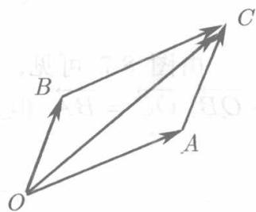
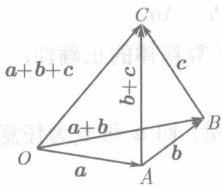
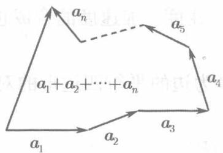
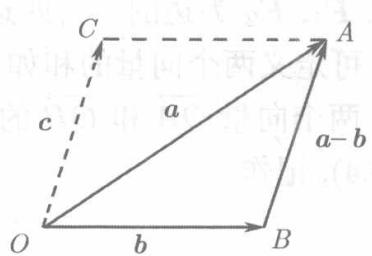

在物理学中，如果两个力 $F_{1}$ 和 $F_{2}$ 作用在同一质点上，则它们的合力 $F$ 可用以 $F_{1}, F_{2}$ 为边的平行四边形的对角线表示。速度、加速度的合成也是如此。由此，可定义两个向量的和如下：

两个向量 $\overrightarrow{OA}$ 和 $\overrightarrow{OB}$ 的和是以这两个矢量为边的平行四边形的对角线 $\overrightarrow{OC}$ (见图8.4), 记作

$$
\overrightarrow {O C} = \overrightarrow {O A} + \overrightarrow {O B}.
$$

矢量的这种求和法则称为平行四边形法则。对于在一条直线上的两个矢量 $\overrightarrow{OA}$ 和 $\overrightarrow{OB}$ ，它们的和定义为同一直线上的一个矢量 $\overrightarrow{OC}$ ，当 $\overrightarrow{OA}, \overrightarrow{OB}$ 指向相同时， $\overrightarrow{OC}$ 取同一指向，而 $\overrightarrow{OC}$ 的模为 $\overrightarrow{OA}, \overrightarrow{OB}$ 的模的和；当 $\overrightarrow{OA}, \overrightarrow{OB}$ 指向相反时， $\overrightarrow{OC}$ 的指向为 $\overrightarrow{OA}, \overrightarrow{OB}$ 中模较大的那一向量的指向，而 $\overrightarrow{OC}$ 的模等于 $\overrightarrow{OA}, \overrightarrow{OB}$ 的模的差。

  
图8.4

由上述定义，显然可见

$$
\overrightarrow {O A} + \overrightarrow {O B} = \overrightarrow {O B} + \overrightarrow {O A},
$$

即：对于加法，交换律是成立的.

  
图8.5

在图8.4中， $\overrightarrow{AC} = \overrightarrow{OB}$ ，因而 $\overrightarrow{OA} +\overrightarrow{AC} = \overrightarrow{OA} +\overrightarrow{OB} =$ OC.由此立刻可得求两个向量的和的另一方法：以第一个向量的终点为起点作第二个向量，则以第一个向量的起点为起点至第二个向量的终点为终点的向量即为两个向量的和。这里由于两个向量与它们的和向量构成一个三角形，故这种求和法称为向量求和的三角形法则。

如果要求三个向量 $a, b, c$ 的和 $a + b + c$ , 则可相继使用三角形法则, 即先求 $a + b$ , 再将这和与 $c$ 相加. 由图8.5可见

$$
(a + b) + c = a + (b + c) = a + b + c,
$$

即对于矢量的加法，结合律也是成立的。

由于向量求和时成立交换律和结合律，因此，三角形法则可以用来求任意有限个向量的和：以前一个向量的终点作为后一个向量的起点，以任何次序相继连接 $n$ 个向量 $A_{1}, A_{2}, \dots, A_{n}$ ，那么，以第一个向量的起点为起点最后一个向量的终点为终点的向量即所给 $n$ 个向量的和（见图8.6).由此可见，若 $n$ 个向量相加构成封闭折线，则它们的和是零向量。

向量的减法定义为加法的逆运算. 即: 若 $b + c = a$ , 则定义 $c = a - b$ . 因此, 为了从矢量 $a$ 减去矢量 $b$ , 只要把它们平行移动到同一起点, 例如 $O$ , 并从减矢量的终点 $B$ 向被减矢量的终点 $A$ 引一矢量 $\overrightarrow{BA}$ , 此即所求的差 $a - b$ (见图8.7).

  
图8.6

  
图8.7

由图8.7可见，若以 $OA$ 为对角线将 $\Delta OBA$ 补成平行四边形，则 $\overrightarrow{AC} = -\overrightarrow{OB}, \overrightarrow{OC} = \overrightarrow{BA}$ 。但是

$$
\overrightarrow {O A} + \overrightarrow {A C} = \overrightarrow {O C}, \quad \overrightarrow {O A} - \overrightarrow {O B} = \overrightarrow {B A},
$$

由此得 $\overrightarrow{OA} + (-\overrightarrow{OB}) = \overrightarrow{OA} - \overrightarrow{OB}$ . 因此，两个向量的差等于被减向量与减向量的相反向量之和.

设 $\lambda$ 是数量而 $a$ 是向量，数 $\lambda$ 与向量 $a$ 的乘积 $\lambda a$ 是一个与 $a$ 平行而模等于 $|\lambda||a|$ 的向量，若 $\lambda > 0$ 其指向与 $a$ 相同，若 $\lambda < 0$ 其指向与 $a$ 相反.

特别，若 $\lambda = -1$ ，则 $(-1)a$ 就是 $a$ 的相反向量 $-a$。由向量的数乘的定义可知，两个非零向量 $a, b$ 平行的充分必要条件是存在数 $\lambda$ 使 $b = \lambda a$。

利用向量的加法以及向量与数乘的定义，容易验证下列运算规律的正确性：

**分配律：** $(\lambda +\mu)a = \lambda a + \mu a,\lambda (a + b) = \lambda a + \lambda b.$

**结合律：** $\lambda (\mu a) = \mu (\lambda a) = (\lambda \mu)a.$ 其中 $\lambda$ 和 $\mu$ 为任意数量，而 $a$ 和 $b$ 为任意向量.

设 $a$ 为非零向量，则向量 $\frac{1}{|a|} a$ 的模为1，且其方向与 $a$ 相同，因此这就是与 $a$ 同方向的单位向量 $a^0$ ：

$$
\boldsymbol {a} ^ {0} = \frac {1}{| \boldsymbol {a} |} \boldsymbol {a}.
$$

即：与非零向量同方向的单位向量可以由该向量乘以它的模的倒数得到。
