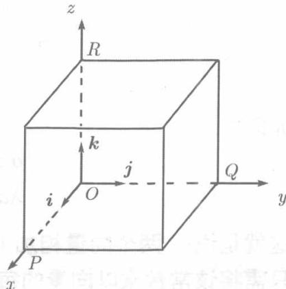
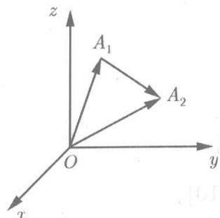

用几何作图的方法施行向量的运算，实践上多少有些不便。为了克服这一缺点，我们引进向量的坐标表示，从而将向量运算代数化。

在空间直角坐标系中，与 $Ox$ 轴、 $Oy$ 轴、 $Oz$ 轴的正向同方向的单位向量依次记为 $\pmb{i},\pmb{j},\pmb{k}$ ，称之为基本单位向量。

设向量 $\pmb{a}$ 的起点为坐标原点 $O$ ，终点为 $A(x,y,z)$ 过点 $A$ 作三张平面分别与 $Ox$ 轴、 $Oy$ 轴、 $Oz$ 轴垂直，设垂足依次为 $P,Q,R$ （见图8.8)，则 $P$ 在 $Ox$ 轴上的坐标为 $x,Q$ 在 $Oy$ 轴上的坐标为 $y,R$ 在 $Oz$ 轴上的坐标为 $z$ .于是，根据数与向量的乘法运算的定义可知

$$
\overrightarrow {O P} = x \mathbf {i}, \quad \overrightarrow {O Q} = y \mathbf {j}, \quad \overrightarrow {O R} = z \mathbf {k}.
$$

于是由向量的加法，

  
图8.8

$$
\begin{array}{l} \boldsymbol {a} = \overrightarrow {O A} = \overrightarrow {O P} + \overrightarrow {P M} + \overrightarrow {M A} = \overrightarrow {O P} + \overrightarrow {O Q} + \overrightarrow {O R} \\ = x \boldsymbol {i} + y \boldsymbol {j} + z \boldsymbol {k}. \\ \end{array}
$$

我们称 $a = x\pmb{i} + y\pmb{j} + z\pmb{k}$ 为向量 $\pmb{a}$ 的坐标表示式. 并简记为

$$
\boldsymbol {a} = \{x, y, z \}.
$$

这里采用花括弧以区别于点 $A$ 的坐标表示 $A(x,y,z)$ ，向量 $xi, yj, zk$ 称为向量 $\pmb{a}$ 在坐标轴 $Ox, Oy, Oz$ 上的分向量，而数 $x, y, z$ 称为向量 $\pmb{a}$ 的坐标.

  
图8.9

如果向量的起点不在原点 $O$ ，而是以 $A_{1}(x_{1},y_{1},z_{1})$ 为起点， $A_{2}(x_{2},y_{2},z_{2})$ 为终点（见图8.9)，则

$$
\begin{array}{l} \overrightarrow {A _ {1} A _ {2}} = \overrightarrow {O A _ {2}} - \overrightarrow {O A _ {1}} \\ = \left(x _ {2} \boldsymbol {i} + y _ {2} \boldsymbol {j} + z _ {2} \boldsymbol {k}\right) - \left(x _ {1} \boldsymbol {i} + y _ {1} \boldsymbol {j} + z _ {1} \boldsymbol {k}\right) \\ = (x _ {2} - x _ {1}) \boldsymbol {i} + (y _ {2} - y _ {1}) \boldsymbol {j} + (z _ {2} - z _ {1}) \boldsymbol {k}, \\ \end{array}
$$

故 $\overrightarrow{A_1A_2}$ 的坐标为 $x_{2} - x_{1},y_{2} - y_{1},z_{2} - z_{1}$

$$
\overrightarrow {A _ {1} A _ {2}} = \left\{x _ {2} - x _ {1}, y _ {2} - y _ {1}, z _ {2} - z _ {1} \right\}.
$$

综上所述，可知：向量的坐标等于它的终点与起点的同名坐标之差，特别，若起点在原点，则向量的坐标就是终点的同名坐标。

利用向量的坐标表示式、向量加法的交换律与结合律，以及向量数乘的结合律与分配律，向量的加减与数乘运算就转化为坐标之间的加减与乘以常数这些简单的代数运算。设

$$
\boldsymbol {a} = \left\{x _ {a}, y _ {a}, z _ {a} \right\}, \quad \boldsymbol {b} = \left\{x _ {b}, y _ {b}, z _ {b} \right\},
$$

即

$$
\boldsymbol {a} = x _ {a} \boldsymbol {i} + y _ {a} \boldsymbol {j} + z _ {a} \boldsymbol {k}, \quad \boldsymbol {b} = x _ {b} \boldsymbol {i} + y _ {b} \boldsymbol {j} + z _ {b} \boldsymbol {k},
$$

于是

$$
\begin{array}{l} \boldsymbol {a} \pm \boldsymbol {b} = \left(x _ {a} \boldsymbol {i} + y _ {a} \boldsymbol {j} + z _ {a} \boldsymbol {k}\right) \pm \left(x _ {b} \boldsymbol {i} + y _ {b} \boldsymbol {j} + z _ {b} \boldsymbol {k}\right) \\ = \left(x _ {a} \pm x _ {b}\right) i + \left(y _ {a} \pm y _ {b}\right) j + \left(z _ {a} \pm z _ {b}\right) k, \\ \lambda \boldsymbol {a} = \lambda \left(x _ {a} \boldsymbol {i} + y _ {a} \boldsymbol {j} + z _ {a} \boldsymbol {k}\right) \\ = (\lambda x _ {a}) \boldsymbol {i} + (\lambda y _ {a}) \boldsymbol {j} + (\lambda z _ {a}) \boldsymbol {k}. \\ \end{array}
$$

亦即

$$
\begin{array}{l} \boldsymbol {a} \pm \boldsymbol {b} = \left\{x _ {a} \pm x _ {b}, y _ {a} \pm y _ {b}, z _ {a} \pm z _ {b} \right\}, \\ \lambda \boldsymbol {a} = \left\{\lambda x _ {a}, \lambda y _ {a}, \lambda z _ {a} \right\}. \\ \end{array}
$$

这就是说：两个向量相加（减）只需将它们的同名坐标相加（减），常数与向量相乘只需将该常数乘以向量的每个坐标。

读者已见，刚才求 $\overrightarrow{A_1A_2}$ 的坐标时就是这样做的。利用两点间的距离公式，可以通过向量的坐标计算它的模。设 $a = \{x,y,z\}$ ，即

$$
\boldsymbol {a} = x \boldsymbol {i} + y \boldsymbol {j} + z \boldsymbol {k}.
$$

这是起点在原点，终点在点 $M(x,y,z)$ 的向量 $\overrightarrow{OM}$ ，于是

$$
| \boldsymbol {a} | = | \overrightarrow {O M} | = \sqrt {x ^ {2} + y ^ {2} + z ^ {2}}. \tag {8.11}
$$

例8.3.1 已知 $a = \{1, -1, 2\}$ , $b = \{0, 4, -2\}$ , 求 $a + b$ , $a - b$ , $2a - 3b$ , 及 $|2a - 3b|$ .

**解**

$$
\begin{array}{l} \boldsymbol {a} + \boldsymbol {b} = \{1 + 0, - 1 + 4, 2 + (- 2) \} = \{1, 3, 0 \}, \\ \boldsymbol {a} - \boldsymbol {b} = \{1 - 0, - 1 - 4, 2 - (- 2) \} = \{1, - 5, 4 \}, \\ 2 a - 3 b = \{2, - 2, 4 \} - \{0, 12, - 6 \} = \{2, -14, 10 \}, \\ \left| 2 a - 3 b \right| = \sqrt {2 ^ {2} + (-14) ^ {2} + 10 ^ {2}} = \sqrt {300} = 10 \sqrt {3}. \\ \end{array}
$$
