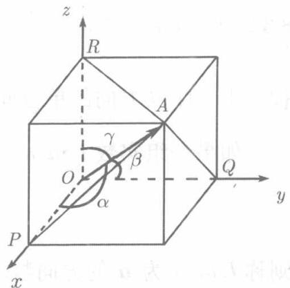

于空间任意取定一点 $P$ ，作向量 $\overrightarrow{PA}$ 、 $\overrightarrow{PB}$ 分别与已知向量 $a, b$ 方向相同（即平行且指向相同），称 $\angle APB$ （ $0 \leqslant \angle APB \leqslant \pi$ ）为向量 $a$ 和 $b$ 的夹角，记为 $(\widehat{a}, \widehat{b})$ 或 $(\widehat{b}, a)$ 。向量 $a$ 与基本单位向量 $i, j, k$ 的夹角 $\alpha, \beta, \gamma$ 称为 $a$ 的方向角（见图8.10）：

$$
\alpha = (\widehat {\boldsymbol {a}, \boldsymbol {i}}), \quad \beta = (\widehat {\boldsymbol {a}, \boldsymbol {j}}), \quad \gamma = (\widehat {\boldsymbol {a}, \boldsymbol {k}}).
$$

方向角的余弦 $\cos \alpha, \cos \beta, \cos \gamma$ 称为向量 $a$ 的方向余弦. 设 $a = \{x, y, z\}$ , 即

$$
\boldsymbol {a} = \overrightarrow {O A} = x \boldsymbol {i} + y \boldsymbol {j} + z \boldsymbol {k}.
$$

过 $\overrightarrow{OA}$ 的终点 $A$ 作三张平面分别垂直于坐标轴 $Ox$ , $Oy$ 及 $Oz$ (见图8.10), 记垂足为 $P, Q, R$ , 由于 $\triangle OPA$ , $\triangle OQA$ , $\triangle ORA$ 都是直角三角形, 故

$$
\left\{ \begin{array}{l} \cos \alpha = \frac {x}{| \boldsymbol {a} |} = \frac {x}{\sqrt {x ^ {2} + y ^ {2} + z ^ {2}}}, \\ \cos \beta = \frac {y}{| \boldsymbol {a} |} = \frac {y}{\sqrt {x ^ {2} + y ^ {2} + z ^ {2}}}, \\ \cos \gamma = \frac {z}{| \boldsymbol {a} |} = \frac {z}{\sqrt {x ^ {2} + y ^ {2} + z ^ {2}}}. \end{array} \right. \tag {8.12}
$$

  
图8.10

这就是通过向量的坐标计算方向余弦的公式。由 (8.12) 立刻可知

$$
\cos^ {2} \alpha + \cos^ {2} \beta + \cos^ {2} \gamma = 1, \tag {8.13}
$$

即任一非零向量的三个方向余弦的平方和等于1.

例8.3.2 已知 $A(1, -1, 0), B(-3, 2, 1)$ ，求 $\overrightarrow{AB}$ 的模及方向余弦。

**解** 因为

$$
\overrightarrow {A B} = \{- 3 - 1, 2 - (- 1), 1 - 0 \} = \{- 4, 3, 1 \},
$$

由（8.11）及（8.12）得

$$
| \overrightarrow {A B} | = \sqrt {(- 4) ^ {2} + 3 ^ {2} + 1 ^ {2}} = \sqrt {26},
$$

$$
\cos \alpha = \frac {- 4}{\sqrt {26}}, \quad \cos \beta = \frac {3}{\sqrt {26}}, \quad \cos \gamma = \frac {1}{\sqrt {26}}.
$$

例8.3.3 求向量 $\pmb{a}$ ，使它的两个方向余弦为 $\cos \alpha = \frac{1}{3},\cos \beta = -\frac{2}{3}$ 且 $|a| = 6$。

**解** 由公式(8.13)得

$$
\cos \gamma = \pm \sqrt {1 - \cos^ {2} \alpha - \cos^ {2} \beta} = \pm \sqrt {1 - \left(\frac {1}{3}\right) ^ {2} - \left(- \frac {2}{3}\right) ^ {2}} = \pm \frac {2}{3},
$$

再由 (8.12) 得

$$
x = | \boldsymbol {a} | \cos \alpha = 2, \quad y = | \boldsymbol {a} | \cos \beta = - 4, \quad z = | \boldsymbol {a} | \cos \gamma = \pm 4.
$$

所以 $a = \{2, -4, 4\}$ 或 $a = \{2, -4, -4\}$ .

由(8.12)可知，向量 $\{\cos \alpha ,\cos \beta ,\cos \gamma \}$ 与向量 $\{x,y,z\}$ 方向相同，而(8.13)又表明 $\{\cos \alpha ,\cos \beta ,\cos \gamma \}$ 的模为1.于是得到结论：以向量 $\{x,y,z\}$ 的三个方向余弦为坐标的向量 $\{\cos \alpha ,\cos \beta ,\cos \gamma \}$ 就是与 $\{x,y,z\}$ 同方向的单位向量．在例8.3.2, 与 $\overrightarrow{AB}$ 同方向的单位向量为 $\left\{\frac{-4}{\sqrt{26}}, \frac{3}{\sqrt{26}}, \frac{1}{\sqrt{26}}\right\}$ . 在例 8.3.3, 与 $\{2, -4, 4\}, \{2, -4, -4\}$ 同方向的单位向量分别为 $\left\{\frac{1}{3}, -\frac{2}{3}, \frac{2}{3}\right\}$ 和 $\left\{\frac{1}{3}, -\frac{2}{3}, -\frac{2}{3}\right\}$ .

如果一组实数 $l, m, n$ 与向量 $\pmb{a}$ 的方向余弦成比例：

$$
\frac {l}{\cos \alpha} = \frac {m}{\cos \beta} = \frac {n}{\cos \gamma}, \tag {8.14}
$$

则称 $l, m, n$ 为 $\pmb{a}$ 的方向数。显然，方向数 $l, m, n$ 同乘以非零常数后得到的数组仍然是方向数。

为了由方向数确定方向余弦，记(8.14)的比值为 $k$ ，则

$$
l = k \cos \alpha , \quad m = k \cos \beta , \quad n = k \cos \gamma ,
$$

注意 (8.13) 即得

$$
l ^ {2} + m ^ {2} + n ^ {2} = k ^ {2},
$$

于是

$$
k = \pm \sqrt {l ^ {2} + m ^ {2} + n ^ {2}},
$$

从而

$$
\left\{ \begin{array}{l} \cos \alpha = \frac {l}{k} = \pm \frac {l}{\sqrt {l ^ {2} + m ^ {2} + n ^ {2}}}, \\ \cos \beta = \frac {m}{k} = \pm \frac {m}{\sqrt {l ^ {2} + m ^ {2} + n ^ {2}}}, \\ \cos \gamma = \frac {n}{k} = \pm \frac {n}{\sqrt {l ^ {2} + m ^ {2} + n ^ {2}}}. \end{array} \right. \tag {8.15}
$$

注意，(8.15) 中的双重符号必须同时取正号或同时取负号。

由 (8.15) 可知, 以给定的一组数的方向数的单位矢量有 2 个, 它们互为相反矢量. 例如, 以 $1,2,-2$ 为方向数的单位向量是 $\left\{\frac{1}{3}, \frac{2}{3}, -\frac{2}{3}\right\}$ 与 $\left\{-\frac{1}{3}, -\frac{2}{3}, \frac{2}{3}\right\}$ .

由 (8.12) 得

$$
\frac {x}{\cos \alpha} = \frac {y}{\cos \beta} = \frac {z}{\cos \gamma},
$$

由此可见，向量的坐标就是它的一组方向数。
