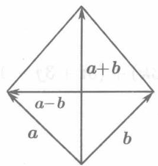
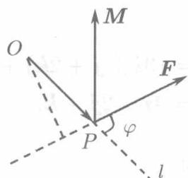

在物理学里我们知道，如果一个大小与方向均不变的力 $F$ 作用在一个质点上，使之获得位移 $s$ ，则力 $F$ 所做之功为

$$
W = | \boldsymbol {F} | | \boldsymbol {s} | \cos (\widehat {\boldsymbol {F}}, \boldsymbol {s}),
$$

即功等于两个向量力 $F$ 和位移 $\boldsymbol{s}$ 的模与它们的夹角的余弦的乘积．这一事实，引出了如下定义.

**定义8.3.1** 向量 $a, b$ 的模与它们的夹角的余弦的乘积称为 $a, b$ 的内积或数量积，记为 $a \cdot b$ 或 $(a, b)$ ，即

$$
\boldsymbol {a} \cdot \boldsymbol {b} = | \boldsymbol {a} | | \boldsymbol {b} | \cos (\widehat {\boldsymbol {a} , \boldsymbol {b}}).
$$

按照这一定义，上述的功 $W$ 就等于力 $F$ 和位移 $s$ 的数量积：

$$
W = \boldsymbol {F} \cdot \boldsymbol {s}.
$$

$|a|\cos (\widehat{a,b})$ 称为向量 $\pmb{a}$ 在向量 $\textit{\textbf{b}}$ 上的投影，记为 $\operatorname {Prj}_b\pmb{a}$ 即

$$
\Pr j _ {b} a = | a | \cos (\widehat {a , b}),
$$

类似地

$$
\Pr j _ {\boldsymbol {a}} \boldsymbol {b} = | \boldsymbol {b} | \cos (\widehat {\boldsymbol {b} , \boldsymbol {a}}).
$$

因此，两个向量 $a, b$ 的数量积也可表示为

$$
\boldsymbol {a} \cdot \boldsymbol {b} = | b | \Pr_ {\boldsymbol {b}} \boldsymbol {a} = | a | \Pr_ {\boldsymbol {a}} \boldsymbol {b}.
$$

数量积运算满足下列规律：

**交换律:** $a \cdot b = b \cdot a$ .

**分配律：** $a\cdot (b + c) = a\cdot b + a\cdot c,\quad (b + c)\cdot a = b\cdot a + c\cdot a.$

**与数乘的结合律：** $\lambda (\pmb {a}\cdot \pmb {b}) = (\lambda \pmb {a})\cdot \pmb {b} = \pmb {a}\cdot (\lambda \pmb {b}).$

交换律的正确性是显然的，分配律的证明涉及射影理论，从略。下面我们来证明与数乘的结合律。

若 $\lambda = 0$ ，则 $\lambda (\pmb {a}\cdot \pmb {b}) = 0,(\lambda \pmb {a})\cdot \pmb {b} = \theta \cdot \pmb {b} = 0,$ 故 $\lambda (\pmb {a}\cdot \pmb {b}) = (\lambda \pmb {a})\cdot \pmb{b}.$

若 $\lambda > 0$ ，则 $\lambda a$ 与 $a$ 方向相同，故 $(\widehat{\lambda a, b}) = (\widehat{a, b})$ ，于是：

$$
\begin{array}{l} \lambda (\boldsymbol {a} \cdot \boldsymbol {b}) = \lambda | \boldsymbol {a} | | \boldsymbol {b} | \cos (\widehat {\boldsymbol {a} , \boldsymbol {b}}), \\ (\lambda \boldsymbol {a}) \cdot \boldsymbol {b} = | \lambda \boldsymbol {a} | | \boldsymbol {b} | \cos (\widehat {\lambda \boldsymbol {a}, \boldsymbol {b}}) = \lambda | \boldsymbol {a} | | \boldsymbol {b} | \cos (\widehat {\boldsymbol {a}, \boldsymbol {b}}), \\ \end{array}
$$

故

$$
\lambda (\boldsymbol {a} \cdot \boldsymbol {b}) = (\lambda \boldsymbol {a}) \cdot \boldsymbol {b}.
$$

若 $\lambda < 0$ ，可类似地验证上式也是正确的．这就证明了 $\lambda (\pmb {a}\cdot \pmb {b}) = (\lambda \pmb {a})\cdot \pmb{b}.$ 同理可证 $\lambda (\pmb {a}\cdot \pmb {b}) = \pmb {a}\cdot (\lambda \pmb {b}).$

今后，将省去括弧，将这些相等的数记为 $\lambda a\cdot b$ .现在我们来证明：向量 $a,b$ 垂直（记为 $a\bot b)$ 的充分必要条件是 $a\cdot b = 0$ （由于零向量的方向可以看作是任意的，因此，零向量可以看作与一切向量垂直.）

事实上，若互相垂直的两个向量 $a, b$ 中有零向量，或 $a, b$ 均非零向量而 $\cos (\widehat{a, b}) = 0$ ，按定义8.3.1都有 $a \cdot b = 0$ 。反之，若 $a \cdot b = 0$ ，即

$$
| \boldsymbol {a} | | \boldsymbol {b} | \cos (\widehat {\boldsymbol {a} , b}) = 0,
$$

则或者 $|a|$ , $|b|$ 有等于 0 者, 或者 $\cos (\widehat{a, b}) = 0$ . 在前一情形 $a, b$ 中有零向量, 因而彼此垂直, 在后一情形, $(\widehat{a, b}) = \frac{\pi}{2}$ , 亦即 $a, b$ 互相垂直. 这就证明了我们的结论.

通常，将 $a$ 与自身的数积 $a \cdot a$ 记为 $a^2$ ，于是由定义8.3.1得 $a^2 = |a|^2$ ，即：向量 $a$ 与自身的数积等于 $a$ 的模的平方。

将上面所述的这些用于基本单位向量 $i,j,k,$ 则有

$$
i \cdot j = j \cdot k = k \cdot i = 0, \quad i \cdot i = j \cdot j = k \cdot k = 1.
$$

利用这些简单事实及数积的运算规律，可以将数积用坐标表示出来。为此，设

$$
\boldsymbol {a} = \left\{x _ {a}, y _ {a}, z _ {a} \right\}, \quad \boldsymbol {b} = \left\{x _ {b}, y _ {b}, z _ {b} \right\},
$$

即

$$
\boldsymbol {a} = x _ {a} \boldsymbol {i} + y _ {a} \boldsymbol {j} + z _ {a} \boldsymbol {k}, \quad \boldsymbol {b} = x _ {b} \boldsymbol {i} + y _ {b} \boldsymbol {j} + z _ {b} \boldsymbol {k},
$$

则

$$
\begin{array}{l} \boldsymbol {a} \cdot \boldsymbol {b} = \left(x _ {a} \boldsymbol {i} + y _ {a} \boldsymbol {j} + z _ {a} \boldsymbol {k}\right) \cdot \left(x _ {b} \boldsymbol {i} + y _ {b} \boldsymbol {j} + z _ {b} \boldsymbol {k}\right) \\ = x _ {a} x _ {b} \boldsymbol {i} \cdot \boldsymbol {i} + x _ {a} y _ {b} \boldsymbol {i} \cdot \boldsymbol {j} + x _ {a} z _ {b} \boldsymbol {i} \cdot \boldsymbol {k} \\ + y _ {a} x _ {b} \boldsymbol {j} \cdot i + y _ {a} y _ {b} \boldsymbol {j} \cdot \boldsymbol {j} + y _ {a} z _ {b} \boldsymbol {j} \cdot \boldsymbol {k} \\ + z _ {a} x _ {b} \boldsymbol {k} \cdot \boldsymbol {i} + z _ {a} y _ {b} \boldsymbol {k} \cdot \boldsymbol {j} + z _ {a} z _ {b} \boldsymbol {k} \cdot \boldsymbol {k} \\ = x _ {a} x _ {b} + y _ {a} y _ {b} + z _ {a} z _ {b}. \\ \end{array}
$$

由此可知，两个向量的数积等于它们的同名坐标的乘积之和.于是向量垂直的条件可以借助于坐标表示为：

$$
\boldsymbol {a} \bot \boldsymbol {b} \Longleftrightarrow x _ {a} x _ {b} + y _ {a} y _ {b} + z _ {a} z _ {b} = 0.
$$

如果以 $\varphi$ 记向量 $a = \{x_{a},y_{a},z_{a}\}$ 与 $\pmb {b} = \{x_b,y_b,z_b\}$ 之间的夹角，则由数积的定义

$$
\boldsymbol {a} \cdot \boldsymbol {b} = | \boldsymbol {a} | | \boldsymbol {b} | \cos \varphi ,
$$

可得

$$
\cos \varphi = \frac {\boldsymbol {a} \cdot \boldsymbol {b}}{| \boldsymbol {a} | | \boldsymbol {b} |} = \frac {x _ {a} x _ {b} + y _ {a} y _ {b} + z _ {a} z _ {b}}{\sqrt {x _ {a} ^ {2} + y _ {a} ^ {2} + z _ {a} ^ {2}} \sqrt {x _ {b} ^ {2} + y _ {b} ^ {2} + z _ {b} ^ {2}}}. \tag {8.16}
$$

这就是用矢量的坐标表示两个矢量的夹角的余弦的公式。因为 $0 \leqslant \varphi \leqslant \pi$ ，有了余弦的值，角 $\varphi$ 也就完全确定了。

公式 (8.16) 还可写作另一形式，设向量 $\mathbf{a}, \mathbf{b}$ 的方向余弦依次为 $\cos \alpha_{1}, \cos \beta_{1}, \cos \gamma_{1}$ 和 $\cos \alpha_{2}, \cos \beta_{2}, \cos \gamma_{2}$ ，则按 (8.12)

$$
\cos \alpha_ {1} = \frac {x _ {a}}{\sqrt {x _ {a} ^ {2} + y _ {a} ^ {2} + z _ {a} ^ {2}}}, \quad \cos \beta_ {1} = \frac {y _ {a}}{\sqrt {x _ {a} ^ {2} + y _ {a} ^ {2} + z _ {a} ^ {2}}}, \quad \cos \gamma_ {1} = \frac {z _ {a}}{\sqrt {x _ {a} ^ {2} + y _ {a} ^ {2} + z _ {a} ^ {2}}},
$$

$$
\cos \alpha_ {2} = \frac {x _ {b}}{\sqrt {x _ {b} ^ {2} + y _ {b} ^ {2} + z _ {b} ^ {2}}}, \quad \cos \beta_ {2} = \frac {y _ {b}}{\sqrt {x _ {b} ^ {2} + y _ {b} ^ {2} + z _ {b} ^ {2}}}, \quad \cos \gamma_ {2} = \frac {z _ {b}}{\sqrt {x _ {b} ^ {2} + y _ {b} ^ {2} + z _ {b} ^ {2}}}.
$$

因而（8.16）又可写为

$$
\cos \varphi = \cos \alpha_ {1} \cos \alpha_ {2} + \cos \beta_ {1} \cos \beta_ {2} + \cos \gamma_ {1} \cos \gamma_ {2}. \tag {8.17}
$$

例8.3.4 已知三点 $A(1, -1, 2), B(2, 0, 2)$ 和 $C(2, -1, 3)$ ，求 $\overrightarrow{AB}$ 和 $\overrightarrow{AC}$ 的夹角 $\varphi$ .

**解** 因为 $\overrightarrow{AB} = \{1,1,0\}$ ， $\overrightarrow{AC} = \{1,0,1\}$ ，按(8.16)得 $\cos \varphi = \frac{1}{2}$，故 $\varphi = \frac{\pi}{3}$。

例8.3.5 三个力 $F_{1} = 3i + j + 2k, F_{2} = -4i - 2j + 3k, F_{3} = 5i + 3j - 4k$ 作用于同一质点，将此质点由 $A(2, -1, 3)$ 沿直线移动到点 $B(3, 0, 7)$ . 求 (1) 合力 $\pmb{F}$ 的方向和大小. (2) 合力 $\pmb{F}$ 与位移 $\overrightarrow{AB}$ 的夹角. (3) $\pmb{F}$ 所做的功 $W$ （长度取米作单位，力取牛顿作单位）.

**解** (1)

$$
\begin{array}{l} \boldsymbol {F} = (3 \boldsymbol {i} + \boldsymbol {j} + 2 \boldsymbol {k}) + (- 4 \boldsymbol {i} - 2 \boldsymbol {j} + 3 \boldsymbol {k}) + (5 \boldsymbol {i} + 3 \boldsymbol {j} - 4 \boldsymbol {k}) \\ = 4 \boldsymbol {i} + 2 \boldsymbol {j} + \boldsymbol {k}, \\ \end{array}
$$

于是合力的大小为

$$
| F | = \sqrt {4 ^ {2} + 2 ^ {2} + 1 ^ {2}} = \sqrt {21} (\text {牛 顿}).
$$

$\pmb{F}$ 的方向由它的方向余弦 $\cos \alpha, \cos \beta, \cos \gamma$ 确定，而

$$
\cos \alpha = \frac {4}{\sqrt {21}}, \quad \cos \beta = \frac {2}{\sqrt {21}}, \quad \cos \gamma = \frac {1}{\sqrt {21}}.
$$

(2) $\overrightarrow{AB} = \{3 - 2,0 - (-1),7 - 3\} = \{1,1,4\}$ 设 $\overrightarrow{AB}$ 与 $\pmb{F}$ 的夹角为 $\varphi$ ，则

$$
\begin{array}{l} \cos \varphi = \frac {\boldsymbol {F} \cdot \overrightarrow {A B}}{| \boldsymbol {F} | | \overrightarrow {A B} |} = \frac {10}{\sqrt {21} \cdot \sqrt {18}} = \frac {10}{3 \sqrt {42}}, \\ \varphi = \arccos  \frac {10}{3 \sqrt {42}}. \\ \end{array}
$$

(3) $W = \pmb{F} \cdot \overrightarrow{AB} = \{4, 2, 1\} \cdot \{1, 1, 4\} = 10$ (牛顿米).

例8.3.6 设 $a = \{x, y, z\}$ , 求 $a$ 在基本单位向量 $i, j, k$ 上的投影。

**解** 由于 $i = \{1,0,0\}$ ， $j = \{0,1,0\}$ ， $\pmb {k} = \{0,0,1\}$ ， $|\pmb {i}| = |\pmb {j}| = |\pmb {k}| = 1$ ，故

$$
\Pr j _ {i} a = \frac {\boldsymbol {a} \cdot \boldsymbol {i}}{| i |} = x, \quad \Pr j _ {j} a = \frac {\boldsymbol {a} \cdot \boldsymbol {j}}{| j |} = y, \quad \Pr j _ {k} a = \frac {\boldsymbol {a} \cdot \boldsymbol {k}}{| k |} = z.
$$

例8.3.6表明，任何向量 $\pmb{a}$ 在基本单位向量 $i,j,k$ 上的投影分别是它的三个坐标 $x,y,z.$ 这三个投影也依次称为 $\pmb{a}$ 在坐标轴 $Ox,Oy,Oz$ 上的投影。

例8.3.7 设 $a + b$ 与 $a - b$ 垂直，求证 $|a| = |b|$。

**证** 因为 $(a + b) \perp (a - b)$ , 故

$$
\left(\boldsymbol {a} + \boldsymbol {b}\right) \cdot \left(\boldsymbol {a} - \boldsymbol {b}\right) = 0,
$$

亦即

$$
\boldsymbol {a} \cdot \boldsymbol {a} + \boldsymbol {b} \cdot \boldsymbol {a} - \boldsymbol {a} \cdot \boldsymbol {b} - \boldsymbol {b} \cdot \boldsymbol {b} = 0.
$$

从而

$$
| \boldsymbol {a} | ^ {2} - | \boldsymbol {b} | ^ {2} = 0,
$$

但 $|a| \geqslant 0, |b| \geqslant 0$ , 故由上式得 $|a| = |b|$ .

例8.3.7的几何意义是：对角线互相垂直的平行四边形必定是菱形（见图8.11）

  
图8.11

  
图8.12
