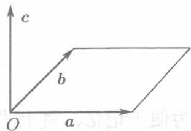

按照力学的知识，若轴 $l$ 以 $O$ 为支点， $P$ 为 $l$ 上某点，则作用于 $P$ 点的力 $\pmb{F}$ 对于 $O$ 点的力矩可以看作一个矢量 $M$ （见图8.12）。这个矢量的模等于力的大小（即模）与力臂的乘积：

$$
| M | = | \overrightarrow {O P} | | F | \sin \varphi ,
$$

其中 $\varphi$ 为 $\overrightarrow{OP}$ 与 $\pmb{F}$ 的夹角；而这个矢量所在的直线垂直于 $\overrightarrow{OP}$ 和 $\pmb{F}$ 所决定的平面，其指向按右手法则确定，即当右手除拇指外的四指以小于 $\pi$ 的角度从 $\overrightarrow{OP}$ 转向 $\pmb{F}$ 握拳时，拇指伸直所指的方向就是 $M$ 所指向正向。抽去物理意义，由此引出两个向量的矢积（也称外积或叉积）的概念。

**定义8.3.2** 对于给定的向量 $a, b$ , 若向量 $c$ 满足三个条件:

(1) $|\pmb {c}| = |\pmb {a}||\pmb {b}|\sin (\widehat{\pmb{a},\pmb{b}});$   
(2) $c$ 垂直于 $a, b$ 所决定的平面；  
(3) $c$ 的正向由 $\mathbf{a},\mathbf{b}$ 经右手法则确定

则称向量 $\pmb{c}$ 为 $\pmb{a}$ 与 $\pmb{b}$ 的矢积，记为 $a\times b$ ，即

$$
\boldsymbol {c} = \boldsymbol {a} \times \boldsymbol {b}.
$$

条件(1)表示， $c$ 的模等于以矢量 $\pmb{a},\pmb{b}$ 为邻边的平行四边形的面积．条件(2)表示， $c$ 既垂直 $\pmb{a}$ 也垂直 $\textit{\textbf{b}}$ 三个向量 $\pmb {a},\pmb {b},\pmb{c}$ 满足条件(3)，则说它们组成右手系(见图8.13).

按定义8.3.2，作用于 $l$ 上的点 $P$ 的力 $\pmb{F}$ 对于支点的力矩可表示为

$$
M = \overrightarrow {O P} \times F.
$$

  
图8.13

关于矢积的运算规律，按定义8.3.2甚易证明

$$
\boldsymbol {a} \times \boldsymbol {b} = - \boldsymbol {b} \times \boldsymbol {a}.
$$

即交换因子的次序时，矢积改变符号. 可见，矢积运算不满足交换律. 不过分配律和对数乘的结合律是成立的：

$$
\boldsymbol {a} \times (\boldsymbol {b} + \boldsymbol {c}) = \boldsymbol {a} \times \boldsymbol {b} + \boldsymbol {a} \times \boldsymbol {c},
$$

$$
\left(\boldsymbol {b} + \boldsymbol {c}\right) \times \boldsymbol {a} = \boldsymbol {b} \times \boldsymbol {a} + \boldsymbol {c} \times \boldsymbol {a},
$$

$$
(\lambda \boldsymbol {a}) \times \boldsymbol {b} = \lambda (\boldsymbol {a} \times \boldsymbol {b}) = \boldsymbol {a} \times (\lambda \boldsymbol {b}).
$$

我们不来证明了.

由定义8.3.2易知，当且仅当 $a, b$ 之中有零向量或 $a, b$ 平行时 $a \times b = \theta$ ，但零向量可以看作与一切向量平行，因此：

两个向量 $a, b$ 平行的充分必要条件是 $a \times b = \theta$ . 特别， $a \times a = \theta$ . 于是，对于基本单位向量 $i, j, k$ ，有

$$
i \times i = j \times j = k \times k = \theta .
$$

同时，由定义8.3.2易知

$$
\boldsymbol {i} \times \boldsymbol {j} = \boldsymbol {k}, \quad \boldsymbol {j} \times \boldsymbol {k} = \boldsymbol {i}, \quad \boldsymbol {k} \times \boldsymbol {i} = \boldsymbol {j}.
$$

由此，可以得到矢积的坐标表示式．为此，设

$$
\boldsymbol {a} = \left\{x _ {a}, y _ {a}, z _ {a} \right\}, \quad \boldsymbol {b} = \left\{x _ {b}, y _ {b}, z _ {b} \right\},
$$

即

$$
\boldsymbol {a} = x _ {a} \boldsymbol {i} + y _ {a} \boldsymbol {j} + z _ {a} \boldsymbol {k}, \quad \boldsymbol {b} = x _ {b} \boldsymbol {i} + y _ {b} \boldsymbol {j} + z _ {b} \boldsymbol {k},
$$

利用矢积的运算规律有

$$
\begin{array}{l} \boldsymbol {a} \times \boldsymbol {b} = \left(x _ {a} \boldsymbol {i} + y _ {a} \boldsymbol {j} + z _ {a} \boldsymbol {k}\right) \times \left(x _ {b} \boldsymbol {i} + y _ {b} \boldsymbol {j} + z _ {b} \boldsymbol {k}\right) \\ = x _ {a} x _ {b} \boldsymbol {i} \times \boldsymbol {i} + x _ {a} y _ {b} \boldsymbol {i} \times \boldsymbol {j} + x _ {a} z _ {b} \boldsymbol {i} \times \boldsymbol {k} \\ + y _ {a} x _ {b} j \times i + y _ {a} y _ {b} j \times j + y _ {a} z _ {b} j \times k \\ + z _ {a} x _ {b} \boldsymbol {k} \times \boldsymbol {i} + z _ {a} y _ {b} \boldsymbol {k} \times \boldsymbol {j} + z _ {a} z _ {b} \boldsymbol {k} \times \boldsymbol {k} \\ = \left(y _ {a} z _ {b} - z _ {a} y _ {b}\right) \boldsymbol {i} - \left(x _ {a} z _ {b} - z _ {a} x _ {b}\right) \boldsymbol {j} + \left(x _ {a} y _ {b} - y _ {a} x _ {b}\right) \boldsymbol {k}. \\ \end{array}
$$

为便于记忆，将上式右端记成一个行列式：

$$
\boldsymbol {a} \times \boldsymbol {b} = \left| \begin{array}{c c c} \boldsymbol {i} & \boldsymbol {j} & \boldsymbol {k} \\ x _ {a} & y _ {a} & z _ {a} \\ x _ {b} & y _ {b} & z _ {b} \end{array} \right|, \tag {8.18}
$$

将这个行列式按第一行展开，就回到了 $a \times b$ 原来的表示式。

现在，向量 $a, b$ 平行的条件 $a \times b = \theta$ 成为

$$
y _ {a} z _ {b} - z _ {a} y _ {b} = 0, x _ {a} z _ {b} - z _ {a} x _ {b} = 0, x _ {a} y _ {b} - y _ {a} x _ {b} = 0, \tag {8.19}
$$

当 $x_{b},y_{b},z_{b}$ 全不为零时，这三个等式可以改写为

$$
\frac {x _ {a}}{x _ {b}} = \frac {y _ {a}}{y _ {b}} = \frac {z _ {a}}{z _ {b}}, \tag {8.20}
$$

而当这个比式分母出现零时，平行条件仍然可以用(8.20)表示，只需约定零分母的分子也为零即可。例如，若 $y_{b} = 0$ ，而 $x_{b}, z_{b}$ 都不为零，则比式

$$
\frac {x _ {a}}{x _ {b}} = \frac {y _ {a}}{0} = \frac {z _ {a}}{z _ {b}}
$$

应理解为

$$
\frac {x _ {a}}{x _ {b}} = \frac {z _ {a}}{z _ {b}}, y _ {a} = 0.
$$

读者可直接验明，这就是(8.19).

这样，我们得到了判定向量平行与否的十分简单的条件：两个向量平行的充分必要条件是对应坐标成比例。即（8.20）成立。

例8.3.8 求以 $A(0,1,-1), B(1,2,1), C(-2,0,2)$ 为顶点的 $\triangle ABC$ 的面积 $S$ 以及 $\sin A$ .

解 因为 $\overrightarrow{AB} = \{1,1,2\}$ , $\overrightarrow{AC} = \{-2, -1, 3\}$ , 按 (8.18),

$$
\overrightarrow {A B} \times \overrightarrow {A C} = \left| \begin{array}{c c c} i & j & k \\ 1 & 1 & 2 \\ - 2 & - 1 & 3 \end{array} \right| = 5 i - 7 j + k.
$$

于是，由定义8.3.2知

$$
\begin{array}{l} S = \frac {1}{2} \left| \overrightarrow {A B} \times \overrightarrow {A C} \right| = \frac {1}{2} \sqrt {5 ^ {2} + (- 7) ^ {2} + 1 ^ {2}} = \frac {5}{2} \sqrt {3}, \\ \sin A = \frac {| \overrightarrow {A B} \times \overrightarrow {A C} |}{| \overrightarrow {A B} | | \overrightarrow {A C} |} = \frac {5 \sqrt {3}}{\sqrt {6} \cdot \sqrt {14}} = \frac {5}{14} \sqrt {7}. \\ \end{array}
$$

例8.3.9 求同时垂直于 $a = \{3,4,5\}$ 和 $b = \{1,2,2\}$ 的单位向量 $c^0$

解同时垂直于 $a, b$ 的向量是 $a \times b$ 或 $b \times a$ . 而

$$
\begin{array}{l} \boldsymbol {a} \times \boldsymbol {b} = \left| \begin{array}{c c c} i & j & k \\ 3 & 4 & 5 \\ 1 & 2 & 2 \end{array} \right| = - 2 i - j + 2 k, \\ \boldsymbol {b} \times \boldsymbol {a} = - (\boldsymbol {a} \times \boldsymbol {b}). \\ \end{array}
$$

故所求的单位向量有两个：

$$
\boldsymbol {c} ^ {0} = \pm \frac {1}{| \boldsymbol {a} \times \boldsymbol {b} |} (\boldsymbol {a} \times \boldsymbol {b}) = \pm \frac {1}{3} (2 \boldsymbol {i} + \boldsymbol {j} - 2 \boldsymbol {k}).
$$

例8.3.10 求证 $(\pmb{a} - \pmb{b}) \times (\pmb{a} + \pmb{b}) = 2(\pmb{a} \times \pmb{b})$

证 直接计算可得：

$$
\begin{array}{l} (a - b) \times (\dot {a} + b) = a \times a - b \times a + a \times b - b \times b \\ = \boldsymbol {a} \times \boldsymbol {b} + \boldsymbol {a} \times \boldsymbol {b} = 2 (\boldsymbol {a} \times \boldsymbol {b}). \\ \end{array}
$$

建议读者在此等式的两边取模，给予几何解释
