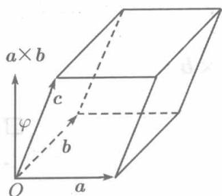

**定义8.3.3** 称数量 $(a\times b)\cdot c$ 为向量 $a,b,c$ 的混合积，记为 $(a,b,c)$ .即

$$
(a, b, c) = (a \times b) \cdot c.
$$

设

$$
\boldsymbol {a} = \left\{x _ {a}, y _ {a}, z _ {a} \right\}, \quad \boldsymbol {b} = \left\{x _ {b}, y _ {b}, z _ {b} \right\}, \quad \boldsymbol {c} = \left\{x _ {c}, y _ {c}, z _ {c} \right\},
$$

由于

$$
\boldsymbol {a} \times \boldsymbol {b} = \left| \begin{array}{c c c} \boldsymbol {i} & \boldsymbol {j} & \boldsymbol {k} \\ x _ {a} & y _ {a} & z _ {a} \\ x _ {b} & y _ {b} & z _ {b} \end{array} \right| = \left| \begin{array}{c c c} y _ {a} & z _ {a} \\ y _ {b} & z _ {b} \end{array} \right| \boldsymbol {i} - \left| \begin{array}{c c c} x _ {a} & z _ {a} \\ x _ {b} & z _ {b} \end{array} \right| \boldsymbol {j} + \left| \begin{array}{c c c} x _ {a} & y _ {a} \\ x _ {b} & y _ {b} \end{array} \right| \boldsymbol {k},
$$

故

$$
(\boldsymbol {a} \times \boldsymbol {b}) \cdot \boldsymbol {c} = x _ {c} \left| \begin{array}{l l} y _ {a} & z _ {a} \\ y _ {b} & z _ {b} \end{array} \right| - y _ {c} \left| \begin{array}{l l} x _ {a} & z _ {a} \\ x _ {b} & z _ {b} \end{array} \right| + z _ {c} \left| \begin{array}{l l} x _ {a} & y _ {a} \\ x _ {b} & y _ {b} \end{array} \right|,
$$

即

$$
(a, b, c) = \left| \begin{array}{c c c} x _ {a} & y _ {a} & z _ {a} \\ x _ {b} & y _ {b} & z _ {b} \\ x _ {c} & y _ {c} & z _ {c} \end{array} \right|. \tag {8.21}
$$

在第12章将证明，行列式的两行元素对换，行列式的绝对值不变但改变符号。据此，由（8.21）易知：

$$
\begin{array}{l} (a, b, c) = - (b, a, c) = - (c, b, a) = - (a, c, b) \\ = (b, c, a) = (c, a, b). \\ \end{array}
$$

即在三个矢量的混合积 $(a,b,c)$ 中，任何两个矢量交换位置，混合积保持绝对值而改变符号；轮序置换三个矢量的位置，混合积不变。

若向量 $a \times b$ 与 $c$ 的夹角为 $\varphi$ , 则按定义8.3.3,

$$
\left| (\boldsymbol {a}, \boldsymbol {b}, \boldsymbol {c}) \right| = \left| (\boldsymbol {a} \times \boldsymbol {b}) \cdot \boldsymbol {c} \right| = \left| \boldsymbol {a} \times \boldsymbol {b} \right| | \boldsymbol {c} | | \cos \varphi |.
$$

  
图8.14

这恰恰是以 $a, b, c$ 为棱的平行六面体的体积（见图8.14）如果向量 $a, b, c$ 在同一平面上，则这个体积为零，因而 $(a, b, c) = 0$ 。反之，若 $(a \times b) \cdot c = 0$ ，则或者 $a, b, c$ 中存在零向量，或者 $a, b, c$ 中有平行矢量，或者 $a \times b$ 与 $c$ 垂直，而在此三种情形， $a, b, c$ 都在同一个平面上，于是：

$a, b, c$ 共面的充分必要条件是 $(a, b, c) = 0$ .

利用 (8.21), 这个条件可以写成便于应用的形式:

三个向量 $a = \{x_{a},y_{a},z_{a}\} ,b = \{x_{b},y_{b},z_{b}\} ,c = \{x_{c},y_{c},z_{c}\}$ 共面的充分必要条件是

$$
\left| \begin{array}{l l l} x _ {a} & y _ {a} & z _ {a} \\ x _ {b} & y _ {b} & z _ {b} \\ x _ {c} & y _ {c} & z _ {c} \end{array} \right| = 0. \tag {8.22}
$$

例8.3.11 已知空间不在同一平面上的四点： $M_{1}(x_{1},y_{1},z_{1})$ ， $M_2(x_2,y_2,z_2)$ $M_3(x_3,y_3,z_3)$ 和 $M(x,y,z)$ ，求四面体 $M_1M_2M_3M$ 的体积 $V$。

**解** 按立体几何的知识，所求体积等于以 $\overrightarrow{M_1M}$ ， $\overrightarrow{M_1M_2}$ ， $\overrightarrow{M_1M_3}$ 为棱的平行六面体的体积的 $\frac{1}{6}$ ，因而

$$
V = \frac {1}{6} \left| \left(\overrightarrow {M _ {1} M}, \overrightarrow {M _ {1} M _ {2}}, \overrightarrow {M _ {1} M _ {3}}\right) \right|.
$$

但

$$
\begin{array}{l} \overrightarrow {M _ {1} M} = \left\{x - x _ {1}, y - y _ {1}, z - z _ {1} \right\}, \\ \overrightarrow {M _ {1} M _ {2}} = \left\{x _ {2} - x _ {1}, y _ {2} - y _ {1}, z _ {2} - z _ {1} \right\}, \\ \overrightarrow {M _ {1} M _ {3}} = \left\{x _ {3} - x _ {1}, y _ {3} - y _ {1}, z _ {3} - z _ {1} \right\}, \\ \end{array}
$$

故

$$
V = \pm \frac {1}{6} \left| \begin{array}{c c c} x - x _ {1} & y - y _ {1} & z - z _ {1} \\ x _ {2} - x _ {1} & y _ {2} - y _ {1} & z _ {2} - z _ {1} \\ x _ {3} - x _ {1} & y _ {3} - y _ {1} & z _ {3} - z _ {1} \end{array} \right|,
$$

选择正号或负号，使 $V > 0$

由此得知， $M,M_{1},M_{2},M_{3}$ 共面的条件是

$$
\left| \begin{array}{c c c} x - x _ {1} & y - y _ {1} & z - z _ {1} \\ x _ {2} - x _ {1} & y _ {2} - y _ {1} & z _ {2} - z _ {1} \\ x _ {3} - x _ {1} & y _ {3} - y _ {1} & z _ {3} - z _ {1} \end{array} \right| = 0.
$$

这一节所讲的都是向量代数的最基础的知识，我们已经看到，它们在力学中的某些应用。下面，将借助于向量进行对空间的平面和直线的讨论。
