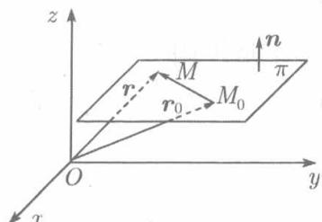
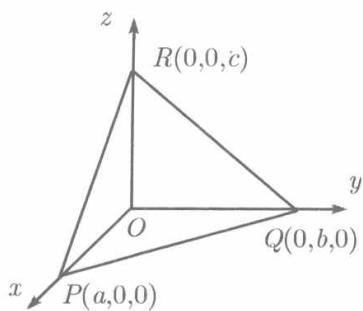
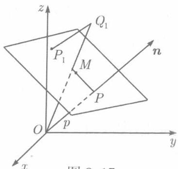

**(1) 平面的一般方程**

如果非零向量 $\pmb{n}$ 垂直于平面 $\pi$ ，则称 $\pmb{n}$ 为平面 $\pi$ 的法向量．若 $\pmb{n}$ 的一组方向数为 $A,B,C,$ 则向量 $\{A,B,C\}$ 和 $\{-A, - B, - C\}$ 都可作为 $\pi$ 的法向量.

  
图8.15

设平面 $\pi$ 通过已知点 $M_0(x_0,y_0,z_0)$ 且其法向量为 $\pmb {n} = \{A,B,C\}$ (见图8.15).对于这个平面上的任意点 $M(x,y,z)$ ，以 $\pmb{r}$ 及 $\pmb{r}_0$ 记点 $M$ 和 $M_0$ 对原点的矢径，则 $\overrightarrow{M_0M} = \boldsymbol {r} - \boldsymbol {r}_0$ .由于 $\pmb{n}$ 垂直于平面 $\pi$ ，所以 $\pmb {n}\bot \overrightarrow{M_0M}$ ，故两者的数积等于零，即

$$
\boldsymbol {n} \cdot (\boldsymbol {r} - \boldsymbol {r} _ {0}) = 0. \tag {8.23}
$$

反之，若空间的点 $M$ 使(8.23)成立，则必有 $\overrightarrow{M_0M} \perp n$ ，因而点 $M$ 位于垂直于 $n$ 且过 $M_0$ 的平面 $\pi$ 上．由此可见(8.23)就是平面 $\pi$ 的方程．若以

$$
\boldsymbol {n} = \{A, B, C \},
$$

$$
\boldsymbol {r} - \boldsymbol {r} _ {0} = \overrightarrow {M _ {0} M} = \left\{x - x _ {0}, y - y _ {0}, z - z _ {0} \right\}
$$

代入，则(8.23)成为

$$
A (x - x _ {0}) + B (y - y _ {0}) + C (z - z _ {0}) = 0. \tag {8.24}
$$

(8.23) 称为平面的向量式方程, 而 (8.24) 称为平面的点法式方程．

在 (8.24) 左端去括弧, 得

$$
A x + B y + C z - A x _ {0} - B y _ {0} - C z _ {0} = 0.
$$

若记 $-Ax_0 - By_0 - Cz_0 = D$ ，则平面 $\pi$ 的方程成为

$$
A x + B y + C z + D = 0. \tag {8.25}
$$

称之为平面的一般方程. 其中 $x, y, z$ 的系数 $A, B, C$ 是法矢量的一组方向数，不全为零，因而 (8.25) 是 $x, y, z$ 的一个一次方程．对于空间的任何平面，都可以在它上面任取一点作为 $M_0(x_0, y_0, z_0)$ ，并任意取一个垂直于该平面的矢量作为法矢量 $\{A, B, C\}$ ，于是，任何平面的方程都是形如 (8.25) 的一次方程.

反之，对于任给的一次方程(8.25)，可任取它的一组解 $x_0,y_0,z_0$ ，因而

$$
A x _ {0} + B y _ {0} + C z _ {0} + D = 0. \tag {8.26}
$$

方程（8.25）减去（8.26）得到（8.25）的等价方程

$$
A (x - x _ {0}) + B (y - y _ {0}) + C (z - z _ {0}) = 0. \tag {8.27}
$$

按(8.24)，这就是过点 $M_0(x_0,y_0,z_0)$ 以 $\pmb {n} = \{A,B,C\}$ 为法矢量的一个平面．这样一来，我们证明了如下定理．

**定理 8.4.1** 在空间直角坐标系中，任何平面都可用点的坐标 $x, y, z$ 的一次方程(8.25)表示，反之，任何一个一次方程(8.25)都表示一个平面.

**例 8.4.1** 写出经过 $M_0(1,0,-1)$ 以 $\pmb{n} = \{1,-1,2\}$ 为法矢量的平面的方程．

**解** 按(8.24)，所求的方程为

$$
1 \cdot (x - 1) + (- 1) \cdot (y - 0) + 2 (z + 1) = 0,
$$

亦即

$$
x - y + 2 z + 1 = 0.
$$

**例 8.4.2** 求通过三点 $A(2,3,0), B(-2,-3,4)$ 和 $C(0,6,0)$ 的平面的方程．

**解** 方法一 按矢积的定义， $\overrightarrow{AB}\times \overrightarrow{AC}$ 垂直于 $\overrightarrow{AB}$ 与 $\overrightarrow{AC}$ 所决定的平面，亦即垂直于 $A,B,C$ 所决定的平面，故可取 $\pmb {n} = \overrightarrow{AB}\times \overrightarrow{AC}$ 又取 $A,B,C$ 之一，例如 $A$ 作为点 $M_0$ ，于是方程(8.23)成为

$$
(\overrightarrow {A M}, \overrightarrow {A B}, \overrightarrow {A C}) = 0.
$$

但

$$
\overrightarrow {A M} = \{x - 2, y - 3, z \}, \overrightarrow {A B} = \{- 4, - 6, 4 \}, \overrightarrow {A C} = \{- 2, 3, 0 \}.
$$

故所求方程为

$$
\left| \begin{array}{r r r} x - 2 & y - 3 & z \\ - 4 & - 6 & 4 \\ - 2 & 3 & 0 \end{array} \right| = 0. \tag {8.28}
$$

按第一行展开，化简得所求方程为

$$
3 x + 2 y + 6 z - 12 = 0.
$$

方法二 按定理8.4.1，所求方程可写为

$$
A x + B y + C z + D = 0.
$$

将所给三点的坐标逐一代入这一方程，得到 $A, B, C, D$ 所满足的方程组

$$
\left\{ \begin{array}{l l} 2 A + 3 B + D = 0, \\ - 2 A - 3 B + 4 C + D = 0, \\ 6 B + D = 0. \end{array} \right.
$$

由此可得 $B = -\frac{1}{6} D, A = -\frac{1}{4} D, C = -\frac{1}{2} D.$ 这里 $D$ 可以取不为零的任何值.例如取 $D = -12,$ 则得

$$
A = 3, B = 2, C = 6, D = -12,
$$

故所求方程为

$$
3 x + 2 y + 6 z - 12 = 0.
$$

方法三 任何一点 $M(x,y,z)$ 在所求平面上的充分必要条件是 $M, A, B, C$ 四点共面，按例8.3.11，这四点共面的充分必要条件是（8.28）成立，由此也得

$$
3 x + 2 y + 6 z - 12 = 0.
$$

**(2) 有缺项的平面方程的讨论**

如果平面的一般方程（8.25）的左端缺少某些项，则它所代表的平面在位置上反映出特殊性。我们依次讨论缺少一项、两项及三项的情形。

对于缺少一项的情形，若缺少的是常数项，即 $D = 0$ ，则（8.25）成为

$$
A x + B y + C z = 0.
$$

显然 $x = y = z = 0$ 满足此方程，因此平面通过原点。若缺少含有 $x$ 的项，即 $A = 0$ ，于是 $\{0, B, C\}$ 是平面的法矢量。由

$$
\{0, B, C \} \cdot \{1, 0, 0 \} = 0
$$

得知法矢量垂直于 $Ox$ 轴，因而平面与 $Ox$ 轴平行。同理，方程（8.25）不含 $y$ 项（即 $B = 0$ ）时，平面与 $Oy$ 轴平行；不含 $z$ 项（即 $C = 0$ ）时，平面与 $Oz$ 轴平行。

对于缺少两项的情形，又可分为缺少常数项与一个变数项以及缺少两个变数项两种。若缺少常数项及含 $x$ 的项，则平面既平行 $Ox$ 轴又通过原点，因而通过 $Ox$ 轴，即平面 $By + Cz = 0$ 通过 $Ox$ 轴。同理，平面 $Ax + Cz = 0$ 通过 $Oy$ 轴；平面 $Ax + By = 0$ 通过 $Oz$ 轴。若缺少两个变数项，例如缺含 $y$ 的项以及含 $z$ 的项，则平面既平行 $Oy$ 轴又平行 $Oz$ 轴，因此平行于 $yOz$ 平面。即平面 $Ax + D = 0$ 平行于 $yOz$ 平面。这个事实由 $x = -\frac{D}{A}$ 为常数也容易看出。同理，平面 $By + D = 0$ 平行于 $xOz$ 平面，平面 $Cz + D = 0$ 平行于 $xOy$ 平面。

对于缺少三项的情形，由于 $A, B, C$ 不能全为零，缺少的只能是常数项和两个变数项.

显然，平面 $Ax = 0$ 即 $yOz$ 面，平面 $By = 0$ 即 $xOz$ 平面，平面 $Cz = 0$ 即 $xOy$ 平面。上述这一切，不但可以用来按方程的形式判定平面的特殊位置，而且还可以反过来，由平面的特殊位置决定方程的形式。

**例 8.4.3** 平面通过 $Oz$ 轴以及点 $P(1, -2, 3)$，求此平面的方程．

**解** 因所述平面通过 $Oz$ 轴，可令方程为

$$
A x + B y = 0,
$$

以 $P$ 点的坐标代入得

$$
A - 2 B = 0,
$$

由此，例如可以取 $A = 2, B = 1$ 得所求方程为 $2x + y = 0$．

当然，也可以在 $Oz$ 轴上随意取两点，例如原点和点 $(0,0,1)$ ，写出类似于(8.28)的一个方程：

$$
\left| \begin{array}{c c c} x & y & z \\ 1 & - 2 & 3 \\ 0 & 0 & 1 \end{array} \right| = 0,
$$

展开这一行列式得到相同结果．

**(3) 平面的截距式方程**

若方程（8.25）的左端不缺任何一项，即 $A, B, C, D$ 全不为零，于是，可将(8.25)变形为

$$
A x + B y + C z = - D,
$$

以 $-D$ 除两端，并将系数 $A, B, C$ 放到分母上去，得

$$
\frac {x}{- \frac {D}{A}} + \frac {y}{- \frac {D}{B}} + \frac {z}{- \frac {D}{C}} = 1,
$$

记 $a = -\frac{D}{A}, b = -\frac{D}{B}, c = -\frac{D}{C}$ , 平面的方程化为

$$
\frac {x}{a} + \frac {y}{b} + \frac {z}{c} = 1. \tag {8.29}
$$

在 (8.29) 中, 令 $y = z = 0$ , 则得 $x = a$ , 可见该平面与 $Ox$ 轴交于点 $P(a,0,0)$ . 同理, 与 $Oy$ 轴交于 $Q(0,b,0)$ , 与 $Oz$ 轴交于 $R(0,0,c)$ (见图 8.16). 由此可见, $a, b, c$ 依次是该平面在 $Ox, Oy, Oz$ 上所截取的有向线段 $\overline{OP}, \overline{OQ}, \overline{OR}$ 的值. 称之为截距, (8.29) 则称为平面的截距式方程.

由于可以改写成截距式方程，故(8.25)是不能缺项的，因此，它所表示的平面既不通过原点，也不平行任何坐标轴。

  
图8.16

  
图8.17

**例 8.4.4** 求平面 $2x - y + 3z - 3 = 0$ 在三个坐标轴上的截距．

**解** 将方程化为截距式

$$
\frac {x}{3 / 2} + \frac {y}{- 3} + z = 1,
$$

立刻知道在轴 $Ox, Oy, Oz$ 上的截距依次为 $\frac{3}{2}, -3$ 和 1.

**(4) 平面的法线式方程，点到平面的距离**

如果平面以给定的矢量 $\pmb{n}$ 为法矢量，并且到原点的距离为 $p(p\neq 0)$ ，则这样的平面有两个，彼此平行而分别位于原点两侧。如果再规定 $\pmb{n}$ 是从原点指向平面的，则在两个平行平面中确定了一个，记之为 $\pi$ ，现在我们求它的方程。

过原点作平面 $\pi$ 的垂线 (见图8.17), 令垂足为 $P$ , 则 $|\overrightarrow{OP}| = p$ , 单位法向量

$$
\boldsymbol {n} ^ {0} = \frac {1}{| \overrightarrow {O P} |} \overrightarrow {O P} = \frac {1}{p} \overrightarrow {O P},
$$

故 $\overrightarrow{OP} = p\pmb{n}^0$ 设 $M(x,y,z)$ 是 $\pi$ 上的任一点，则 $\overrightarrow{PM}\cdot \pmb{n}^{0} = 0.$ 但

$$
\overrightarrow {P M} = \overrightarrow {O M} - \overrightarrow {O P} = \overrightarrow {O M} - p \boldsymbol {n} ^ {0},
$$

于是

$$
(\overrightarrow {O M} - p \boldsymbol {n} ^ {0}) \cdot \boldsymbol {n} ^ {0} = 0.
$$

设 $\pmb{n}^0$ 的方向余弦为 $\cos \alpha, \cos \beta, \cos \gamma,$ 由于 $\pmb{n}^0 \cdot \pmb{n}^0 = 1$ , $\overrightarrow{OM} = \{x, y, z\}$ , 上式成为

$$
x \cos \alpha + y \cos \beta + z \cos \gamma - p = 0. \tag {8.30}
$$

$\pi$ 上的每一点都满足此式，而 $\pi$ 以外的一切点都不满足，因此，(8.30) 是平面 $\pi$ 的方程。平面方程的这种形式称为法线式方程或法向式方程。其特征是： $x, y, z$ 的系数的平方和是 1，且若有常数项则必是负的。由此可知，欲将一般方程 (8.25) 化为法线式方程，只需用 $\frac{1}{\pm \sqrt{A^2 + B^2 + C^2}}$ （这个乘数称为法化因子）乘方程两端，

这里的双重符号选取一个使常数项为负。例如，平面

$$
x - 2 y + 2 z + 3 = 0 \quad {\text {和}} \quad 3 x - 4 z - 15 = 0
$$

的法线式方程依次为

$$
- \frac {x}{3} + \frac {2}{3} y - \frac {2}{3} z - 1 = 0 \quad \text {和} \quad \frac {3}{5} x - \frac {4}{5} z - 3 = 0.
$$

利用法线式方程很容易得到空间任何一点 $Q_{1}(x_{1},y_{1},z_{1})$ 到平面 $\pi$ 的距离 $d$ ，并判明点 $Q_{1}$ 与原点是在 $\pi$ 的同侧还是异侧.在图8.17中，设过 $Q_{1}$ 向平面所作垂线的垂足为 $P_{1}$ ，则 $\overrightarrow{P_1Q_1}$ 为所求的距离 $d.$ 由于 $\overrightarrow{P_1Q_1}$ 与 $\pmb{n}^0$ 共线，故存在数 $\lambda$ 使

$$
\overrightarrow {P _ {1} Q _ {1}} = \lambda \boldsymbol {n} ^ {0}, \quad | \overrightarrow {P _ {1} Q _ {1}} | = | \lambda |,
$$

并且当且仅当 $\overrightarrow{P_1Q_1}$ 与 $\pmb{n}^0$ 同指向亦即 $Q_{1}$ 与原点位于 $\pi$ 异侧时 $\lambda >0$ .由于

$$
\overrightarrow {O P _ {1}} = \overrightarrow {O Q _ {1}} + \overrightarrow {Q _ {1} P _ {1}} = \overrightarrow {O Q _ {1}} - \lambda n ^ {0} = \left\{x _ {1} - \lambda \cos \alpha , y _ {1} - \lambda \cos \beta , z _ {1} - \lambda \cos \gamma \right\},
$$

且点 $P_{1}$ 在平面 $\pi$ 上，将 $P_{1}(x_{1} - \lambda \cos \alpha, y_{1} - \lambda \cos \beta, z_{1} - \lambda \cos \gamma)$ 代入 (8.30)，注意 $\cos^2\alpha + \cos^2\beta + \cos^2\gamma = 1$ 得

$$
\begin{array}{l} \lambda = x _ {1} \cos \alpha + y _ {1} \cos \beta + z _ {1} \cos \gamma - p, \\ d = | \lambda | = | x _ {1} \cos \alpha + y _ {1} \cos \beta + z _ {1} \cos \gamma - p |. \\ \end{array}
$$

于是得到结论：将已知点的坐标代入平面 $\pi$ 的法线式方程，所得之数 $\lambda$ 的绝对值就是点到 $\pi$ 的距离，并且， $\lambda > 0$ 时该点与原点在 $\pi$ 异侧； $\lambda < 0$ 时，该点与原点在 $\pi$ 同侧。

若平面 $\pi$ 由一般方程

$$
A x + B y + C z + D = 0
$$

给出，则点 $(x_{1},y_{1},z_{1})$ 到 $\pi$ 的距离为

$$
d = \left| \frac {A x _ {1} + B y _ {1} + C z _ {1} + D}{\sqrt {A ^ {2} + B ^ {2} + C ^ {2}}} \right|. \tag {8.31}
$$

**例 8.4.5** 平面 $\pi$ 的方程为

$$
2 x - 4 y + 4 z + 1 = 0,
$$

求点 $P(1,0,3)$ 与 $\pi$ 的距离 $d,$ 并问 $P$ 与原点在 $\pi$ 的同侧还是异侧？

**解** 以法化因子 $-\frac{1}{6}$ 乘方程两端，化为法线式方程

$$
- \frac {2}{6} x + \frac {4}{6} y - \frac {4}{6} z - \frac {1}{6} = 0,
$$

所以，

$$
d = \left| \frac {2 \times 1 - 4 \times 0 + 4 \times 3 + 1}{- 6} \right| = \left| - \frac {5}{2} \right| = \frac {5}{2}.
$$

由于 $-\frac{5}{2} < 0$ 故 $P$ 与原点在 $\pi$ 同侧．

**(5) 两个平面的夹角**

两个平面的夹角指的是这两个平面所成的相邻的两个两面角之中的任何一个（两个平行平面的夹角可以认为是0，也可以认为是 $\pi$ ）。由于这其中的某一个是与该两平面的法矢量的夹角相等的。因此，定义两个平面的法矢量的夹角为这两个平面的夹角。

设两个平面

$$
\begin{array}{l} \pi_ {1}: A _ {1} x + B _ {1} y + C _ {1} z + D _ {1} = 0, \\ \pi_ {2}: A _ {2} x + B _ {2} y + C _ {2} z + D _ {2} = 0 \\ \end{array}
$$

的夹角为 $\varphi$ ，由于 $\pi_1,\pi_2$ 的法矢量可分别取为 $\{A_{1},B_{1},C_{1}\}$ 和 $\{A_{2},B_{2},C_{2}\}$ ，由(8.16)可得

$$
\cos \varphi = \frac {A _ {1} A _ {2} + B _ {1} B _ {2} + C _ {1} C _ {2}}{\sqrt {A _ {1} ^ {2} + B _ {1} ^ {2} + C _ {1} ^ {2}} \sqrt {A _ {2} ^ {2} + B _ {2} ^ {2} + C _ {2} ^ {2}}}, \tag {8.32}
$$

此即两个平面的夹角的余弦公式．由此立刻得知，两个平面 $\pi_1$ 和 $\pi_2$ 垂直的充分必要条件是

$$
A _ {1} A _ {2} + B _ {1} B _ {2} + C _ {1} C _ {2} = 0. \tag {8.33}
$$

又两个平面平行当且仅当它们的法矢量平行，由此又得：平面 $\pi_1$ 和 $\pi_2$ 平行的充分必要条件是

$$
\frac {A _ {1}}{A _ {2}} = \frac {B _ {1}}{B _ {2}} = \frac {C _ {1}}{C _ {2}}. \tag {8.34}
$$

**例 8.4.6** 求两个平面 $y - z + 2 = 0$ 和 $3y - 1 = 0$ 的夹角 $\varphi$ .

**解** 由公式 (8.32), 得

$$
\cos \varphi = \frac {3}{\sqrt {2} \cdot 3} = \frac {1}{\sqrt {2}},
$$

故

$$
\varphi = \frac {\pi}{4}.
$$

**例 8.4.7** 求一个平面，垂直于平面 $x + 2y + z - 1 = 0$ 且经过两点 $(-1,0,1)$ 和 $(1,1,1)$ .

**解** 经过点 $(-1,0,1)$ 的平面的方程可写为

$$
A (x + 1) + B y + C (z - 1) = 0,
$$

其中 $A, B, C$ 为不全为零的待定系数. 由于点 $(1,1,1)$ 在这个平面上，以 $x = 1, y = 1, z = 1$ 代入，得

$$
2 A + B = 0;
$$

又由于所求平面与平面 $x + 2y + z - 1 = 0$ 垂直，由（8.33）又得

$$
A + 2 B + C = 0.
$$

解 $A, B, C$ 所满足的两个方程，例如，令 $C = 1$ 得 $A = \frac{1}{3}, B = \frac{-2}{3}$，故所求平面的方程为

$$
\frac {1}{3} (x + 1) - \frac {2}{3} y + (z - 1) = 0,
$$

亦即

$$
x - 2 y + 3 z - 2 = 0.
$$
