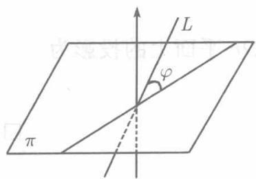

**(1) 直线在平面上的投影**

过已知直线 $L$ 作平面 $\pi$ 的垂直平面与 $\pi$ 相交，交线称为 $L$ 在平面 $\pi$ 上的投影.而所作的平面称为投影平面.

较为常见的是求直线在坐标面上的投影. 设直线 $L$ 的方程为

$$
\left\{ \begin{array}{l} A _ {1} x + B _ {1} y + C _ {1} z + D _ {1} = 0, \\ A _ {2} x + B _ {2} y + C _ {2} z + D _ {2} = 0. \end{array} \right.
$$

在这两个方程中消去 $x$ ，得

$$
(A _ {2} B _ {1} - A _ {1} B _ {2}) y + (A _ {2} C _ {1} - A _ {1} C _ {2}) z + (A _ {2} D _ {1} - A _ {1} D _ {2}) = 0,
$$

这是一个平行于 $Ox$ 轴即垂直于 $yOz$ 平面的平面，并且显然过直线 $L$ ，于是直线 $L$ 在 $yOz$ 平面上的投影是直线

$$
\left\{ \begin{array}{l} (A _ {2} B _ {1} - A _ {1} B _ {2}) y + (A _ {2} C _ {1} - A _ {1} C _ {2}) z + (A _ {2} D _ {1} - A _ {1} D _ {2}) = 0, \\ x = 0. \end{array} \right.
$$

类似地，可以求得 $L$ 在另两个坐标面上的投影．

**例 8.4.13** 设直线 $L$ 的参数方程为

$$
x = 1 + t, \quad y = - 1 + 2 t, \quad z = 2 - 3 t,
$$

其中 $t$ 为参数，求 $L$ 在三个坐标面上的投影．

**解** 在 $y, z$ 的参数表示式中消去参数 $t$ , 得联系 $y$ 和 $z$ 的方程

$$
3 y + 2 z - 1 = 0,
$$

这是经过 $L$ 且平行于 $Ox$ 轴的平面. 因此, 直线 $L$ 在 $yOz$ 平面上的投影为

$$
\left\{ \begin{array}{l l} 3 y + 2 z - 1 = 0, \\ x = 0. \end{array} \right.
$$

类似地，在 $x, z$ 的参数表示式中消去参数 $t$ ，并将所得结果与 $y = 0$ 联立，即得在 $zOx$ 平面上的投影为

$$
\left\{ \begin{array}{l} 3 x + z - 5 = 0, \\ y = 0. \end{array} \right.
$$

在 $x, y$ 的参数表示式中消去参数 $t$ , 与 $z = 0$ 联立, 得在 $xOy$ 平面上的投影为

$$
\left\{ \begin{array}{l} 2 x - y - 3 = 0, \\ z = 0. \end{array} \right.
$$

□

欲求直线 $L$ 在任一已知平面上的投影，可以利用平面束．

**例 8.4.14** 求直线

$$
\left\{ \begin{array}{l} - x + y + z + 2 = 0, \\ x - y + z - 1 = 0, \end{array} \right.
$$

在平面 $x + y + z = 2$ 上的投影．

**解** 通过已知直线的平面束的方程为

$$
(- x + y + z + 2) + \lambda (x - y + z - 1) = 0,
$$

即

$$
(- 1 + \lambda) x + (1 - \lambda) y + (1 + \lambda) z + 2 - \lambda = 0.
$$

现欲在此平面束中确定一个平面，使之与平面

$$
x + y + z - 2 = 0
$$

垂直，因而 $\lambda$ 需满足条件

$$
- 1 + \lambda + (1 - \lambda) + (1 + \lambda) = 0,
$$

解之，得 $\lambda = -1$ ，于是得到投影平面

$$
- 2 x + 2 y + 3 = 0.
$$

所以，所求的投影方程为

$$
\left\{ \begin{array}{l} - 2 x + 2 y + 3 = 0, \\ x + y + z - 2 = 0. \end{array} \right.
$$

**(2) 直线与平面的交角**

直线 $L$ 与平面的交角 $\varphi$ 定义为 $L$ 与它在该平面的投影所成的两个邻角的任何一个。由于这两个邻角的正弦是相等的，不妨规定 $0 \leqslant \varphi \leqslant \frac{\pi}{2}$ （见图8.18）。

设所给直线的方程为

$$
\frac {x - x _ {0}}{l} = \frac {y - y _ {0}}{m} = \frac {z - z _ {0}}{n},
$$

  
图8.18

所给平面的方程为

$$
A x + B y + C z + D = 0.
$$

则直线的方向矢量 $s = \{l,m,n\}$ ，平面的法矢量 $\pmb{n} =$ $\{A,B,C\}$ 而矢量 $\pmb{s}$ 和 $\pmb{n}$ 的夹角为 $\frac{\pi}{2} -\varphi$ 或 $\frac{\pi}{2} +\varphi ,$ 又

$$
\sin \varphi = \cos \left(\frac {\pi}{2} - \varphi\right) = \left| \cos \left(\frac {\pi}{2} + \varphi\right) \right| = | \cos (\widehat {\boldsymbol {s}, \boldsymbol {n}}) |,
$$

故由 (8.16) 得

$$
\sin \varphi = \frac {| \boldsymbol {s} \cdot \boldsymbol {n} |}{| \boldsymbol {s} | | \boldsymbol {n} |} = \frac {| A l + B m + C n |}{\sqrt {A ^ {2} + B ^ {2} + C ^ {2}} \sqrt {l ^ {2} + m ^ {2} + n ^ {2}}}.
$$

由于当且仅当直线的方向矢量与平面的法矢量平行时直线与平面垂直，当且仅当直线的方向矢量与平面的法矢量垂直时直线与平面平行，所以：

直线与平面垂直的充分必要条件是

$$
\frac {A}{l} = \frac {B}{m} = \frac {C}{n},
$$

直线与平面平行的充分必要条件是

$$
A l + B m + C n = 0.
$$

**例 8.4.15** 求直线

$$
\left\{ \begin{array}{l} - x + y + z + 2 = 0, \\ x - y + z - 1 = 0, \end{array} \right.
$$

与平面 $x + y + z = 2$ 的夹角 $\varphi$ .

**解** 所给直线的方向矢量为

$$
\left| \begin{array}{c c c} i & j & k \\ - 1 & 1 & 1 \\ 1 & - 1 & 1 \end{array} \right| = 2 i + 2 j,
$$

平面 $x + y + z = 2$ 的法矢量为 $\pmb {i} + \pmb {j} + \pmb{k}$ ，于是

$$
\begin{array}{l} \sin \varphi = \frac {| 1 \times 2 + 1 \times 2 |}{\sqrt {1 ^ {2} + 1 ^ {2} + 1 ^ {2}} \sqrt {2 ^ {2} + 2 ^ {2}}} = \frac {2}{\sqrt {6}}, \\ \varphi = \arcsin \frac {2}{\sqrt {6}}. \\ \end{array}
$$

□

**(3) 直线与平面的交点**

为求直线与平面的交点，并由此讨论直线与平面的位置关系，在一般情况下，以采用直线的参数方程较为方便。设已知直线 $L$ 的方程为

$$
\frac {x - x _ {0}}{l} = \frac {y - y _ {0}}{m} = \frac {z - z _ {0}}{n},
$$

而已知平面 $\pi$ 的方程为

$$
A x + B y + C z + D = 0.
$$

求 $L$ 与 $\pi$ 的交点的坐标，就是求这些方程的公共解。为此目的，令直线方程各式的比值为 $t$ ，得直线 $L$ 的参数方程

$$
x = x _ {0} + l t, \quad y = y _ {0} + m t, \quad z = z _ {0} + n t, \tag {8.39}
$$

以此代入平面的方程，得

$$
A (x _ {0} + l t) + B (y _ {0} + m t) + C (z _ {0} + n t) + D = 0,
$$

即

$$
\left. (A l + B m + C n) t + \left(A x _ {0} + B y _ {0} + C z _ {0} + D\right) = 0. \right. \tag {8.40}
$$

i) 若 $Al + Bm + Cn \neq 0$ (即 $L$ 不与 $\pi$ 平行), 则由上式解得唯一的 $t$ :

$$
t = - \frac {A x _ {0} + B y _ {0} + C z _ {0} + D}{A l + B m + C n}.
$$

代入 (8.39), 即得 $L$ 与 $\pi$ 的唯一的交点

ii) 若 $Al + Bm + Cn = 0$ , 而 $Ax_0 + By_0 + Cz_0 + D \neq 0$ , 则 (8.40) 是矛盾方程, 无解. 故 $L$ 与 $\pi$ 不相交. 事实上, 此时 $L$ 与 $\pi$ 平行, 且点 $(x_0, y_0, z_0)$ 不在 $\pi$ 内.

iii) 若 $Al + Bm + Cn = 0, Ax_0 + By_0 + Cz_0 + D = 0$ , (8.40) 成为恒等式, $L$ 的一切点都满足 $\pi$ 的方程, 故直线 $L$ 在平面 $\pi$ 内. 事实上, 此时 $L$ 与 $\pi$ 平行, 且两者都过点 $(x_0, y_0, z_0)$ .

**例 8.4.16** 求点 $P(1,4,1)$ 到直线 $L: \frac{x - 3}{1} = \frac{y - 4}{2} = \frac{z - 2}{1}$ 的距离 $d$ .

**解** 过点 $P$ 作平面 $\pi$ 垂直于 $L$ , 记 $\pi$ 与 $L$ 的交点为 $Q$ , 则线段 $PQ$ 之长即所求距离 $d$ . 因 $\pi$ 与 $L$ 垂直, 可取 $L$ 的方向矢量为 $\pi$ 的法矢量, 故 $\pi$ 的方程为

$$
x - 1 + 2 (y - 4) + z - 1 = 0,
$$

即

$$
x + 2 y + z - 10 = 0.
$$

以 $L$ 的参数方程

$$
x = 3 + t, \quad y = 4 + 2 t, \quad z = 2 + t
$$

代入得 $6t + 3 = 0$ ，即 $t = -\frac{1}{2}$ ，代回上式得 $\pi$ 与 $L$ 的交点 $Q\left(\frac{5}{2},3,\frac{3}{2}\right)$ ，于是

$$
d = | P Q | = \sqrt {\left(1 - \frac {5}{2}\right) ^ {2} + (4 - 3) ^ {2} + \left(1 - \frac {3}{2}\right) ^ {2}} = \frac {\sqrt {14}}{2}.
$$

**例 8.4.17** 证明：直线 $\frac{x + 9}{3} = \frac{y + 2}{4} = \frac{z - 2}{1}$ 与三个坐标面的交点之一平分其余两交点间的线段.

**证** 为求所给直线与 $yOz$ 平面的交点，以参数方程

$$
x = - 9 + 3 t, \quad y = - 2 + 4 t, \quad z = 2 + t,
$$

代入方程 $x = 0$ ，得 $-9 + 3t = 0$ ， $t = 3$ ．于是得到直线与 $yOz$ 平面的交点 $P(0,10,5)$．类似地，可以求得直线与另两坐标面的交点 $Q\left(-\frac{15}{2},0,\frac{5}{2}\right),R(-15, - 10,0).$ 由中点公式（8.10）可知点 $Q$ 平分线段 $PR$．

注意，由于本题求的是直线与特殊平面——坐标面的交点，也可以不引入直线的参数方程，而直接在所给的标准方程 $\frac{x + 9}{3} = \frac{y + 2}{4} = \frac{z - 2}{1}$ 中依此令 $x = 0, y = 0, z = 0$ 求得交点 $P, Q, R$ .
