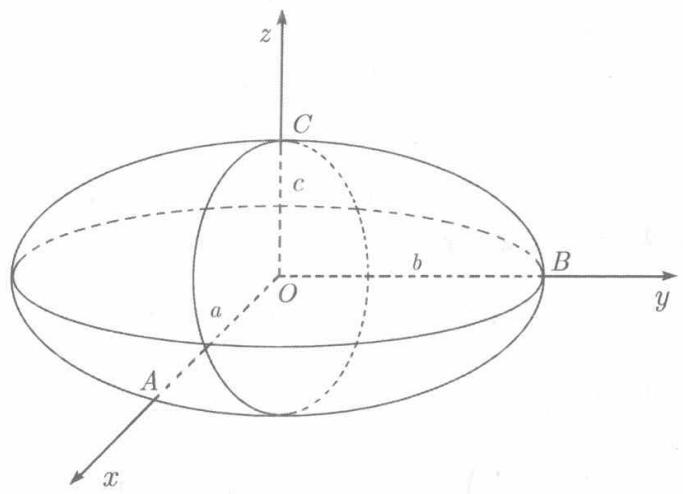
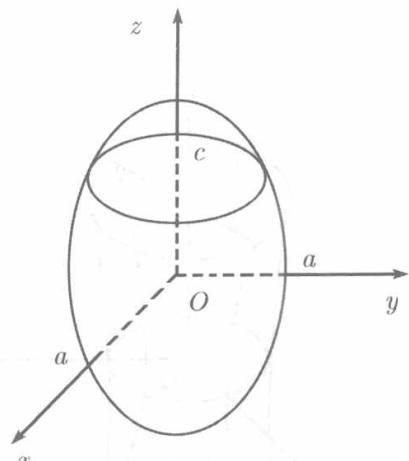

由方程

$$
\frac {x ^ {2}}{a ^ {2}} + \frac {y ^ {2}}{b ^ {2}} + \frac {z ^ {2}}{c ^ {2}} = 1 \quad (a > 0, b > 0, c > 0) \tag{8.41}
$$

所确定的曲面称为椭球面(见图8.19).

由（8.41）得知

$$
\frac {x ^ {2}}{a ^ {2}} \leqslant 1, \quad \frac {y ^ {2}}{b ^ {2}} \leqslant 1, \quad \frac {z ^ {2}}{c ^ {2}} \leqslant 1,
$$

因而

$$
| x | \leqslant a, \quad | y | \leqslant b, \quad | z | \leqslant c.
$$

可见整个椭球面位于以平面 $x = \pm a, y = \pm b, z = \pm c$ 所构成的长方体内. $a, b, c$ 称为椭球面的半轴

  
图8.19

在方程 (8.41) 中，改变变量 $x, y, z$ 中的一个、两个或三个的符号而保持其绝对值，方程不受影响。因而椭球面 (8.41) 关于三个坐标面、三个坐标轴以及坐标原点都是对称的。

为了对椭球面的形状获得清晰的了解，我们来考察它被坐标面以及坐标面的平行平面所截得的截痕。椭球面（8.41）被三个坐标面 $xOy, yOz, zOx$ 所截的截痕可以依次以 $z = 0, x = 0, y = 0$ 代入方程（8.41），分别得到三个椭圆

$$
\frac {x ^ {2}}{a ^ {2}} + \frac {y ^ {2}}{b ^ {2}} = 1, \quad \frac {y ^ {2}}{b ^ {2}} + \frac {z ^ {2}}{c ^ {2}} = 1, \quad \frac {x ^ {2}}{a ^ {2}} + \frac {z ^ {2}}{c ^ {2}} = 1.
$$

以 $xOy$ 平面的平行平面 $z = h(|h|\leqslant c)$ 截椭球面（8.41）所得的截痕在平面 $z = h$ 上，它的方程可以在(8.41）中以 $z = h$ 代入而得

$$
\frac {x ^ {2}}{a ^ {2}} + \frac {y ^ {2}}{b ^ {2}} = 1 - \frac {h ^ {2}}{c ^ {2}}.
$$

对于满足 $-c < h < c$ 的每一 $h$ , 这表示平面 $z = h$ 上的一个椭圆. 其半轴为

$$
a \sqrt {1 - \frac {h ^ {2}}{c ^ {2}}}, \quad b \sqrt {1 - \frac {h ^ {2}}{c ^ {2}}}.
$$

可见，当 $h = 0$ 时这个椭圆最大，就是以 $xOy$ 平面所截而得。随 $|h|$ 的增大，截痕将缩小，直到 $|h| = c$ 时缩小为点 $(0,0,c)$ 和 $(0,0,-c)$ ，它们分别是椭球面的最高点和最低点。

以平行于 $yOz$ 平面的平面 $x = k$ （ $|k| \leqslant a$ ）以及平行于 $zOx$ 平面的平面 $y = l$ （ $|l| \leqslant b$ ）相截所得的截痕与此类似，也都是椭圆。椭球面 (8.41) 的最右、最左的点是 $(0, b, 0)$ 和 $(0, -b, 0)$ ，最前和最后的点是 $(a, 0, 0)$ 和 $(-a, 0, 0)$ 。如果椭球面的某两个半轴相等，例如 $a = b$ ，则 (8.41) 成为

$$
\frac {x ^ {2}}{a ^ {2}} + \frac {y ^ {2}}{a ^ {2}} + \frac {z ^ {2}}{c ^ {2}} = 1,
$$

于是平面 $z = h$ 截得的截痕是圆周

$$
x ^ {2} + y ^ {2} = a ^ {2} \left(1 - \frac {h ^ {2}}{c ^ {2}}\right).
$$

这个圆周上的每一点到 $Oz$ 轴的距离是相等的.于是这个椭球面可以由 $yOz$ 平面上的椭圆 $\frac{y^2}{a^2} +\frac{z^2}{c^2} = 1$ 或 $zOx$ 平面上的椭圆 $\frac{x^2}{a^2} +\frac{z^2}{c^2} = 1$ 绕 $Oz$ 轴旋转而成．故而称之为旋转椭球面(见图8.20).

类似于此，

  
图8.20

$$
\frac {x ^ {2}}{a ^ {2}} + \frac {y ^ {2}}{b ^ {2}} + \frac {z ^ {2}}{b ^ {2}} = 1, \quad \frac {x ^ {2}}{c ^ {2}} + \frac {y ^ {2}}{b ^ {2}} + \frac {z ^ {2}}{c ^ {2}} = 1
$$

也都是旋转椭球面. 建议读者自己指出它们各自是什么曲线绕何轴旋转而成

最后，当三个半轴都相等即 $a = b = c$ (此时，称（8.41）为等轴椭球面）时，得到球面

$$
x ^ {2} + y ^ {2} + z ^ {2} = a ^ {2}.
$$
