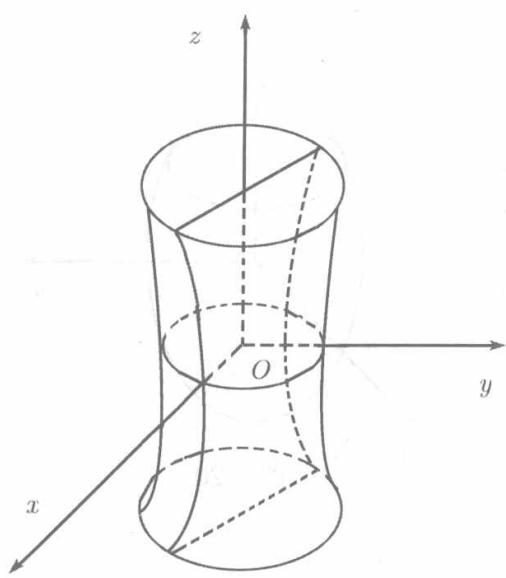

设 $a > 0, b > 0, c > 0$ . 由方程

$$
\frac {x ^ {2}}{a ^ {2}} + \frac {y ^ {2}}{b ^ {2}} - \frac {z ^ {2}}{c ^ {2}} = 1, \quad \frac {x ^ {2}}{a ^ {2}} - \frac {y ^ {2}}{b ^ {2}} + \frac {z ^ {2}}{c ^ {2}} = 1, \quad - \frac {x ^ {2}}{a ^ {2}} + \frac {y ^ {2}}{b ^ {2}} + \frac {z ^ {2}}{c ^ {2}} = 1
$$

所确定的曲面都称为单叶双曲面, 其中 $a, b, c$ 称为它的半轴.

与椭球面同样的理由，单叶双曲面关于坐标轴、坐标平面及坐标原点都是对称的.

我们来详细考察曲面（见图8.21）

$$
\frac {x ^ {2}}{a ^ {2}} + \frac {y ^ {2}}{b ^ {2}} - \frac {z ^ {2}}{c ^ {2}} = 1. \tag {8.42}
$$

它被坐标面 $xOy$ 所截得的截痕是椭圆

$$
\frac {x ^ {2}}{a ^ {2}} + \frac {y ^ {2}}{b ^ {2}} = 1.
$$

平行于平面 $xOy$ 的任何平面 $z = h(-\infty < h < +\infty)$ 都和曲面 (8.42) 相交，截痕为平面 $z = h$ 上的椭圆

$$
\frac {x ^ {2}}{a ^ {2}} + \frac {y ^ {2}}{b ^ {2}} = 1 + \frac {h ^ {2}}{c ^ {2}},
$$

  
图8.21

两个半轴为 $\frac{a}{c}\sqrt{c^2 + h^2}$ 和 $\frac{b}{c}\sqrt{c^2 + h^2}$ . 由此可见，随着 $|h|$ 的增加，所截得的椭圆也越来越大.

平面 $zOx$ 截（8.42）所得截痕是双曲线

$$
\frac {x ^ {2}}{a ^ {2}} - \frac {z ^ {2}}{c ^ {2}} = 1,
$$

实半轴为 $a$ ，虚半轴为 $c$ 实轴与 $Ox$ 轴重合，虚轴与 $Oz$ 轴重合.平行于 $zOx$ 平面的一切平面 $y = h$ 都和曲面(8.42)相交. $|h|\neq b$ 时，截痕为双曲线

$$
\frac {x ^ {2}}{a ^ {2}} - \frac {z ^ {2}}{c ^ {2}} = 1 - \frac {h ^ {2}}{b ^ {2}},
$$

其半轴为

$$
\frac {a}{b} \sqrt {b ^ {2} - h ^ {2}} \quad \text {和} \quad \frac {c}{b} \sqrt {b ^ {2} - h ^ {2}}.
$$

若 $|h| < b$ ，则实轴平行于 $Ox$ 轴，虚轴平行于 $Oz$ 轴

若 $|h| > b$ ，则实轴平行于 $Oz$ 轴，虚轴平行于 $Ox$ 轴

若 $|h| = b$ ，则上述方程成为

$$
\frac {x ^ {2}}{a ^ {2}} - \frac {z ^ {2}}{c ^ {2}} = 0,
$$

即

$$
\left(\frac {x}{a} + \frac {z}{c}\right) \left(\frac {x}{a} - \frac {z}{c}\right) = 0.
$$

这表示两条相交直线。由此可知，平面 $y = b$ 截双曲面 (8.42) 所得截痕为相交于 $(0, b, 0)$ 的两条直线，而平面 $y = -b$ 截双曲面 (8.42) 所得截痕为相交于 $(0, -b, 0)$ 的两条直线。

平面 $yOz$ 及其平行平面 $x = k (|k| \neq a)$ 截双曲面 (8.42) 所得截痕也是双曲线，两个平面 $x = \pm a$ 截 (8.42) 的截痕是两对相交直线。

在 (8.42) 中若 $a = b$ ，则得

$$
\frac {x ^ {2}}{a ^ {2}} + \frac {y ^ {2}}{a ^ {2}} - \frac {z ^ {2}}{c ^ {2}} = 1.
$$

平面 $z = h(0\leqslant |h| < + \infty)$ 与之相截得截痕

$$
x ^ {2} + y ^ {2} = a ^ {2} \left(1 + \frac {h ^ {2}}{c ^ {2}}\right),
$$

这在平面 $z = h$ 上表示一个半径为 $\frac{a}{c}\sqrt{c^2 + h^2}$ 的圆，此时，单叶双曲面由 $zOx$ 平面上的双曲线 $\frac{x^2}{a^2} -\frac{z^2}{c^2} = 1$ 或 $yOz$ 平面上的双曲线 $\frac{y^2}{a^2} -\frac{z^2}{c^2} = 1$ 绕 $Oz$ 轴旋转而成，称为单叶旋转双曲面.
