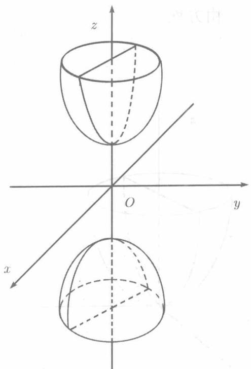

设 $a > 0, b > 0, c > 0,$ 由方程

$$
\frac {x ^ {2}}{a ^ {2}} - \frac {y ^ {2}}{b ^ {2}} - \frac {z ^ {2}}{c ^ {2}} = 1, \quad - \frac {x ^ {2}}{a ^ {2}} + \frac {y ^ {2}}{b ^ {2}} - \frac {z ^ {2}}{c ^ {2}} = 1, \quad - \frac {x ^ {2}}{a ^ {2}} - \frac {y ^ {2}}{b ^ {2}} + \frac {z ^ {2}}{c ^ {2}} = 1
$$

所确定的曲面都称为双叶双曲面. 我们来详细考察其中之一（见图8.22）：

$$
- \frac {x ^ {2}}{a ^ {2}} - \frac {y ^ {2}}{b ^ {2}} + \frac {z ^ {2}}{c ^ {2}} = 1. \tag {8.43}
$$

与椭球面、单叶双曲面一样，双叶双曲面关于坐标轴、坐标面及坐标原点都是对称的.

在 (8.43) 中以 $z = h$ 代入，移项后得

$$
\frac {x ^ {2}}{a ^ {2}} + \frac {y ^ {2}}{b ^ {2}} = \frac {h ^ {2}}{c ^ {2}} - 1.
$$

当 $|h| < c$ 时，任何 $x, y$ 都不能满足此式，可见平面 $z = h$ （包括 $xOy$ 平面）与曲面 (8.43)不相交，因而没有截痕

当 $|h| = c$ 时，得 $\frac{x^2}{a^2} +\frac{y^2}{b^2} = 0.$ 由此可知，平面 $z = h$ 与曲面（8.43）仅有一个公共点 $(0,0,h)$ ，平面 $z = -h$ 与曲面（8.43）也仅有一个公共点 $(0,0, - h)$ .这两点称为双叶双曲面的顶点

当 $|h| > c$ 时，得到的截痕是位于平面 $z = h$ 上的椭圆，其半轴为 $\frac{a}{c}\sqrt{h^2 - c^2}$ 和 $\frac{b}{c}\sqrt{h^2 - c^2}$ 随 $|h|$ 的增大，椭圆也越来越大.

  
图8.22

总之，曲面分成互不相连的两叶，一叶在平面 $z = c$ 上方，另一叶在平面 $z = -c$ 下方.

以 $y = h$ 代入（8.43）得

$$
- \frac {x ^ {2}}{a ^ {2}} + \frac {z ^ {2}}{c ^ {2}} = 1 + \frac {h ^ {2}}{b ^ {2}},
$$

由此可见，平行于 $xOz$ 平面的一切平面包括 $xOz$ 平面本身截曲面(8.43)所得的截痕都是双曲线。其半轴为 $\frac{a}{b}\sqrt{b^2 + h^2}$ 和 $\frac{c}{b}\sqrt{b^2 + h^2}$ 。实轴与 $Oz$ 轴平行，虚轴与 $Oy$ 轴平行。

同样可知， $yOz$ 平面及其平行平面截曲面 (8.43) 所得截痕也是双曲线，其实轴与 $Oz$ 轴平行，虚轴与 $Oy$ 轴平行。

若 $a = b$ ，则（8.43）成为

$$
- \frac {x ^ {2}}{a ^ {2}} - \frac {y ^ {2}}{a ^ {2}} + \frac {z ^ {2}}{c ^ {2}} = 1,
$$

平面 $z = h$ $(c < |h| < +\infty)$ 与之相截得到的都是圆周

$$
x ^ {2} + y ^ {2} = \left(\frac {h ^ {2}}{c ^ {2}} - 1\right) a ^ {2}.
$$

此时曲面由 $zOx$ 平面上的双曲线 $-\frac{x^2}{a^2} + \frac{z^2}{c^2} = 1$ 或 $yOz$ 平面上的双曲线 $\frac{y^2}{a^2} + \frac{z^2}{c^2} = 1$ 绕 $Oz$ 轴旋转而得，称之为双叶旋转双曲面.
