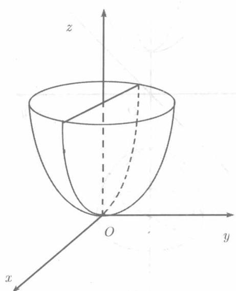

由方程

$$
\frac {x ^ {2}}{p} + \frac {y ^ {2}}{q} = 2 z \quad (pq > 0) \tag {8.44}
$$

  
图8.23

所确定的曲面称为椭圆抛物面(见图8.23). 我们对于 $p > 0, q > 0$ 的情形详细考察曲面 (8.44).

以 $-x$ 代替 $x$ , 以 $-y$ 代替 $y$ , 方程 (8.44) 不变, 可见椭圆抛物面 (8.44) 关于 $Oz$ 轴以及坐标面 $xOz$ 和 $yOz$ 都是对称的.

以 $z = h$ 代入（8.44）得

$$
\frac {x ^ {2}}{p} + \frac {y ^ {2}}{q} = 2 h.
$$

若 $h < 0$ ，任何 $x, y$ 都不满足此方程，平面 $z = h$ 与曲面 (8.44) 不相交

若 $h = 0$ ，则得 $x = 0,y = 0$ 平面 $z = 0$ 与曲面(8.44)有唯一的公共点 $(0,0,0)$ .称之为椭圆抛物面的顶点

若 $h > 0$ ，则平面 $z = h$ 截曲面 (8.44) 得

$$
\frac {x ^ {2}}{2 p h} + \frac {y ^ {2}}{2 q h} = 1,
$$

这是平面 $z = h$ 上的椭圆，其半轴为 $\sqrt{2ph}$ 和 $\sqrt{2qh}$ . 随 $h$ 的增大，椭圆也越来越大.

总之，曲面经过原点且整个的位于 $xOy$ 平面的上方，开口向上

在 (8.44) 中令 $y = 0$ ，可知它被 $xOz$ 平面截得的截痕是抛物线

$$
x ^ {2} = 2 p z,
$$

它的轴合于 $Oz$ 轴

在 (8.44) 中令 $y = h(|h| > 0)$ ，可知它被 $xOz$ 平面的一切平行平面所得的截痕也都是抛物线，其方程为

$$
x ^ {2} = 2 p \left(z - \frac {h ^ {2}}{2 q}\right).
$$

它以点 $\left(0, h, \frac{h^2}{2q}\right)$ 为顶点而轴与 $Oz$ 轴平行.

坐标面 $yOz$ 及其一切平行平面截曲面 (8.44) 所得截痕也是抛物线

若 $p = q > 0$ ，则（8.44）成为

$$
\frac {x ^ {2}}{p} + \frac {y ^ {2}}{p} = 2 z,
$$

对一切正数 $h$ ，平面 $z = h$ 截它所得的截痕都是圆周

$$
x ^ {2} + y ^ {2} = 2 p h.
$$

此时，曲面(8.44)由 $yOz$ 平面上的抛物线 $y^{2} = 2pz$ 或 $zOx$ 平面上的抛物线 $x^{2} = 2pz$ 绕 $Oz$ 轴旋转而得，称之为旋转抛物面

若 $p < 0, q < 0$ , 结果是类似的, 此时, 曲面整个地位于 $xOy$ 平面下方, 开口向下.

曲面

$$
\frac {y ^ {2}}{p} + \frac {z ^ {2}}{q} = 2 x, \quad \frac {z ^ {2}}{p} + \frac {x ^ {2}}{q} = 2 y \quad (p q > 0)
$$

也都是椭圆抛物面.
