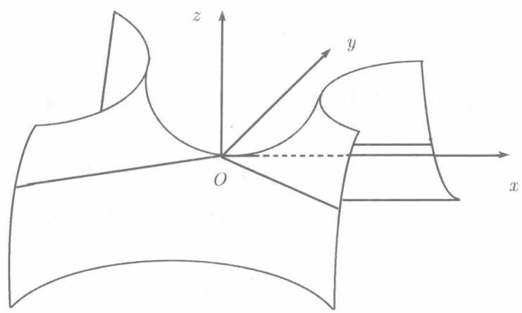

由方程

$$
\frac {x ^ {2}}{p} - \frac {y ^ {2}}{q} = 2 z \quad (p q > 0) \tag {8.45}
$$

所确定的曲面称为双曲抛物面. 由于它形如马鞍, 故亦称鞍形曲面(见图8.24).

  
图8.24

我们对于 $p > 0, q > 0$ 的情形详细考察这一曲面

与椭圆抛物面同样的理由，双曲抛物面(8.45)关于 $Oz$ 轴以及坐标面 $yOz$ 和坐标面 $xOz$ 都是对称的.

以 $z = 0$ 代入（8.45）并将左端分解因式，得

$$
\left(\frac {x}{\sqrt {p}} + \frac {y}{\sqrt {q}}\right) \left(\frac {x}{\sqrt {p}} - \frac {y}{\sqrt {q}}\right) = 0,
$$

由此得知， $xOy$ 平面截曲面（8.45）所得截痕为相交于原点的一对直线

$$
\frac {x}{\sqrt {p}} + \frac {y}{\sqrt {q}} = 0 \quad \text {和} \quad \frac {x}{\sqrt {p}} - \frac {y}{\sqrt {q}} = 0.
$$

以 $z = h$ 代入 (8.45), 得

$$
\frac {x ^ {2}}{2 p h} - \frac {y ^ {2}}{2 q h} = 1,
$$

由此可见，平行于 $xOy$ 平面的平面 $z = h$ 截曲面（8.45）的截痕为双曲线。 $h > 0$ 时实轴平行于 $Ox$ 轴， $h < 0$ 时实轴平行 $Oy$ 轴。

以 $y = h$ 代入（8.45）得

$$
x ^ {2} = 2 p \left(z + \frac {h ^ {2}}{2 q}\right),
$$

若 $h = 0$ ，则得 $xOz$ 平面截曲面(8.45)的截痕 $x^{2} = 2pz$ ，这是以 $Oz$ 轴为对称轴的抛物线．若 $h\neq 0$ ，则得 $xOz$ 平面的平行平面 $y = h$ 截（8.45）的截痕——以点 $\left(0,h, - \frac{h^2}{2q}\right)$ 为顶点而轴平行于 $Oz$ 轴的抛物线

$yOz$ 平面及其平行平面 $x = h$ 截曲面 (8.45) 得到的也都是抛物线，其轴也平行于 $Oz$ 轴.

若 $p < 0, q > 0$ , 结果是类似的, 不同的是与平面 $z = h$ 所截得的双曲线, 当 $h > 0$ 时, 实轴平行于 $Oy$ 轴, 当 $h < 0$ 时, 实轴平行于 $Ox$ 轴.

曲面

$$
\frac {y ^ {2}}{p} - \frac {z ^ {2}}{q} = 2 x, \quad \frac {z ^ {2}}{p} - \frac {x ^ {2}}{q} = 2 y \quad (p q > 0)
$$

也都是双曲抛物面.
