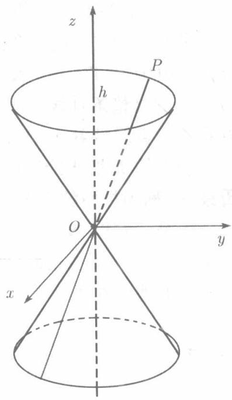

直线过定点 $Q$ 沿着不经过点 $Q$ 的曲线 $C$ 移动所生成的曲面称为锥面, $Q$ 称为该锥面的顶点, $C$ 称为准线, $C$ 上的每一点与 $Q$ 点的连线称为锥面的母线.

现在证明，由方程

$$
\frac {x ^ {2}}{a ^ {2}} + \frac {y ^ {2}}{b ^ {2}} - \frac {z ^ {2}}{c ^ {2}} = 0, \quad \frac {x ^ {2}}{a ^ {2}} - \frac {y ^ {2}}{b ^ {2}} + \frac{z^{2}}{c^{2}} = 0, \quad - \frac {x ^ {2}}{a ^ {2}} + \frac {y ^ {2}}{b ^ {2}} + \frac {z ^ {2}}{c ^ {2}} = 0,
$$

$(a > 0, b > 0, c > 0)$ 所确定的曲面都是锥面。由于这些方程都是二次代数方程，它们所确定的锥面都称为二次锥面.

我们来对

$$
\frac {x ^ {2}}{a ^ {2}} + \frac {y ^ {2}}{b ^ {2}} - \frac {z ^ {2}}{c ^ {2}} = 0 \tag {8.46}
$$

进行论证.

显然，曲面（8.46）通过原点 $O$ ，平面 $z = h$ 截曲面（8.46）所得截痕是椭圆 $C$ （见图8.25）：

$$
\frac {x ^ {2}}{a ^ {2}} + \frac {y ^ {2}}{b ^ {2}} = \frac {h ^ {2}}{c ^ {2}}.
$$

对于 $C$ 上的任意一点 $P(x_0,y_0,h)$ ，有

$$
\frac {x _ {0} ^ {2}}{a ^ {2}} + \frac {y _ {0} ^ {2}}{b ^ {2}} - \frac {h ^ {2}}{c ^ {2}} = 0.
$$

连接点 $O$ 和点 $P$ 的直线以向量 $\overrightarrow{OP}$ 为方向矢量，而 $\overrightarrow{OP} = \{x_0,y_0,h\}$ ，于是直线 $OP$ 的参数方程为

$$
x = x _ {0} t, \quad y = y _ {0} t, \quad z = h t,
$$

  
图8.25

代入 (8.46) 得

$$
\frac {x ^ {2}}{a ^ {2}} + \frac {y ^ {2}}{b ^ {2}} - \frac {z ^ {2}}{c ^ {2}} = \left(\frac {x _ {0} ^ {2}}{a ^ {2}} + \frac {y _ {0} ^ {2}}{b ^ {2}} - \frac {h ^ {2}}{c ^ {2}}\right) t ^ {2} = 0 (- \infty <   t <   + \infty).
$$

这证明直线 $OP$ 整个地位于曲面 (8.46) 上。由于曲线 $C$ 上的每一点 $P$ 都如此，因而曲面 (8.46) 由通过定点 $O$ 的直线沿曲线 $C$ 移动而成，即以 $O$ 为顶点以 $C$ 为准线的一个锥面。

若 $a = b$ ，则方程（8.46）成为

$$
\frac {x ^ {2}}{a ^ {2}} + \frac {y ^ {2}}{a ^ {2}} - \frac {z ^ {2}}{c ^ {2}} = 0,
$$

平面 $z = h$ 与之相截所得截痕是圆周

$$
x ^ {2} + y ^ {2} = \frac {a ^ {2} h ^ {2}}{c ^ {2}}.
$$

此时（8.46）是以 $Oz$ 轴为旋转轴的旋转锥面，称之为圆锥面
