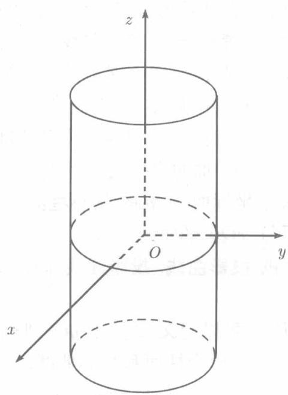
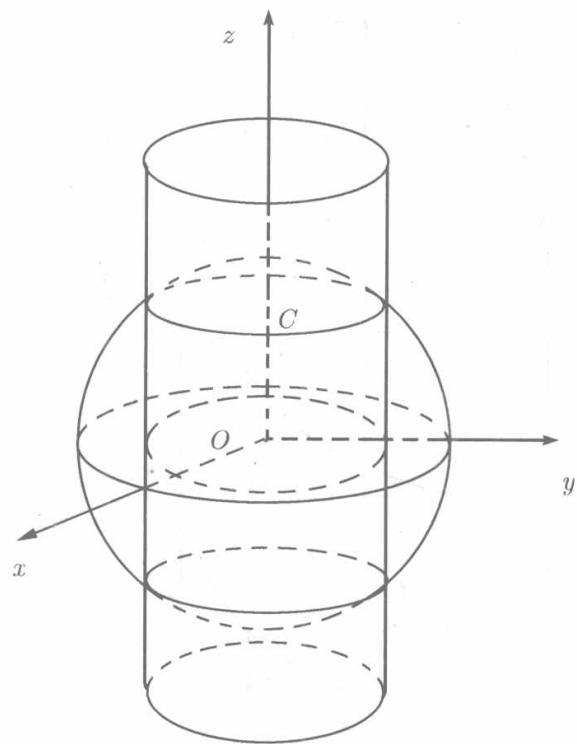
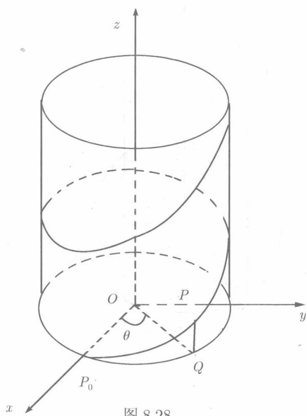
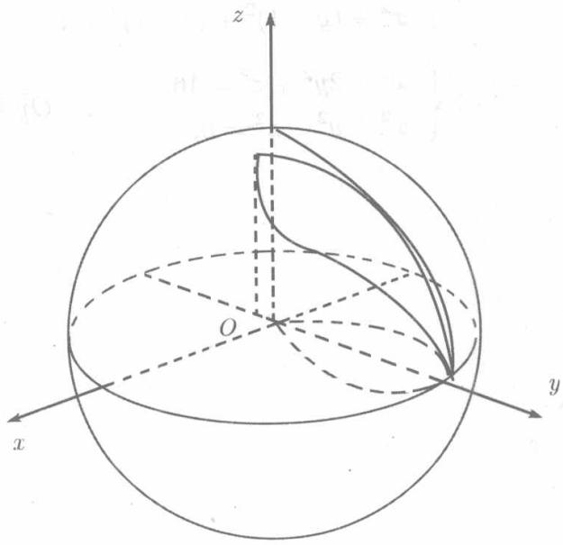

我们已经知道，空间两个平面的交线是一条直线，它可以用两个平面方程联立起来表示。类似于此，两个曲面的交线一般是曲线。如果已经知道这两个曲面的方程是 $F(x, y, z) = 0$ 和 $G(x, y, z) = 0$ ，则它们的交线的方程是联立方程

$$
\left\{ \begin{array}{l} F (x, y, z) = 0, \\ G (x, y, z) = 0. \end{array} \right. \tag {8.48}
$$

称之为空间曲线的一般方程

例如， $x^{2} + y^{2} + z^{2} = 16$ 是以原点为球心4为半径的球面．它与平面 $z = 3$ 相交，所得的交线是圆周 $C$ （见图8.27），其方程为

  
图8.26

  
图8.27

$$
C: \left\{ \begin{array}{l} x ^ {2} + y ^ {2} + z ^ {2} = 16, \\ z = 3. \end{array} \right.
$$

当然，曲线 $C$ 的方程也可写为

$$
\left\{ \begin{array}{l} x ^ {2} + y ^ {2} = 7, \\ z = 3, \end{array} \right.
$$

这时， $C$ 被看作为圆柱 $x^{2} + y^{2} = 7$ 和平面 $z = 3$ 的交线．由此可知，作为给定曲

线 $C$ 方程的联立方程组不是唯一的。这一事实，与曲线 $C$ 可以作为这两个曲面的交线也可以看作另两个曲面的交线有关。

如果曲线上每一点的三个坐标都写成某个参数 $t$ 的函数：

$$
x = \varphi (t), \quad y = \psi (t); \quad z = \lambda (t), \tag {8.49}
$$

则得曲线的参数方程

例如，动点 $P(x,y,z)$ 从点 $P_0(R,0,0)$ 出发，沿着圆柱面 $x^{2} + y^{2} = R^{2}$ 以角速度 $\omega$ （常数）绕 $Oz$ 轴旋转，同时又以线速度 $v$ （常数）按平行于 $Oz$ 轴的方向上升，则在时刻 $t(t > 0)$ 点 $P$ 所转过的角度为 $\theta = \omega t,$ 而上升的高度为 $QP = vt,$ 于是

$$
x = R \cos \omega t, \quad y = R \sin \omega t, \quad z = v t.
$$

  
图8.28

这就是点 $P$ 的轨迹的参数方程. 这方程所确定的曲线称为螺旋线(见图8.28).

以后，常常需要求空间曲线在坐标面上的投影，现在我们来建立这一投影的概念并说明它的求法

设 $C$ 为已知的空间曲线，以 $C$ 为准线，平行于 $Oz$ 轴的直线为母线的柱面称为 $C$ 关于坐标面 $xOy$ 的投影柱面，而投影柱面与 $xOy$ 平面的交线称为 $C$ 在 $xOy$ 平面的投影曲线.投影曲线简称投影

类似地，可以定义 $C$ 关于 $yOz$ 平面及 $zOx$ 平面的投影柱面和投影曲线

若曲线 $C$ 的方程为(8.48)，由（8.48）的两个方程消去变数 $\textit{\textbf{z}}$ 得

$$
\varphi (x, y) = 0.
$$

这是一个母线平行于 $Oz$ 轴的柱面．如果 $x,y,z$ 满足(8.48)，则必满足这一方程即曲线 $C$ 整个的位于所述柱面上．因此，柱面 $\varphi (x,y) = 0$ 就是曲线 $C$ 关于 $xOy$ 平面的投影柱面．因而曲线 $C$ 在 $xOy$ 平面上的投影方程为

$$
\left\{ \begin{array}{l l} \varphi (x, y) = 0, \\ z = 0. \end{array} \right.
$$

同理，可以得到曲线 $C$ 在另两个坐标面上的投影

若 $C$ 的方程由(8.49)给出，则它在三个坐标 $xOy, yOz, zOx$ 上的投影曲线依次由参数方程

$$
\left\{ \begin{array}{l} x = \varphi (t), \\ y = \psi (t), \\ z = 0, \end{array} \right. \quad \left\{ \begin{array}{l} y = \psi (t), \\ z = \lambda (t), \\ x = 0, \end{array} \right. \quad \left\{ \begin{array}{l} z = \lambda (t), \\ x = \varphi (t), \\ y = 0. \end{array} \right.
$$

给出.

例8.5.3 求位于 $xOy$ 平面上方的曲线 $C: \left\{ \begin{array}{l} x^2 + y^2 + z^2 = 16, \\ x^2 + y^2 = 4y \end{array} \right.$ （ $z \geqslant 0$ ）在坐标面 $xOy$ 和 $yOz$ 上的投影曲线的方程

解 由于曲线 $C$ 的第二个方程本身就不含 $z$ , 它所表示的就是 $C$ 关于 $xOy$ 平面的投影柱面. 故 $C$ 在 $xOy$ 平面上的投影为圆 (见图8.29)

$$
\left\{ \begin{array}{l} x ^ {2} + y ^ {2} = 4 y, \\ z = 0. \end{array} \right.
$$

在曲线 $C$ 的方程中消去 $x$ , 得到 $C$ 关于 $yOz$ 平面的投影的柱面 $z^2 + 4y = 16$ , 于是 $C$ 在 $yOz$ 平面上的投影为一段抛物线弧

$$
\left\{ \begin{array}{l l} z ^ {2} + 4 y = 16, \\ x = 0 \end{array} \right. \quad (0 \leqslant y \leqslant 4, z \geqslant 0).
$$

注意，曲线 $C$ 位于有界曲面（球面） $x^{2} + y^{2} + z^{2} = 16$ 上，是一条有界曲线，它在 $yOz$ 平面上的投影不可能成为整个无界的抛物线 $\left\{ \begin{array}{l}z^2 +4y = 16,\\ x = 0, \end{array} \right.$

而只能是这抛物线的一部分. 因此有限制条件 $z \geqslant 0, 0 \leqslant y \leqslant 4$ . 这里, $z \geqslant 0$ 是由于 $C$ 本身满足 $z \geqslant 0, y \geqslant 0$ 是由于 $C$ 满足 $x^{2} + y^{2} = 4y, y \leqslant 4$ 是由于 $C$ 满足 $x^{2} + y^{2} + z^{2} = 16$ . 此例表明, 用上面介绍的方法, 求得的联立方程, 所表示的曲线可能所求的投影 “更大”. 此时, 需结合原曲线 $C$ 的方程, 给变量适当的限制. 以得到 “真正” 的投影.

  
图8.29

在多元函数积分学（第10章、第11章）中，注意到这一情况是十分重要的.
