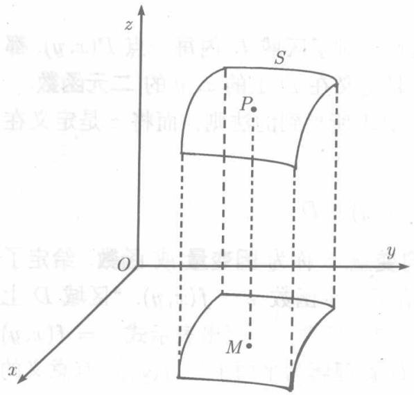

平面上由一条或几条曲线所围成的一部分称为一个(平面)区域.围成这个区域的那些曲线称为该区域的边界.例如椭圆、圆、三角形、矩形所围成的都是区域，平面上的第一象限、直线 $ax + by = 0$ 将平面所分成的两部分、两个圆所围成的环形也都是区域

**定义9.1.1**（二元函数）如果依据某个法则，对于区域 $D$ 内每一点 $P(x,y)$ ，都有一个或多个确定的 $z$ 值与之对应，则说 $z$ 是定义在 $D$ 上的 $x,y$ 的二元函数。

通常用一个字母 $f, g, \varphi$ 或 $\psi$ 表示定义9.1.1所提到的法则，而将 $z$ 是定义在 $D$ 上的 $x, y$ 的函数这一事实记为

$$
z = f (x, y) \quad (x, y) \in D.
$$

区域 $D$ 称为函数的定义域, $x, y$ 称为自变量, $z$ 称为因变量或函数. 给定了定义域 $D$ 和由 $x, y$ 到 $z$ 的对应法则 $f$ , 就有了一个函数 $z = f(x, y)$ . “区域 $D$ 上的函数 $z = f(x, y)$ ”也说成“ $D$ 上的函数 $f$ ”. 通常, 在写出表示式 $z = f(x, y)$ 时, 并不特别指出函数的定义域 $D$ , 这时, $D$ 就理解为平面上使 $f(x, y)$ 有意义的一切点所成的集合. 即所谓自然定义域.

类似于定义9.1.1，可以定义三元函数及更多变元的函数

例如， $z = \sqrt{xy}$ 是二元函数，其定义域是平面上包括 $Ox$ 轴和 $Oy$ 轴的第一、第三象限；函数 $z = \arcsin (x^{2} + y^{2})$ 的定义域是包括圆周的单位圆 $x^{2} + y^{2}\leqslant 1$ ；三元函数 $u = \ln (1 - x^2 -y^2 -z^2)$ 的定义域是不包括球面的单位球 $x^{2} + y^{2} + z^{2} <   1.$

这三个例子中，第一个和第三个都只有一个确定的 $z$ 与 $x, y$ 对应，称之为单值函数；而第二个则有多个 $z$ 与 $x, y$ 对应，称之为多值函数。今后，我们只讨论单值函数。

函数 $z = f(x,y),u = g(x,y,z)$ 也可以写成 $z = f(P),u = g(P)$ ，其中 $P$ 分别表示平面上或空间中的点．函数 $z = f(x,y)$ 在已知点 $P_{0}(x_{0},y_{0})$ 的值记为 $f(x_0,y_0)$、$f(P_0)$ 或 $\left.\boldsymbol {z}\right|_{\substack{x = x_0\\ y = y_0}}$ .例如，若 $f(x,y) = \sqrt{xy}$ ，则 $f(2,8) = \sqrt{xy}\bigg|_{\substack{x = 2\\ y = 8}} = 4.$

包括边界的区域称为闭区域，不包括边界的区域称为开区域。如果存在常数 $L$ ，使得区域 $D$ 内的一切点 $P(x, y)$ 都满足 $|x| \leqslant L, |y| \leqslant L$ ，则说 $D$ 是有界区域，否则，称 $D$ 是无界区域。无界区域可以延伸至无限远处，而有界区域则不能。例如四个区域

$$
\begin{array}{l} D _ {1} = \{(x, y) | x ^ {2} + y ^ {2} <   1 \}, \quad D _ {2} = \{(x, y) | - 1 \leqslant x \leqslant 2, 0 \leqslant y \leqslant 3 \}, \\ D _ {3} = \{(x, y) | 3 x + 4 y > 0 \}, \quad D _ {4} = \{(x, y) | x y \geqslant 0 \} \\ \end{array}
$$

中， $D_{1}, D_{2}$ 是有界区域， $D_{3}, D_{4}$ 是无界区域， $D_{1}, D_{3}$ 是开区域， $D_{2}, D_{4}$ 是闭区域.

以点 $P_0(x_0,y_0)$ 为中心 $\delta$ 为半径的不含圆周的圆

$$
\sqrt {(x - x _ {0}) ^ {2} + (y - y _ {0}) ^ {2}} <   \delta
$$

称为 $P_0$ 的 $\delta$ 邻域, 记为 $U(P_0, \delta)$ . 在这个圆内去掉圆心, 则称之为空心邻域.

  
图9.1

如果存在点 $P$ 的一个邻域 $U(P_0,\delta)$ 它整个地属于 $D$ ，则称 $P$ 为区域 $D$ 的内点.

如同一元函数 $y = f(x)$ 的图形是 $xOy$ 平面上的曲线一样，我们可以在空间中考察二元函数 $z = f(x,y)$ 的图形。若 $z = f(x,y)$ 的定义域为 $D$ ，则按定义9.1.1，对于 $xOy$ 平面上的区域 $D$ 内的每点 $M(x,y)$ ，都有一个确定的 $\textit{\textbf{z}}$ 与之对应，于是在空间就得到确定的一个点 $P(x,y,z)$ .当点 $M$ 在 $D$ 内变动时，一般说来， $P$ 点的轨迹将是一片曲面 $S$ ，它

就是函数 $z = f(x,y)$ 的图形（见图9.1).例如，函数 $z = \frac{1}{2} (x^{2} + y^{2})$ 的图形是椭圆抛物面(见图8.23)，函数 $z = \frac{1}{2} (x^2 -y^2)$ 的图形是双曲抛物面（见图8.24），而 $z = c\left(1 - \frac{x}{a} -\frac{y}{b}\right)(abc\neq 0)$ 的图形是一个平面(见图8.16).
