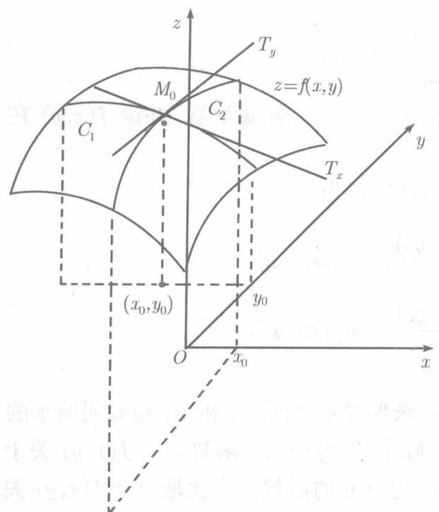

我们知道，一元函数 $y = f(x)$ 对于自变量 $x$ 的变化率即导数 $f^{\prime}(x)$ 。对于多元函数，考察函数对于它的一个变元（其余变元保持为常数）的变化率，就产生了偏导数。精确地说，二元函数 $z = f(x, y)$ 在点 $P_{0}(x_{0}, y_{0})$ 的偏导数可以用极限定义如下。

**定义9.2.1**（二元函数的偏导数）设函数 $u = f(x,y)$ ，在点 $(x_0,y_0)$ 的邻域内有定义，若极限

$$
\lim  _ {\Delta x \rightarrow 0} \frac {f (x _ {0} + \Delta x , y _ {0}) - f (x _ {0} , y _ {0})}{\Delta x}
$$

存在且为有限数，则称之为 $f(x,y)$ 在点 $(x_0,y_0)$ 关于 $x$ 的偏导数，并说 $f(x,y)$ 在点 $(x_0,y_0)$ 关于 $x$ 可导.

函数 $u = f(x,y)$ 在 $(x_0,y_0)$ 关于 $x$ 的偏导数记为

$$
\begin{array}{l l l} \frac {\partial f}{\partial x} \Big | _ {x = x _ {0}}, & \frac {\partial f (x _ {0} , y _ {0})}{\partial x}, & f _ {x} ^ {\prime} (x _ {0}, y _ {0}), \\ \frac {\partial u}{\partial x} \Big | _ {x = x _ {0}}, & \frac {\partial u (x _ {0} , y _ {0})}{\partial x}, & u _ {x} ^ {\prime} (x _ {0}, y _ {0}). \end{array}
$$

在所有这些记号里， $\partial x$ 表明函数对变量 $x$ 求偏导数，而 $x_0$ 和 $y_0$ 则表明所求的偏导数在点 $(x_0, y_0)$ 取值。如果对平面开区域 $D$ 的每一点，函数 $u = f(x, y)$ 关于变量 $x$ 都是可导的，则这个偏导数本身也成为 $x, y$ 的函数，这就是 $u = f(x, y)$ 关于 $x$ 的偏导函数，记之为

$$
\frac {\partial f (x , y)}{\partial x}, \quad f _ {x} ^ {\prime} (x, y), \quad \frac {\partial u (x , y)}{\partial x}, \quad u _ {x} ^ {\prime} (x, y).
$$

对于偏导函数，通常省去括号内的自变量，而记为

$$
\frac {\partial f}{\partial x}, \quad f _ {x} ^ {\prime}, \quad \frac {\partial u}{\partial x}, \quad u _ {x} ^ {\prime}.
$$

在不会产生混淆时，偏导函数也简称为偏导数。

完全类似地，保持 $x = x_0$ 为常数，若存在有限极限

$$
\lim  _ {\Delta y \to 0} \frac {f (x _ {0} , y _ {0} + \Delta y) - f (x _ {0} , y _ {0})}{\Delta y},
$$

则称之为函数 $u = f(x,y)$ 在点 $(x_0,y_0)$ 关于 $y$ 的偏导数，记为

$$
\begin{array}{l l l} \frac {\partial f}{\partial y} \Big | _ {x = x _ {0}}, & \frac {\partial f (x _ {0} , y _ {0})}{\partial y}, & f _ {y} ^ {\prime} (x _ {0}, y _ {0}), \\ \frac {\partial u}{\partial y} \Big | _ {x = x _ {0}}, & \frac {\partial u (x _ {0} , y _ {0})}{\partial y}, & u _ {y} ^ {\prime} (x _ {0}, y _ {0}). \end{array}
$$

关于 $y$ 的偏导函数则记为

$$
\begin{array}{l l l l} \frac {\partial f (x , y)}{\partial y}, & f _ {y} ^ {\prime} (x, y), & \frac {\partial u (x , y)}{\partial y}, & u _ {y} ^ {\prime} (x, y), \\ \frac {\partial f}{\partial y}, & f _ {y} ^ {\prime}, & \frac {\partial u}{\partial y}, & u _ {y} ^ {\prime}. \end{array}
$$

  
图9.2

由定义可知，偏导数 $f_{x}^{\prime}(x_{0},y_{0})$ 实际上就是一元函数 $f(x,y_0)$ 的导数在点 $x_0$ 的值， $f_y^\prime (x_0,y_0)$ 就是一元函数 $f(x_0,y)$ 的导数在点 $y_{0}$ 的值．由此，可以说明二元函数的偏导数的几何意义如下.

如图9.2，曲面 $z = f(x,y)$ 与平面 $y = y_{0}$ 相交，得平面 $y = y_0$ 内的曲线 $C_1$ ，其方程为

$$
\left\{ \begin{array}{l} z = f (x, y _ {0}), \\ y = y _ {0}. \end{array} \right.
$$

记 $z_0 = f(x_0, y_0)$ , 则由

$$
f _ {x} ^ {\prime} \left(x _ {0}, y _ {0}\right) = \frac {\mathrm {d}}{\mathrm {d} x} f (x, y _ {0}) \Bigg | _ {x = x _ {0}}
$$

可知， $f(x,y)$ 在点 $(x_0,y_0)$ 的偏导数 $f_{x}^{\prime}(x_{0},y_{0})$ 乃是曲线 $C_1$ 在点 $M_0(x_0,y_0,z_0)$ 的切线 $T_{x}$ 对 $x$ 轴的斜率，亦即 $T_{x}$ 对 $x$ 轴正向的倾角的正切.

同理， $f_{y}^{\prime}(x_{0},y_{0})$ 是曲面 $z = f(x,y)$ 与平面 $x = x_0$ 的交线

$$
C _ {2}: \left\{ \begin{array}{l l} z = f (x _ {0}, y), \\ x = x _ {0}. \end{array} \right.
$$

在 $M_0(x_0,y_0,z_0)$ 的切线 $T_{y}$ 对 $y$ 轴的斜率，亦即 $T_{y}$ 对 $y$ 轴正向的倾角的正切

对于三元函数 $u = f(x,y,z)$ ，可以类似地定义它关于 $x$ 、关于 $y$ 、关于 $z$ 的偏导数.

由偏导数的定义可知，求多元函数对某个变元的偏导数，只需将其余变元看成常数，利用一元函数的导数公式及运算法则对该变元求导，因此，求偏导数不需要新的计算方法.

例9.2.1 求 $z = \arctan \frac{y}{x}$ 的偏导数 $\frac{\partial z}{\partial x}, \frac{\partial z}{\partial y}$ .

解 视 $y$ 为常数，按一元函数求导数的链锁公式（定理2.1.7），

$$
\frac {\partial z}{\partial x} = \frac {1}{1 + \left(\frac {y}{x}\right) ^ {2}} \cdot \left(- \frac {y}{x ^ {2}}\right) = \frac {- y}{x ^ {2} + y ^ {2}},
$$

同理可得

$$
\frac {\partial z}{\partial y} = \frac {1}{1 + \left(\frac {y}{x}\right) ^ {2}} \cdot \frac {1}{x} = \frac {x}{x ^ {2} + y ^ {2}}.
$$

例9.2.2 设 $z = x^{y}$ $(x > 0, x \neq 1)$ , 求证

$$
\frac {x}{y} \frac {\partial z}{\partial x} + \frac {1}{\ln x} \frac {\partial z}{\partial y} = 2 z.
$$

证因为

$$
\frac {\partial z}{\partial x} = y x ^ {y - 1}, \quad \frac {\partial z}{\partial y} = x ^ {y} \ln x,
$$

所以

$$
\frac {x}{y} \frac {\partial z}{\partial x} + \frac {1}{\ln x} \frac {\partial z}{\partial y} = x ^ {y} + x ^ {y} = 2 x ^ {y} = 2 z.
$$

例9.2.3 设 $r = \sqrt{(x - x_0)^2 + (y - y_0)^2 + (z - z_0)^2}$ , 其中 $x_0, y_0, z_0$ 为常数, 求函数 $\frac{1}{r}$ 的三个偏导数.

解视 $y,z$ 为常数，则 $\frac{1}{r}$ 是 $x$ 的复合函数，

$$
\begin{array}{l} \frac {\partial}{\partial x} \left(\frac {1}{r}\right) = - \frac {1}{r ^ {2}} \frac {\partial r}{\partial x} \\ = - \frac {1}{r ^ {2}} \frac {x - x _ {0}}{\sqrt {(x - x _ {0}) ^ {2} + (y - y _ {0}) ^ {2} + (z - z _ {0}) ^ {2}}} = - \frac {x - x _ {0}}{r ^ {3}}, \\ \end{array}
$$

按变量 $x, y, z$ 的对称性，立刻可得

$$
\frac {\partial}{\partial y} \left(\frac {1}{r}\right) = - \frac {y - y _ {0}}{r ^ {3}}, \quad \frac {\partial}{\partial z} \left(\frac {1}{r}\right) = - \frac {z - z _ {0}}{r ^ {3}}.
$$

例9.2.4 求 $z = \sqrt{x} + \sin xy$ 在点 $(1, \pi)$ 对于 $x, y$ 的偏导数。

解 $\frac{\partial z}{\partial x} = \frac{1}{2\sqrt{x}} + y \cos xy, \frac{\partial z}{\partial y} = x \cos xy.$

以 $x = 1, y = \pi$ 代入得

$$
\left. \frac {\partial z}{\partial x} \right| _ {\substack {x = 1 \\ y = \pi}} = \frac {1}{2} - \pi , \quad \left. \frac {\partial z}{\partial y} \right| _ {\substack {x = 1 \\ y = \pi}} = -1.
$$

例9.2.5 设

$$
f (x, y) = {\left\{ \begin{array}{l l} { {\frac {x y}{x ^ {2} + y ^ {2}}},} & {{\text {当}} x ^ {2} + y ^ {2} \neq 0;} \\ {0,} & {{\text {当}} x ^ {2} + y ^ {2} = 0.} \end{array} \right.}
$$

求证 $f(x,y)$ 在原点关于 $x$ 和 $y$ 都是可导的，并求 $f_{x}^{\prime}(0,0)$ 和 $f_{y}^{\prime}(0,0)$ 的值。

解 因为

$$
\lim  _ {\Delta x \rightarrow 0} \frac {f (0 + \Delta x , 0) - f (0 , 0)}{\Delta x} = \lim  _ {\Delta x \rightarrow 0} \frac {0 - 0}{\Delta x} = 0,
$$

所以 $f(x,y)$ 在原点关于 $x$ 可导，且 $f_{x}^{\prime}(0,0) = 0$

类似地可以证明 $f(x,y)$ 在原点关于 $y$ 也是可导的，且 $f_y'(0,0) = 0$

我们知道，一元函数在导数存在的点一定是连续的（定理2.1.1)，而多元函数却未必如此。例9.2.5中的二元函数 $f(x,y)$ 在原点关于两个变元都是可导的，但在这点却不连续(例9.1.4)。
