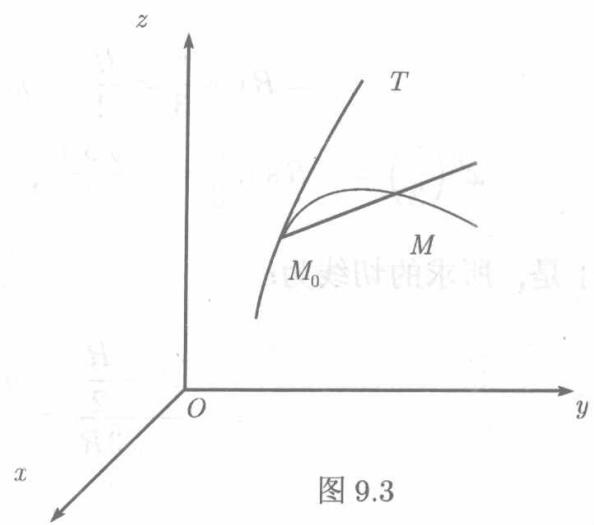

(1) 曲线写成参数方程的情形设一空间曲线的参数方程为

$$
x = x (t), y = y (t), z = z (t),
$$

其中函数 $x(t),y(t),z(t)$ 是某个区间上的可导函数，且 $x^{\prime}(t),y^{\prime}(t),z^{\prime}(t)$ 不同时为零.

和平面曲线的情形一样，如果动点 $M(x,y,z)$ 沿着曲线趋于定点 $M_0(x_0,y_0,z_0)$ 时，割线 $M_0M$ 有极限位置 $M_0T$ ，则称 $M_0T$

  
图9.3

为曲线在点 $M_0$ 的切线(见图9.3).设 $M_0$ 和 $M$ 分别对应于参数 $t_0$ 和 $t$ , 则割线 $M_0M$ 的方程为

$$
\frac {X - x _ {0}}{x (t) - x \left(t _ {0}\right)} = \frac {Y - y _ {0}}{y (t) - y \left(t _ {0}\right)} = \frac {Z - z _ {0}}{z (t) - z \left(t _ {0}\right)},
$$

其中 $X, Y, Z$ 为割线上的点的流动坐标，而 $x_0 = x(t_0)$ ， $y_0 = y(t_0)$ ， $z_0 = z(t_0)$ 是曲线上的点 $M_0$ 的坐标。以 $t - t_0$ 通除上式的分母，可将 $M_0M$ 的方程写为

$$
\frac {X - x _ {0}}{\frac {x (t) - x \left(t _ {0}\right)}{t - t _ {0}}} = \frac {Y - y _ {0}}{\frac {y (t) - y \left(t _ {0}\right)}{t - t _ {0}}} = \frac {Z - z _ {0}}{\frac {z (t) - z \left(t _ {0}\right)}{t - t _ {0}}},
$$

当 $M\to M_0$ 时， $t\rightarrow t_0$ ，上式中的三个分母分别以 $x^{\prime}(t_0),y^{\prime}(t_0),z^{\prime}(t_0)$ 为极限．又按假设这三个导数至少有一个不为零，于是方程

$$
\frac {X - x _ {0}}{x ^ {\prime} (t _ {0})} = \frac {Y - y _ {0}}{y ^ {\prime} (t _ {0})} = \frac {Z - z _ {0}}{z ^ {\prime} (t _ {0})},
$$

表示过 $M_0$ 的一条直线，它就是所求的切线．并且 $\{x^{\prime}(t_0),y^{\prime}(t_0),z^{\prime}(t_0)\}$ 是它的方向矢量．称之为曲线在点 $M_0$ 的切矢量

过点 $M_0$ 并且与切线 $M_0T$ 垂直的平面称为曲线在 $M_0$ 的法平面，它的法矢量就是曲线在 $M_0$ 的切矢量，于是，过 $M_0$ 的法平面的方程为

$$
x ^ {\prime} (t _ {0}) (X - x _ {0}) + y ^ {\prime} (t _ {0}) (Y - y _ {0}) + z ^ {\prime} (t _ {0}) (Z - z _ {0}) = 0.
$$

例9.4.1 求螺旋线

$$
x = R \cos t, \quad y = R \sin t, \quad z = 3 t
$$

在 $t = \frac{\pi}{3}$ 时的切线和法平面

解 以 $t = \frac{\pi}{3}$ 代入 $x(t), y(t), z(t)$ 及它们的导数，得

$$
x _ {0} = R \cos \frac {\pi}{3} = \frac {R}{2}, \quad y _ {0} = R \sin \frac {\pi}{3} = \frac {\sqrt {3} R}{2}, \quad z _ {0} = \pi ,
$$

$$
x ^ {\prime} \left(\frac {\pi}{3}\right) = - R \sin \frac {\pi}{3} = - \frac {\sqrt {3} R}{2}, \quad y ^ {\prime} \left(\frac {\pi}{3}\right) = R \cos \frac {\pi}{3} = \frac {R}{2}, \quad z ^ {\prime} \left(\frac {\pi}{3}\right) = 3.
$$

于是，所求的切线为：

$$
\frac {x - \frac {R}{2}}{- \frac {\sqrt {3} R}{2}} = \frac {y - \frac {\sqrt {3}}{2} R}{\frac {R}{2}} = \frac {z - \pi}{3},
$$

法平面为：

$$
- \frac {\sqrt {3}}{2} R \left(x - \frac {R}{2}\right) + \frac {R}{2} \left(y - \frac {\sqrt {3}}{2} R\right) + 3 (z - \pi) = 0,
$$

即

$$
- \sqrt {3} R \left(x - \frac {R}{2}\right) + R \left(y - \frac {\sqrt {3}}{2} R\right) + 6 (z - \pi) = 0.
$$

这里，按通常习惯，将流动坐标 $X, Y, Z$ 写成了 $x, y, z$ .

(2) 曲线写成一般方程的情形

如果空间曲线的方程是

$$
\left\{ \begin{array}{l} F (x, y, z) = 0, \\ G (x, y, z) = 0, \end{array} \right.
$$

这里的函数 $F$ 和 $G$ 有一阶连续偏导数，并且在点 $M_0(x_0,y_0,z_0)$ 行列式 $\left| \begin{array}{ll}F_y' & F_z'\\ G_y' & G_z'\end{array} \right|$ 不为零，则曲线的方程可以改写为（见(9.11))

$$
y = y (x), \quad z = z (x),
$$

并且（见（9.12））

$$
y ^ {\prime} = - \frac {\left| \begin{array}{l l} F _ {x} ^ {\prime} & F _ {z} ^ {\prime} \\ G _ {x} ^ {\prime} & G _ {z} ^ {\prime} \end{array} \right|}{\left| \begin{array}{l l} F _ {y} ^ {\prime} & F _ {z} ^ {\prime} \\ G _ {y} ^ {\prime} & G _ {z} ^ {\prime} \end{array} \right|}, \quad z ^ {\prime} = - \frac {\left| \begin{array}{l l} F _ {y} ^ {\prime} & F _ {x} ^ {\prime} \\ G _ {y} ^ {\prime} & G _ {x} ^ {\prime} \end{array} \right|}{\left| \begin{array}{l l} F _ {y} ^ {\prime} & F _ {z} ^ {\prime} \\ G _ {y} ^ {\prime} & G _ {z} ^ {\prime} \end{array} \right|}.
$$

于是，视 $x$ 为参数 $t$ ，则曲线在任一点的切矢量可取为

$$
\left\{\left| \begin{array}{c c} F _ {y} ^ {\prime} & F _ {z} ^ {\prime} \\ G _ {y} ^ {\prime} & G _ {z} ^ {\prime} \end{array} \right|, \quad \left| \begin{array}{c c} F _ {z} ^ {\prime} & F _ {x} ^ {\prime} \\ G _ {z} ^ {\prime} & G _ {x} ^ {\prime} \end{array} \right|, \quad \left| \begin{array}{c c} F _ {x} ^ {\prime} & F _ {y} ^ {\prime} \\ G _ {x} ^ {\prime} & G _ {y} ^ {\prime} \end{array} \right| \right\}.
$$

因而过 $M_0(x_0,y_0,z_0)$ 的切线和法平面依次为

$$
\frac {X - x _ {0}}{\left| \begin{array}{l l} F _ {y} ^ {\prime} & F _ {z} ^ {\prime} \\ G _ {y} ^ {\prime} & G _ {z} ^ {\prime} \end{array} \right| _ {M _ {0}}} = \frac {Y - y _ {0}}{\left| \begin{array}{l l} F _ {z} ^ {\prime} & F _ {x} ^ {\prime} \\ G _ {z} ^ {\prime} & G _ {x} ^ {\prime} \end{array} \right| _ {M _ {0}}} = \frac {Z - z _ {0}}{\left| \begin{array}{l l} F _ {x} ^ {\prime} & F _ {y} ^ {\prime} \\ G _ {x} ^ {\prime} & G _ {y} ^ {\prime} \end{array} \right| _ {M _ {0}}},
$$

和

$$
\left| \begin{array}{l l} F _ {y} ^ {\prime} & F _ {z} ^ {\prime} \\ G _ {y} ^ {\prime} & G _ {z} ^ {\prime} \end{array} \right| _ {M _ {0}} (X - x _ {0}) + \left| \begin{array}{l l} F _ {z} ^ {\prime} & F _ {x} ^ {\prime} \\ G _ {z} ^ {\prime} & G _ {x} ^ {\prime} \end{array} \right| _ {M _ {0}} (Y - y _ {0}) + \left| \begin{array}{l l} F _ {x} ^ {\prime} & F _ {y} ^ {\prime} \\ G _ {x} ^ {\prime} & G _ {y} ^ {\prime} \end{array} \right| _ {M _ {0}} (Z - z _ {0}) = 0.
$$

显然，这后一方程又可为

$$
\left| \begin{array}{c c c} X - x _ {0} & Y - y _ {0} & Z - z _ {0} \\ F _ {x} ^ {\prime} & F _ {y} ^ {\prime} & F _ {z} ^ {\prime} \\ G _ {x} ^ {\prime} & G _ {y} ^ {\prime} & G _ {z} ^ {\prime} \end{array} \right| = 0,
$$

其中一切偏导数都在 $M_0$ 取值

例9.4.2 求球面 $x^{2} + y^{2} + z^{2} = 2$ 与平面 $y + z = 0$ 的交线在点 $M_0(0,1, - 1)$ 的切线与法平面.

解 所述曲线的方程为

$$
\left\{ \begin{array}{l} x ^ {2} + y ^ {2} + z ^ {2} - 2 = 0, \\ y + z = 0, \end{array} \right.
$$

于是过 $(0,1, - 1)$ 的法平面为

$$
\left| \begin{array}{c c c} x & y - 1 & z + 1 \\ 0 & 2 & - 2 \\ 0 & 1 & 1 \end{array} \right| = 0.
$$

将这行列式展开，得 $4x = 0$ ，可见法平面即 $yOz$ 平面．而切线为

$$
\frac {x}{4} = \frac {y - 1}{0} = \frac {z + 1}{0},
$$

即

$$
\left\{ \begin{array}{l} y = 1, \\ z = - 1. \end{array} \right.
$$
