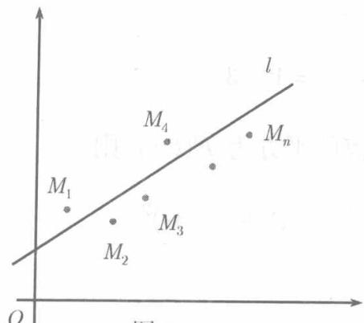

如果对于 $P_{0}(x_{0},y_{0})$ 的某个邻域内的一切点 $(x,y)$ 都成立 $f(x,y)\geqslant f(x_0,y_0)$ 则说 $f(x,y)$ 在点 $P_{0}$ 取极小值 $f(x_0,y_0)$ ；反之，若对 $P_{0}$ 的某个邻域内的一切点 $(x,y)$ 都成立 $f(x,y)\leqslant f(x_0,y_0)$ ，则说 $f(x,y)$ 在点 $P_{0}$ 取极大值 $f(x_0,y_0)$ .极大值和极小值统称极值，使函数 $f(x,y)$ 取得极值的点称为极值点.

例如，函数 $z = x^{2} + 2y^{2}$ 在点 $(0,0)$ 取极小值0.这是因为对于异于原点的每一点 $(x,y)$ 都成立 $x^{2} + 2y^{2} > 0$ 而 $z(0,0) = 0$

从函数图形看， $(0,0,0)$ 是椭圆抛物面 $z = x^{2} + 2y^{2}$ 的最低点（见图8.23).同样可以说明，函数 $z = -\sqrt{x^2 + y^2}$ 在 $(0,0)$ 取得极大值0,从图形上看， $(0,0,0)$ 是锥面 $x^{2} + y^{2} - z^{2} = 0$ 在 $xOy$ 平面下方的那一部分的最高点(见图8.25).

为了以偏导数作为工具讨论函数的极值，在建立必要条件时假定函数 $f(x,y)$ 有一阶偏导数，而在建立充分条件时假定 $f(x,y)$ 的二阶偏导数是连续的.

定理9.4.1（极值的必要条件）若 $f(x,y)$ 在点 $P_0(x_0,y_0)$ 取极值，并且 $f_x', f_y'$ 在点 $P_0$ 存在，则 $f_x'(x_0,y_0) = 0, f_y'(x_0,y_0) = 0.$

证 设 $f(x_0, y_0)$ 是极小值，则存在 $P_0(x_0, y_0)$ 的邻域，此邻域内的一切点 $(x, y)$ 成立不等式 $f(x, y) \geqslant f(x_0, y_0)$ ，特别，对于这个邻域内使 $y = y_0$ 而 $x \neq x_0$ 的点 $(x, y_0)$ ，成立

$$
f (x, y _ {0}) \geqslant f (x _ {0}, y _ {0}),
$$

这表示一元函数 $f(x, y_0)$ 在 $x = x_0$ 时取极小值，因此（定理3.4.3）

$$
\left. \left[ \frac {\mathrm {d}}{\mathrm {d} x} f (x, y _ {0}) \right] \right| _ {x = x _ {0}} = 0,
$$

而由偏导数 $f_{x}^{\prime}(x_{0},y_{0})$ 的定义可知，此即

$$
f _ {x} ^ {\prime} (x _ {0}, y _ {0}) = 0.
$$

类似地可以证明

$$
f _ {y} ^ {\prime} \left(x _ {0}, y _ {0}\right) = 0.
$$

对于 $f(x_0, y_0)$ 是极大值的情形可同样证明

使得 $f_{x}^{\prime} = 0, f_{y}^{\prime} = 0$ 的点 $(x_0, y_0)$ 称为 $f(x, y)$ 的静止点或驻点. 定理9.4.1表明，在偏导数存在时，函数的极值点一定是驻点．但反之未必，驻点不一定是极值点．作为例子，考察函数 $z = x^{2} - y^{2}$ ，它以(0,0)为驻点，但 $z(0,0) = 0$ 却不是极值，事实上，在(0,0)的任何邻域内，都有点 $(x, y)$ 使得 $|x| > |y|$ ，对于这种点就成立 $x^{2} - y^{2} > 0$ ，因而 $z(x, y) > z(0,0)$ ；同时，在此邻域内也有点 $(x, y)$ 使 $|x| < |y|$ ，因而成立 $x^{2} - y^{2} < 0$ ，即 $z(x, y) < z(0,0)$ . 由此可见，函数 $z = x^{2} - y^{2}$ 在(0,0)不取极值．曲面 $z = x^{2} - y^{2}$ 是鞍形曲面（见图8.24），在(0,0)的无论多小的邻域内，都有比(0,0,0)高的点，也有比(0,0,0)低的点.

既然驻点未必是极值点，那么，如何来判定它是不是极值点呢，我们来讨论极值的充分条件.

定理9.4.2（极值的充分条件）设函数 $z = f(x,y)$ 在点 $P_{0}(x_{0},y_{0})$ 的某邻域内有连续的一阶及二阶偏导数， $f_{x}^{\prime}(x_{0},y_{0}) = 0,f_{y}^{\prime}(x_{0},y_{0}) = 0,$ 记

$$
A = f _ {x x} ^ {\prime \prime} (x _ {0}, y _ {0}), \quad B = f _ {x y} ^ {\prime \prime} (x _ {0}, y _ {0}), \quad C = f _ {y y} ^ {\prime \prime} (x _ {0}, y _ {0}).
$$

$1^{\circ}$ 若 $B^{2} - AC < 0$ ，则 $f(x_0,y_0)$ 是极值． $A > 0$ 时为极小， $A < 0$ 时为极大；

$2^{\circ}$ 若 $B^{2} - AC > 0$ ，则 $f(x_0,y_0)$ 不是极值；

$3^{\circ}$ 若 $B^{2} - AC = 0$ 则 $f(x_0,y_0)$ 可能是极值，也可能不是极值

证设 $(x_0 + \Delta x, y_0 + \Delta y)$ 是所述邻域中的任意一点，在泰勒公式(9.17）中取 $n = 1$ ，并注意 $f_{x}^{\prime}(x_{0},y_{0}) = 0,f_{y}^{\prime}(x_{0},y_{0}) = 0,$ 得

$$
\begin{array}{l} f (x _ {0} + \Delta x, y _ {0} + \Delta y) = f (x _ {0}, y _ {0}) + \frac {1}{2 !} \left\{f _ {x x} ^ {\prime \prime} \left(x _ {0} + \theta \Delta x, y _ {0} + \theta \Delta y\right) \Delta x ^ {2} \right. \\ + 2 f _ {x y} ^ {\prime \prime} \left(x _ {0} + \theta \Delta x, y _ {0} + \theta \Delta y\right) \Delta x \Delta y \\ \left. + f _ {y y} ^ {\prime \prime} \left(x _ {0} + \theta \Delta x, y _ {0} + \theta \Delta y\right) \Delta y ^ {2} \right\} \quad (0 <   \theta <   1). \tag {9.19} \\ \end{array}
$$

令

$$
f _ {x x} ^ {\prime \prime} (x _ {0} + \theta \Delta x, y _ {0} + \theta \Delta y) = f _ {x x} ^ {\prime \prime} (x _ {0}, y _ {0}) + \varepsilon_ {1} = A + \varepsilon_ {1},
$$

$$
f _ {x y} ^ {\prime \prime} \left(x _ {0} + \theta \Delta x, y _ {0} + \theta \Delta y\right) = f _ {x y} ^ {\prime \prime} \left(x _ {0}, y _ {0}\right) + \varepsilon_ {2} = B + \varepsilon_ {2},
$$

$$
f _ {y y} ^ {\prime \prime} (x _ {0} + \theta \Delta x, y _ {0} + \theta \Delta y) = f _ {y y} ^ {\prime \prime} (x _ {0}, y _ {0}) + \varepsilon_ {3} = C + \varepsilon_ {3},
$$

则（9.19）可改写为

$$
\begin{array}{l} f \left(x _ {0} + \Delta x, y _ {0} + \Delta y\right) - f \left(x _ {0}, y _ {0}\right) \\ = \frac {1}{2} (A \Delta x ^ {2} + 2 B \Delta x \Delta y + C \Delta y ^ {2}) + \frac {1}{2} (\varepsilon_ {1} \Delta x ^ {2} + 2 \varepsilon_ {2} \Delta x \Delta y + \varepsilon_ {3} \Delta y ^ {2}). \\ \end{array}
$$

按二阶偏导数的连续性，当 $\Delta x$ 和 $\Delta y$ 都趋于0时， $\varepsilon_1, \varepsilon_2$ 和 $\varepsilon_3$ 也都趋于0. 令

$$
\Delta x = \rho \cos t, \quad \Delta y = \rho \sin t \quad (0 \leqslant t \leqslant 2 \pi),
$$

则

$$
\begin{array}{l} f \left(x _ {0} + \Delta x, y _ {0} + \Delta y\right) - f \left(x _ {0}, y _ {0}\right) \\ = \frac {\rho^ {2}}{2} \left[ \left(A \cos^ {2} t + 2 B \cos t \sin t + C \sin^ {2} t\right) + \left(\varepsilon_ {1} \cos^ {2} t + 2 \varepsilon_ {2} \cos t \sin t + \varepsilon_ {3} \sin^ {2} t\right) \right] \\ = \frac {\rho^ {2}}{2} [ \varphi (t) + \varepsilon ], \tag {9.20} \\ \end{array}
$$

其中

$$
\begin{array}{l} \varphi (t) = A \cos^ {2} t + 2 B \cos t \sin t + C \sin^ {2} t, \\ \varepsilon = \varepsilon_ {1} \cos^ {2} t + 2 \varepsilon_ {2} \cos t \sin t + \varepsilon_ {3} \sin^ {2} t, \\ \end{array}
$$

于是，当 $\Delta x\to 0,\Delta y\to 0$ 时 $\varepsilon \rightarrow 0$

若 $B^2 - AC < 0$ , 则必 $A \neq 0$ , 在 $A > 0$ 时,

$$
\begin{array}{l} \varphi (t) = A \cos^ {2} t + 2 B \cos t \sin t + C \sin^ {2} t \\ = \frac {1}{A} \left[ A ^ {2} \cos^ {2} t + 2 A B \cos t \sin t + A C \sin^ {2} t \right] \\ = \frac {1}{A} \left[ \left(A \cos t + B \sin t\right) ^ {2} - \left(B ^ {2} - A C\right) \sin^ {2} t \right] > 0, \tag {9.21} \\ \end{array}
$$

又 $\varphi (t)$ 在闭区间 $[0,2\pi ]$ 上连续，故存在最小值 $m$ （定理1.4.5）且 $m > 0$ 又当 $|\Delta x|$ $|\Delta y|$ 充分小时， $|\varepsilon | <   m$ .于是

$$
\varphi (t) + \varepsilon > m - | \varepsilon | > 0,
$$

(9.20) 表示， $(x_0, y_0)$ 的充分小的邻域内一切异于 $(x_0, y_0)$ 的点 $(x_0 + \Delta x, y_0 + \Delta y)$ ，都成立

$$
f (x _ {0} + \Delta x, y _ {0} + \Delta y) > f (x _ {0}, y _ {0}),
$$

即 $f(x_0, y_0)$ 是极小值. 同理可证 $A < 0$ 时 $f(x_0, y_0)$ 是极大值，结论 $1^\circ$ 得证

若 $B^2 - AC > 0$ ，则在 $A, C$ 至少有一个不为 0，例如 $A \neq 0$ 时， $\varphi(t)$ 仍然可以表示为 (9.21). 此时，对于 $t = t_1 = 0$ ， $\varphi(t_1) = A$ ；对于使得 $A \cos t_2 + B \sin t_2 = 0$ 的 $t_2$ ， $\varphi(t_2) = \frac{AC - B^2}{A} \sin^2 t_2$ ，与 $A$ 的符号相反，亦即 $\varphi(t_2)$ 与 $\varphi(t_1)$ 符号相反，由 (9.20) 可知，在 $(x_0, y_0)$ 的充分小的一切邻域内， $f(x_0 + \Delta x, y_0 + \Delta y) - f(x_0, y_0)$ 既可以为正也可以为负，可见 $f(x_0, y_0)$ 不是极值。在 $C \neq 0$ 时可类似地证明。而在 $A = C = 0$ 时，必定 $B \neq 0$ ，此时

$$
\varphi (t) = 2 B \sin t \cos t = B \sin 2 t.
$$

在 $0 \leqslant t \leqslant 2\pi$ 时显然可取正值也可取负值， $f(x_0, y_0)$ 也不是极值。结论 $2^\circ$ 得证。

若 $B^2 - AC = 0$ ，读者容易验证 $f_1(x, y) = xy^2$ ， $f_2(x, y) = (x^2 + y^2)^2$ ，在驻点 $(0,0)$ 都满足这一条件，但 $f_1(0,0)$ 不是极值， $f_2(0,0)$ 是极小。由此即知结论 $3^\circ$ 正确。

按定理9.4.1和定理9.4.2，讨论二阶偏导数连续的二元函数的极值，只需求方程组

$$
f _ {x} ^ {\prime} (x, y) = 0, \quad f _ {y} ^ {\prime} (x, y) = 0
$$

的一切实数解，求得全部驻点，然后对每一驻点计算定理9.4.2中的 $A, B, C,$ 在 $B^{2} - AC\neq 0$ 时，按定理9.4.2的结论 $1^{\circ}$ 或 $2^{\circ}$ 判别是否极值，是极大呢还是极小；而在 $B^{2} - AC = 0$ 时，定理9.4.2不能提供肯定的结论，需根据具体问题进行分析.

例9.4.5 求函数 $f(x,y) = x^4 + y^4 - (x + y)^2$ 的全部极值

解 由方程组

$$
\left\{ \begin{array}{l} f _ {x} ^ {\prime} = 4 x ^ {3} - 2 (x + y) = 0, \\ f _ {y} ^ {\prime} = 4 y ^ {3} - 2 (x + y) = 0, \end{array} \right.
$$

得 $\frac{1}{2} (x + y) = x^3 = y^3$ ，由此解得 $x = y = 0,1, - 1.$ 于是有三个驻点 $P_{1}(0,0),P_{2}(1,1)$ $P_{3}(-1, - 1)$ .求出二阶偏导数

$$
f _ {x x} ^ {\prime \prime} = 12 x ^ {2} - 2, \quad f _ {x y} ^ {\prime \prime} = - 2, \quad f _ {y y} ^ {\prime \prime} = 12 y ^ {2} - 2.
$$

对于驻点 $P_{2}(1,1)$ 和 $P_{3}(-1, - 1),A = 10 > 0,B = -2,C = 10,B^{2} - AC <   0,$ 由定理9.4.2知， $P_{2}$ 和 $P_{3}$ 都是极小点， $f(1,1) = -2,f(-1, - 1) = -2$ 都是极小值.

对于驻点 $P_{1}(0,0), A = B = C = -2, B^{2} - AC = 0$ ，定理9.4.2不能提供结论.由于对充分小的一切正数 $x, f(x,x) = 2x^4 - 4x^2 = 2x^2 (x^2 - 2) < 0, f(x, - x) = 2x^4 > 0,$ 而 $f(0,0) = 0.$ 可见 $P_{1}$ 不是极值点. □

例9.4.6 求 $f(x, y) = -x^{3} + y^{3} + 3x^{2} + 3y^{2} - 9y$ 的全部极值

解 由方程组

$$
\left\{ \begin{array}{l} f _ {x} ^ {\prime} = - 3 x ^ {2} + 6 x = 0, \\ f _ {y} ^ {\prime} = 3 y ^ {2} + 6 y - 9 = 0, \end{array} \right.
$$

求得驻点 $P_{1}(0,1), P_{2}(2,1), P_{3}(0,-3), P_{4}(2,-3)$ .

求出二阶偏导数

$$
f _ {x x} ^ {\prime \prime} = - 6 x + 6, \quad f _ {x y} ^ {\prime \prime} = 0, \quad f _ {y y} ^ {\prime \prime} = 6 y + 6.
$$

对于驻点 $P_{1}(0,1)$ ， $A = 6$ ， $B = 0$ ， $C = 12$ ， $B^{2} - AC < 0$ ， $A > 0$ ，故在 $P_{1}$ 取极小值 $f(0,1) = -5$

对于 $P_{2}(2,1)$ ， $A = -6$ ， $B = 0$ ， $C = 12$ ， $B^{2} - AC > 0$ ，故 $P_{2}$ 不是极值点；

对于 $P_{3}(0, - 3),A = 6,B = 0,C = -12,B^{2} - AC > 0,$ 故 $P_{3}$ 不是极值点；

对于 $P_{4}(2, - 3),A = -6,B = 0,C = -12,B^{2} - AC <   0,A <   0,$ 故在 $P_{3}$ 取极大值 $f(2, - 3) = 31$

对于三元函数 $u = f(x,y,z)$ ，可仿照二元函数定义极值与极值点，并且在偏导数 $f_{x}^{\prime},f_{y}^{\prime},f_{z}^{\prime}$ 都存在时，可仿照定理9.4.1证明， $u$ 在 $P_0(x_0,y_0,z_0)$ 取极值的必要条件是

$$
f _ {x} ^ {\prime} \left(x _ {0}, y _ {0}, z _ {0}\right) = 0, \quad f _ {y} ^ {\prime} \left(x _ {0}, y _ {0}, z _ {0}\right) = 0, \quad f _ {z} ^ {\prime} \left(x _ {0}, y _ {0}, z _ {0}\right) = 0.
$$

如果这些条件满足，且 $f$ 的二阶偏导数连续，记 $f_{x^2}''(P_0) = a_{11}$ ， $f_{y^2}''(P_0) = a_{22}$ ， $f_{z^2}''(P_0) = a_{33}$ ， $f_{xy}''(P_0) = a_{12}$ ， $f_{xz}''(P_0) = a_{13}$ ， $f_{yz}''(P_0) = a_{23}$ ，则当

$$
a _ {1 1} > 0, \quad \left| \begin{array}{c c} a _ {1 1} & a _ {1 2} \\ a _ {1 2} & a _ {2 2} \end{array} \right| > 0, \quad \left| \begin{array}{c c c} a _ {1 1} & a _ {1 2} & a _ {1 3} \\ a _ {1 2} & a _ {2 2} & a _ {2 3} \\ a _ {1 3} & a _ {2 3} & a _ {3 3} \end{array} \right| > 0
$$

时 $f(P_0)$ 是极小值，而当

$$
a _ {1 1} <   0, \quad \left| \begin{array}{l l} a _ {1 1} & a _ {1 2} \\ a _ {1 2} & a _ {2 2} \end{array} \right| > 0, \quad \left| \begin{array}{l l l} a _ {1 1} & a _ {1 2} & a _ {1 3} \\ a _ {1 2} & a _ {2 2} & a _ {2 3} \\ a _ {1 3} & a _ {2 3} & a _ {3 3} \end{array} \right| <   0
$$

时 $f(P_0)$ 是极大值

在实际问题中，人们所关心的往往是函数的最大值或最小值。我们知道，如果函数在有界闭区域 $D$ 上连续，则它在 $D$ 上有最大值及最小值。最大值及最小值可

能在 $D$ 的内部的点达到，也可能在 $D$ 的边界上的点达到。但在前一情形，达到最大或最小的点，必然是极值点，因而在偏导数存在时必定是驻点。由此可知，若函数在有界闭区域 $D$ 上连续且在 $D$ 内存在一阶偏导数，则求最大值和最小值的方法是：求出 $D$ 内的全部驻点处的函数值（不必判定这些值是否是极值）以及函数在边界上的最大值和最小值，比较所有这些值，其最大者即最大值，最小者即最小值。

有些问题，所寻求的往往是最大值、最小值之一，我们可以结合问题的实际意义而解决得更简单些：如果按问题的性质可以断定所求的最大值或最小值是存在的，并且只能在 $D$ 的内部达到，而在 $D$ 内驻点又是唯一的，则函数在该点的值即为所求者.

例9.4.7 求两条异面直线 $L_{1}$ : $\left\{ \begin{array}{l}x + y + z = 0,\\ x + z - 1 = 0, \end{array} \right.$ $L_{2}$ : $\left\{ \begin{array}{l}x + y - z + 2 = 0\\ x - 2y + 3z + 1 = 0 \end{array} \right.$ 之间的距离 $d$

解 将 $L_{1}$ 和 $L_{2}$ 改写为参数方程，

$$
\begin{array}{l} L _ {1}: x = 1 - t, y = - 1, z = t; \\ L _ {2}: x = - 2 + s, y = 1 - 4 s, z = 1 - 3 s. \\ \end{array}
$$

记 $L_{1}$ 上的点 $P(t)$ 与 $L_{2}$ 上的点 $Q(s)$ 之间的距离的平方为 $F(t,s)$ ，则

$$
F (t, s) = (3 - t - s) ^ {2} + (- 2 + 4 s) ^ {2} + (- 1 + t + 3 s) ^ {2},
$$

令 $F_{t}^{\prime} = 0, F_{s}^{\prime} = 0$ 化简后得到方程组

$$
\left\{ \begin{array}{l} t + 2 s = 2, \\ 2 t + 13 s = 7, \end{array} \right.
$$

由此解得唯一的驻点 $t = \frac{4}{3}, s = \frac{1}{3}$ , 代入 $L_{1}, L_{2}$ 的参数方程得 $M_{1}\left(-\frac{1}{3}, -1, \frac{4}{3}\right)$ , $M_{2}\left(-\frac{5}{3}, -\frac{1}{3}, 0\right)$ , 按问题的实际意义, 所求的距离 $d$ (即 $L_{1}$ 上的任意点与 $L_{2}$ 上任意点之间的距离的最小值) 是存在的, 于是 $d = |M_{1}M_{2}| = 2$ .

例9.4.8 设长方体过同一顶点的三边长度之和为定值 $a$ , 试问三边各取何值时长方体体积 $V$ 最大.

解设三边各长 $x,y,z$ ，则

$$
x + y + z = a,
$$

即 $z = a - x - y.$ 于是

$$
V = x y z = x y (a - x - y).
$$

问题归结为在区域 $D$ ： $x > 0,y > 0,x + y <   a$ 内求 $V$ 的最大值． $D$ 的边界是三条直线 $x = 0;y = 0;x + y = a.$ 按问题的实际意义可知，体积 $V$ 是有最大值的，而在 $D$ 的边界上 $V = 0$ ，不可能是最大值．因而最大值只能在 $D$ 内达到，由方程组

$$
V _ {x} ^ {\prime} = a y - 2 x y - y ^ {2} = 0, \quad V _ {y} ^ {\prime} = a x - x ^ {2} - 2 x y = 0
$$

得 $D$ 内的唯一的驻点 $\left(\frac{a}{3},\frac{a}{3}\right)$ 它必定是最大值点，因而当三边之长都是 $\frac{a}{3}$ 时，长方体体积最大.

即：三边长度之和为定数的长方体中，以正方体体积最大

例9.4.9（最小二乘法）有时，人们确信变量 $y$ 是 $x$ 的函数，但却不知道具体的函数关系。这时，就需要通过实验或观察采集数据，按这些数据建立 $y$ 依赖于 $x$ 的近似公式。这种方法多种多样，这里介绍的最小二乘法是最为简单的一种。

设采集到 $n$ 组数据

  
图9.4

$$
(x _ {1}, y _ {1}), (x _ {2}, y _ {2}), \dots , (x _ {n}, y _ {n}),
$$

在平面直角坐标系中，它们对应于 $n$ 个点 $M_1,M_2,\dots ,M_n.$ 如果这些点分布在某一直线 $\iota$ 附近（见图9.4)，则可以近似地认为 $y$ 是 $x$ 的线性函数

$$
y = a x + b,
$$

问题在于如何选择 $a, b$ 之值，使这种近似表示尽可能精确

令 $\varepsilon_{i} = |y_{i} - ax_{i} - b|$ , 则当且仅当 $\varepsilon_{i} = 0$ 时 $M_{i}$ $(i = 1,2,\dots ,n)$ 在 $l$ 上. 由此可见, $\sum_{i=1}^{n} \varepsilon_{i}$ 越小, 则近似公式 $y = ax + b$ 越精确. 为了避免讨论绝对值, 以 $\varepsilon^{2}$ 代替 $\varepsilon$ , 考虑

$$
F (a, b) = \sum_ {i = 1} ^ {n} \varepsilon_ {i} ^ {2} = \sum_ {i = 1} ^ {n} \left(y _ {i} - a x _ {i} - b\right) ^ {2},
$$

问题归结为选择 $a, b,$ 使这个和数最小．由极值的必要条件，可得

$$
\begin{array}{l} \frac {\partial F}{\partial a} = - 2 \sum_ {i = 1} ^ {n} \left(y _ {i} - a x _ {i} - b\right) x _ {i} = 0, \\ \frac {\partial F}{\partial b} = - 2 \sum_ {i = 1} ^ {n} \left(y _ {i} - a x _ {i} - b\right) = 0. \\ \end{array}
$$

整理，得到 $a, b$ 所应满足的线性方程组：

$$
\left\{ \begin{array}{l} {\left(\sum_ {i = 1} ^ {n} x _ {i} ^ {2}\right) a + \left(\sum_ {i = 1} ^ {n} x _ {i}\right) b = \sum_ {i = 1} ^ {n} x _ {i} y _ {i}} \\ {\left(\sum_ {i = 1} ^ {n} x _ {i}\right) a + n b = \sum_ {i = 1} ^ {n} y _ {i},} \end{array} \right.
$$

由此解出 $a, b$ ，即得所求的近似公式

这种由偏差平方和最小确定 $a, b$ 的方法，称为最小二乘法。我们介绍的是求近似公式 $y = ax + b$ 的方法，但不难推广到求其他函数，例如 $y = ax^2 + bx + c$ 或 $z = ax + by + c$ 等。

迄今为止，在讨论极值问题时，函数除接受定义域的限制外，没有受附加条件的约束。我们称这种极值为无条件极值。与此相反，函数在某些附加条件（称为约束条件）下的极值，则称之为条件极值。
